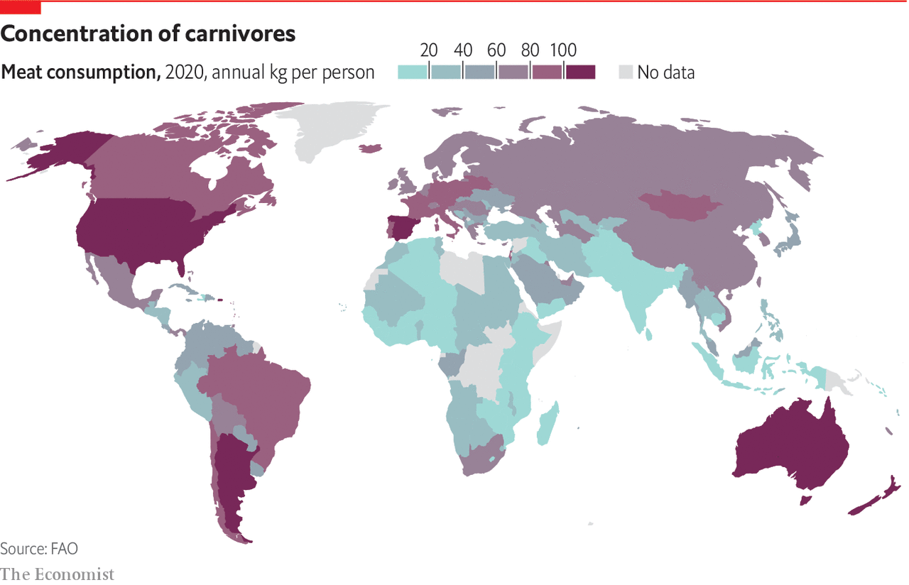

###### Features and bugs

# Feeding 9bn people will mean reimagining the edible world 

##### More insects are likely to be on the menu 

 

> Sep 28th 2021 

OVER LATE afternoon Cutty Sark and fried haddock at a bar overlooking the working waterfront in Portland, Maine, Steve Train is doing what so many lobstermen do on shore: telling stories. Mr Train has been a lobsterman for 45 years; he first went out when he was 11 years old.

One story is about sea urchins. For years when he and other lobstermen found sea urchins in their lobster traps they would crush them underfoot: the urchins were nuisances. That was before Japanese buyers realised that urchin from the cold waters off Maine produced some of the finest uni on earth. There was value, it turned out, in something long overlooked.


Mr Train now hopes the same thing could be true again—this time for weeds. At the end of October, when winter weather and the departure of the lobsters for deeper waters will soon be keeping keep him off the water, Mr Train lays ropes seeded with kelp across 1.6 hectares (four acres) of water close to where he lives on an island in Casco Bay. He uses the same equipment to tend his kelp farm as he does to catch lobsters: boats and ropes, pullers and winches. Atlantic Sea Farms, the company that supplies the seed, promises to buy every usable blade. It ferments some into “sea-chi”—deliciously briny and funky. Some is frozen for smoothies.

The fight to feed a world of perhaps 10bn by mid-century is being fought on many fronts. It demands massive reductions in the amount of food wasted and farming that ensures long-term soil fertility at the same time as increases in yield. It will also be helped by filling in some of the gaps in the current food system: things overlooked until an entrepreneurial eye coupled to an appropriate technology sees what could be made of them. Fishing and agriculture tend to be seasonal, leaving workers with time and unused machinery for part of each year that, with imagination, can find alternative employment. There are foods routinely ignored in some places which other palates and cultures prize—such as sea urchins. Kelp farming happens to tick both boxes.

Seaweeds of various sorts are routinely eaten across East Asia, but the global industry is worth only around $6bn per year according to the UN Food and Agriculture Organisation (FAO)—about as much as Americans spend on tortilla chips. Kelp is loaded with minerals and fibre and a lot more sustainable than many crops it might replace. But as anyone who has ever raised or been a child knows, just because a thing should be eaten does not mean it will be. Filling in the gaps in the world’s food web requires unlearning some tastes and preferences.

 


Consider the insect. Around 1,900 species are eaten around the world, according to the FAO. The cuisine of Oaxaca, arguably Mexico’s most complex and delicious, features fried chapulines (grasshoppers) seasoned with lime, chilies and salt and rolled into a fresh corn tortilla. Drinkers in rural Thailand snack on deep-fried, thumb-sized beetles; those working the fields of southern Africa prefer chubby mopane worms. Around 2bn people choose to eat insects on a regular basis. The rest of the world does so unknowingly, and to a lesser degree, while eating other things, as FDA rules make fascinatingly clear: American asparagus, for example, is not allowed to contain more than 40 thrips [tiny winged insects] per 100 grams.

Insects convert nutrients and water into protein far more efficiently than more commonly consumed animals. Raising them does not require land-clearing, releases very little greenhouse gas and can be done alongside other crops—another bit of gap-filling. They can be fed on organic waste, reducing the flow of waste into landfills. Most species contain more protein by weight than legumes; some contain more than meat and eggs. Their exoskeletons can be uncomfortable in the mouth; but exoskeletons, as eaters of prawn and lobster know, can be removed.

It would undoubtedly be better for the world if people ate more bugs. And yet many in the Western world (including your correspondent, who is otherwise a reasonably adventurous eater) find the notion of such entomophagy revolting. This is illogical, particularly for diners who happily consume shrimp and other crustaceans, but then eating is only rarely logical.

Fifty years ago, most Western diners looked askance at eating raw fish; today you can get sushi at supermarkets. A number of insect-food startups have been garnering a modest amount of investment hoping for a similar change in taste.

Pat Crowley runs one of the older ones, Chapul, founded through a kickstarter funding campaign in 2012. He’s an ento-evangelist—black soldier-fly larvae, he enthuses, are “one of the best-tasting insects I’ve ever had”—who was drawn into the business by his concerns about water resources in the American west. He says that younger consumers are far more open to entomophagy than older ones, which is a source of hope.

But most of Chapul’s business is not in whole insects, but in insect flour. The growth of keto, Palaeo and other protein-heavy diets—as well as those that eschew wheat—has made cricket flour an appealing bet for bug farmers. It abounds in protein and minerals, and its neutral, nutty flavour mixes well with other foods.

Processed-insect products from Chapul and others are also eagerly swallowed up by animals that have neither scruples nor choice in what they eat—that is to say, other farmed animals. This makes insect farming controversial to some, who see it as propping up the cruelties and slaughter of the intensive poultry and livestock business. But from an ecosystem point of view it may be helpful. A rich protein source that does not require large-scale arable farming or lots of water—as soybeans do—may have a lower overall burden, especially if it is largely fed on waste. Replacing fishmeal is particularly appealing. Farmed salmon is often fed with fishmeal made from other species, disrupting the open-ocean food chain. Highly productive insect farms could be a way to turn food waste into fresh fish, which seems greatly preferable.

In time insects may become the sought-after delicacies Mr Crowley would like. It is not just sushi that once turned up noses—potatoes and tomatoes did too. Tastes change over time; the menu from a celebratory dinner in 1921 (consommé viveur, boned squab, friandises) seems as archaic to contemporary eyes as the diners’ starched collars and flapper hats.

What will a slap-up menu from 2021 look like to people in 100 years? They may marvel at the idea of rack of lamb when the meat they eat has never seen a bone, skeleton or even a blood vessel. They may pity dining choices limited to a small number of living creatures—no fried, giant crickets, or cultured, cured panda ham. They may be astounded at fruits and vegetables sourced from far away, rather than coming—as all the finest produce does—from a farm just a few floors below the restaurant. They may shudder at the risks of eating line-caught fish, or grow envious at the idea of a world where the climate allowed coffee to come from beans grown on hillsides, rather than from yeast which still doesn’t quite get the flavonoids right despite a century of genetic tinkering.

Some will deem the cruelty and environmental damage done by their ancestors’ diets unimaginable and unforgivable. If they do so from the moral high ground of a better record in such matters, there is every reason to hope that it will be because some of the technologies described in this report have become mainstream—as unremarkable as slaughterhouses and greenhouses are today. That will help build a diet that reveals its eaters to be part of an Anthropocene that humankind is managing tolerably well, both delighting the palate and lying lightly on the conscience.■


Features and bugs: Feeding 9bn people will mean reimagining the edible world*

