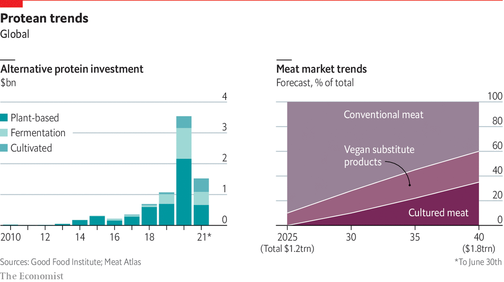

###### Cell-side markets

# Meat no longer requires animal slaughter 

##### You can grow it in a laboratory 

 

> Sep 28th 2021 

A GENERAL PRINCIPLE of restaurant dining is this: if you look into the kitchen and see at least one chef wielding tweezers, prepare for a markedly lighter wallet. This is not because the tweezers will place anything particularly expensive on your plate (the occasional flakes of gold leaf notwithstanding) but because they signify that you are eating at a restaurant so devoted to every detail of your dining experience that it pays people to hover over your plate carefully distributing tasteless little flower petals or sprigs of greenery. They signify luxury, and luxury costs.

In the well-equipped test kitchen of Upside Foods, in an unremarkable office park in Berkeley, California, Morgan Reese uses long tweezers to place two frazzled mushroom slivers and a single caper next to an almond-sized piece of sautéed chicken. Plain chicken may not seem like a gold-flake-calibre luxury. But as Uma Valeti, Upside’s CEO, noted while Mr Reese worked, there are only “maybe a thousand-plus people that have tasted [this type of chicken] so far in the world”.


That is because this particular chicken was grown entirely in a lab. Some time ago, Upside took a tissue sample from a living chicken that survived the procedure unharmed; the cells gathered in that biopsy were used to form a cell line from which the company is able to produce meat like that on the plate. It looks, smells and tastes exactly like a boneless piece of white-meat chicken—which is precisely what it is, just created using novel means.

It is not a new idea. In “The Space Merchants”, a dystopian satire by Frederik Pohl and Cyril M. Kornbluth published in 1952, the hero spends some time gathering algae to be fed to a thing called “Chicken Little”: “a grey-brown, rubbery hemisphere some fifteen yards in diameter. Dozens of pipes ran into her pulsating flesh. You could see that she was alive.” Chicken Little has been grown from cultured cells to feed a resource-poor world in thrall to hucksterism. A small chamber hollowed out of its flesh provides access to meetings of a revolutionary groupuscule.

Today Upside Foods and its backers hope that lab-grown meat will not shield the revolution, but be the revolution—and in a much more appealing way. The company has broken ground on a new production facility in California’s East Bay. It is not alone. Nearly 100 firms are vying to be the first to bring cultured meat to market. Select locations—including a private club in Singapore and a test kitchen in Tel Aviv—serve it from time to time. But as yet it remains unavailable to the average diner.

It is not hard to see why investors are excited. Demand for meat and fish is soaring, particularly among the rapidly growing middle classes in parts of the developing world. Making that meat the old-fashioned way uses a lot of land and produces gigatonnes of greenhouse gas. Much of the fish people want is not caught sustainably, and some comes from endangered or threatened species. Plant-based substitutes can meet some of the increased demand, but currently they only really compete with processed products such as those based on mince. Growing meat directly from animal cells offers a way of squaring the circle, while also satisfying the moral demands of consumers uneasy about factory farming and animal slaughter. But it is a hugely ambitious undertaking.

Cells, tissues and muscle fibres have been grown in vitro, as scientists say, for decades; Alexis Carrel and his associates first grew the cells of a chick’s heart in a lab in 1912, and kept the culture going for more than 30 years. Such cultures are fundamental to much biological research. One of the things that now makes the process appealing to food producers is that it has become practical to extract stem cells that can give rise to different types of cells, such as those that make up fat and muscle, and have them do it to order. A cardiologist by training, Mr Valeti says he was inspired to start Upside by “the idea of injecting stem cells into the human heart” to help it regenerate muscle after a heart attack.

Unlike Chicken Little, which was immortal, the cells these firms use are harvested after just a few weeks of culture. What happens then varies by company; each has a proprietary method for turning muscle cells into meat. Animals naturally grow fat, muscle and connective tissue together, in coherent and familiar forms around a skeleton. Cultured-meat producers must figure out how to replicate the mouthfeel engendered by such forms.

Some put the cells on scaffolds, to give them shape: cultured muscle cells, unlike the natural type, do not have bone and sinew to grow around. Others use extrusion, in a process similar to making pasta. Such techniques allow firms to customise the final shape of their product. BlueNalu, a San Diego-based firm growing bluefin tuna and mahi-mahi in a lab, boasts of being able to give chefs “a sheet-pan” of sashimi-quality fish if that is what they want. An Israeli firm, Aleph Farms, uses 3D printers to turn cow cells into steaks—a process borrowed from techniques being used to grow human tissue and organs outside the body for transplant.

Most of the companies emphasise that their process is “species-agnostic,” meaning they can replicate any type of protein for which they can find cells, but most also have placed bets on specific end products. New entrants boasting of a unique approach to some specific tissue or other turn up with remarkable regularity. Some are working on high-value fish, as BlueNalu is. The cultured product will compete against an incumbent product made increasingly rare and expensive by overfishing.

 


There are echoes here of the strategy successfully used by Tesla to build its electric-car business. Rather than starting with small cars that looked like toys at worst and just a bit weird at best, it kicked off with a sexy sports car and followed up with an expensive luxury sedan, flourishing in that niche as it built up the technology and manufacturing capacity for the mass market.

BlueNalu is not the only firm looking to enter the market at the top end. Gourmey, a French startup, is using cells cultured from duck eggs in an effort to replicate foie gras, a product which combines a high price with high cruelty. Researchers at Osaka University recently announced the stem-cell-and-3D-printer creation of a steak in which muscle, blood vessels and fat were arranged to mimic the structure of Wagyu beef. But it is worth remembering that Tesla’s success depended not just on making a high-end product, but on making one that could outperform the competition in almost every way, not just in its lack of exhaust-pipe emissions. No cultured-meat company can yet make that claim.

Vegetable or mineral?

Even so, the technology has inherent charms. When it comes to the quartet of healthy not harmful, natural not artificial, pure not processed, environmentally friendly not pernicious, cultured meat might seem irredeemably artificial. It may be cytologically indistinguishable from meat, but it has never been part of an animal’s life. What makes it less cruel also makes it less natural, at least to most. (It also seems to mean that it can be neither kosher nor halal; both sets of restrictions require meat to be slaughtered according to particular rules.) But to its advocates, such meat does offer a particular type of purity.

Fish meat grown in sealed, sanitised bioreactors will never be exposed to the microplastics, mercury and other pollutants often found in wild seafood. Chicken built up from its constituent cells never comes into contact with faeces, thus eliminating the risk of salmonella. No livestock means no chance of animal pathogens crossing over into humans, whether in the farm, the market, the slaughterhouse, the kitchen or the dining room.

Companies willing to venture beyond tissue culture into genetic modification or gene editing could go further—improving the nutritional value or even, perhaps, the flavour. The Osaka beef-engineers imagine dialling the fat content of pseudo-Wagyu up or down according to taste or health requirements. Chicken could be loaded with the omega-3 fatty acids that fish get from eating algae, or beef with beneficial plant proteins. And fresh fish can be fresher if it comes straight from the lab than if it must be caught at sea.

But several challenges remain before these products come to a supermarket near you. First is regulation. Here Singapore leads the world. It introduced a regulatory framework in 2019 which allows “alternative protein products that do not have a history of being consumed as food” to be sold if they pass an expert panel’s safety review and are properly labelled. Meat grown in labs must be sold as “cultured”, that made from plants must be labelled as “plant-based” or “mock”. Eat Just, a San Francisco-based firm, got approval for its cultured chicken there late last year. The process is typically expected to take just three to six months.

This compares well, for producers, with America’s, which requires the attentions of two different agencies: the Food and Drug Administration, which monitors cell growth and issues premarket safety assessments; and the Department of Agriculture, which will conduct ongoing inspections, as it does for live-animal facilities, when licensed production gets under way. The European Food Safety Authority’s process may be all under one procedural roof, but it is nevertheless expected to take at least three times longer than Singapore’s.

Singapore had good reason to create a streamlined process. Cultured meat fits with the tiny country’s goal of producing 30% of its food by 2030 to avoid disruptions in supply. And the reason why that goal requires it to get into cultured meat—its lack of an incumbent meat industry—meant a lot less lobbying against cultured meat than can be expected elsewhere.

Another challenge is the range of cuts. In principle cultured meat can be grown as tissues, not just cells. In practice compressible nubs similar to ground animal meat are much easier and what most of the companies do best. Eat Just serves chicken nuggets in Singapore, and SuperMeat offers “crispy cultured chicken fillet” in Tel Aviv (it’s a burger, but made from fried chicken). Whole chicken breasts—to say nothing of a rack of ribs, or any other meat on the bone—remain far off. But given the improvements in plant-based meat alternatives, it is to that level of ambition that the new industry needs to aspire if it is to show decent margins.

At the same time it also needs to make a fundamental part of its process much cheaper. Just like animals in fields, cell cultures in bioreactors need feeding, and they are fussy about nutrients. You cannot just feed them processed algae, as Pohl and Kornbluth imagined. Fetal bovine serum (FBS), a nutrient-rich liquid long used by scientists in the lab, has become the nourishment of choice for many cultured-meat companies. But unfortunately for an industry which wants to sell meat untainted by death, FBS is derived from blood collected from pregnant cows at slaughter. And unfortunately for an industry trying to make its wares a lot cheaper, it is also expensive and subject to wild price fluctuations. On top of that, it is also nutritionally variable from batch to batch.

Cultured-meat companies would like to use synthetic alternatives (as would many laboratory scientists). Creating something truly comparable, though, would almost certainly involve genetically engineering yeast in order to make it produce at least some of the necessary nutrients. That yeast would itself need to be fed in order to produce what is required. To make a cell-based alternative to meat, you need to make a food chain for those cells as surely as you need to provide grass, silage or feedstock to cattle. And the meat will never be cheaper than the medium it grows in.

This drawback has not stopped investors from piling in to the sector. If they are doing so on the basis that biotechnologists are both cunning and armed with ever more subtle tools, fair enough. But no cultured-meat company is as yet either producing at scale or making money. Upside and BlueNalu are in the process of opening production facilities a lot larger than their original laboratories—not big enough to serve a national or even a significant regional market, but enough to provide a proof-of-concept that could justify the capital investment needed for the big time.

If they can scale up at reasonable cost, though, there will still be doubts as to the eventual size of the market. The benefits of plant-based meat alternatives may not be as clear as some consumers think, but the idea of eating plants is neither novel nor disturbing. The idea of eating something grown from a tissue culture is definitely novel and may prove to be disturbing. How much of a problem that will prove is a question that will only be answered when the choice is presented to more than just a self-selected group of already curious diners in a few cosmopolitan cities. Polls asking people’s views of cultured meat show varying responses.

Proponents argue that people frequently eat meats that seem familiar but are not made from the breed, or through the processes, that they used to be. The rich world’s pork has been bred to be leaner and its chickens to be more breast-heavy; its production has moved from fields, farmyards and sties to squalid, hurtful factories. But this is a sadly double-edged argument. If people are sufficiently adaptable about the way food is raised as to be happy with today’s cruelty, they may also be adaptable enough to embrace meat from the lab. But having learned to accept the cruelty, will they be motivated to make the change?

Upside hopes they will, and to that end it is set on educating consumers and gaining their trust. It is designing its East Bay facility with immense windows into the production rooms, to let consumers see as much as possible. For maximum effect it might consider offering an abattoir the lease on a similarly open building next door free of charge. The lack of takers would be telling. ■


Cell-side markets: Meat no longer requires animal slaughter*


