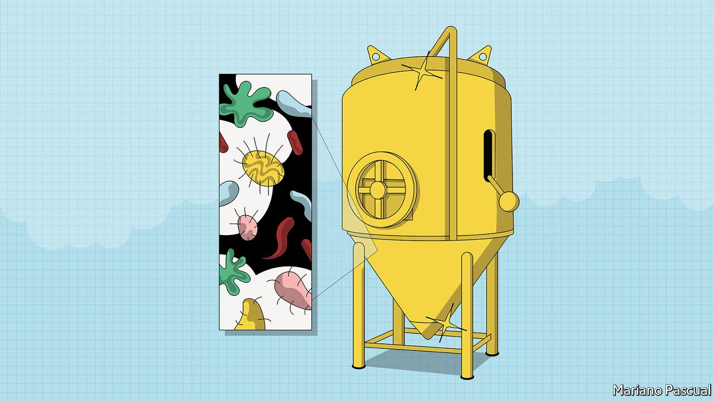

###### Culture club

# Microbes are being used more and more to make delicious food 

##### A new realm of “precision fermentation” beckons 

 

> Sep 28th 2021 

THE FETID salinity of prosciutto, bresaola’s jaw-wearying toughness and the pallid greasiness of lardo, which is cured solid fat, all have their fans—if not, normally, among those in the business of keeping arteries clean. But the single best cured meat in the world comes from north-eastern Thailand. Rice, pork, garlic, salt and herbs are stuffed into a casing and left at room temperature for a few days. When cooked, this naem has a robust pigginess. But it is best eaten raw, with chilies and garlic cloves.

Its sinus-clearing sourness, a perfect balance to the other strong flavours, comes courtesy of bacteria that produce lactic acid. It is a strategy the bacteria evolved to prevent the growth of other, less acid-tolerant microbes; by nobbling the competition they get more food for themselves—and leave the rest safe for human consumption. Such bacteria are also at work in Nigerian ogi, Korean kimchi, and a host of other foods including that lockdown mainstay, sourdough bread.


Humans have been harnessing microbe-based biochemistry for food preservation since before history began. Without lactic-acid fermentation a bumper crop of cabbage would rot uneaten. With the right microbes, salt and time it can be turned into sauerkraut. Ethanol fermentation raises bread and fizzes champagne. Acetic-acid fermentation provides vinegar and thus pickling, not to mention the peerless lambic beers of the Zenne Valley in Belgium.

In many cases, such as that of a sourdough starter or a yoghurt culture, the microbes put to work come not as individual species but as long-standing collectives. The processes by which these collectives are controlled—or at least cajoled—have for millennia been governed by the algorithms of traditional knowledge and the data inputs of sight, smell, taste and, for dough, touch.

Many have now been simplified, industrialised and scaled up. An array of vitamins, flavourings and colours have long been made using microbial fermentation. Not all these products of fermentation are preservatives or additives; some are foods in themselves. When yeast produce alcohol for beer they also produce more yeast—which sometimes turns into Marmite, a savoury spread about which British people delight in having divergent views. Quorn, a plant-based meat alternative that has been on the market for decades, is made from a quickly-growing microfungus discovered by a chemical company in the 1960s.

Now that food technologists have genome sequencing and gene editing at their disposal they are exploring a realm of “precision fermentation” in which microbes can be chosen, or engineered, for very specific purposes. The breakthrough took place in 1990, when Pfizer used the genetic-engineering techniques previously used to make medicines such as insulin to create a microbe that produced the clotting agent found in rennet, which is used to curdle milk proteins into cheese. Rennet was previously sourced from the fourth stomachs of unweaned calves, which is inconvenient. The engineered version is now used in most mass-market cheeses.

Genetically altered microbes now make a variety of proteins important in foodstuffs, such as the leghaemoglobin which provides Impossible Foods with the haem for its burgers. Other companies are editing microbes to produce whey and casein for animal-free cheeses, collagen to use in synthetic leather and spiders’ silk for clothes.

Scientists think the right microbes in the right fermenters could eventually produce abundant saturated fats, such as those in avocado or coconut oil, to give a rich texture to plant-based meat-substitutes. Palm oil could, in principle, be created without the need for deforestation. That said, something will always have to be grown somewhere to provide the bugs doing the work with energy and raw materials. Fermentation can change things, but it cannot create them out of nothing: it is metabolism, not magic

But the right plate of naem might have you challenging that assertion.


Culture club: Microbes are being used more and more to make delicious food*


