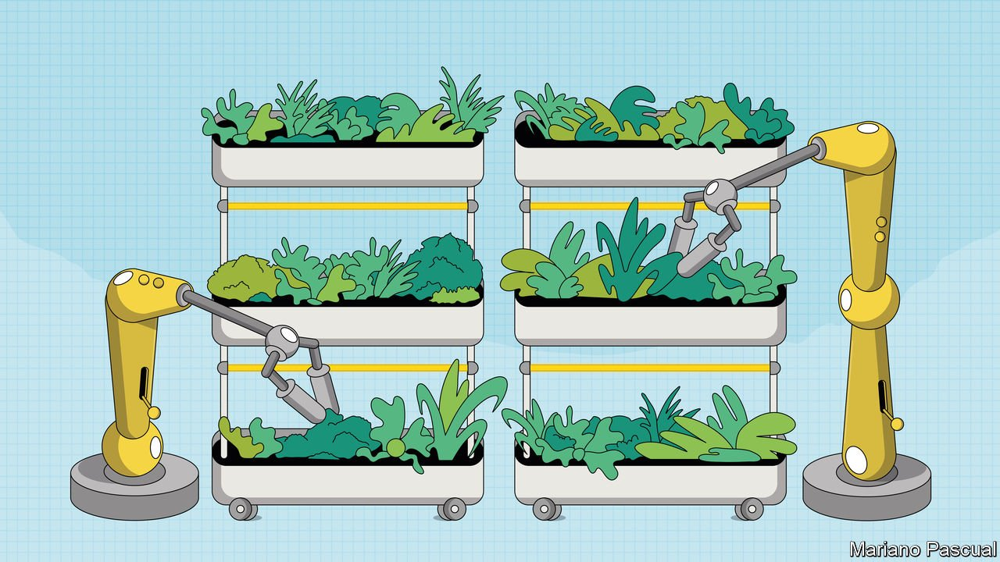

###### Green castles in the sky

# Vertical farms are growing more and more vegetables in urban areas 

##### They don’t need soil or sunlight 

 

> Sep 28th 2021 

THE BEST basil in the world is grown in a small village on the Ligurian coast just west of Genoa. Picked at the height of ripeness, after just the right number of sunny days and temperate nights, the delicate basil is perfect in the pesto for which Liguria is justly famed.

Unfortunately, many more people use fresh basil than live within driving distance of Genoa. And even on the Ligurian coast, nature does not always provide perfect weather. But a close approximation—crisp and recognisably peppery with the right anise undernotes, perhaps not quite vibrant enough to make a Genoese chef do cartwheels, but better than the limp stuff in plastic sachets sold in supermarkets—can be found in a few shipping containers at the back of a car park in north Brooklyn, just down the block from a synagogue and around the corner from a petrol station.


Those containers house a vertical farm—a farm in which crops grow on top of each other, rather than just next to each other, as they do in a field, allowing growth at far higher density. Square Roots, the farm’s owner, grows fresh herbs here, delivering them to 100 retailers in New York within 24 hours of harvest using emission-free electric tricycles. The company has a larger facility in Grand Rapids, Michigan, and ambitions for further expansion.

Not all vertical farms are small. Across the country in South San Francisco, a firm called Plenty runs an 8,100-square-metre (two-acre) vertical farm that, it claims, grows as much produce as a normal farm over 300 times its size. Plans are under way for massive vertical farms in the UAE and Switzerland. China plans to build an entire neighbourhood in Shanghai around vertical farming.

Most vertical farms share a few attributes. One is a lack of soil. Their stacked rows of crops are grown aeroponically, meaning the roots are fed with a nutrient-rich mist, or hydroponically, meaning the roots either sit in an aqueous, nutrient-rich solution or in a container in which the solution constantly flows over them.

This lets a lot less water than is usually used do a lot more work. No soil means precise control over what level of nutrients all the roots receive. It also eliminates weeds and helps keep down microbes, insects and other crop-devouring pests, many of which need soil for some of their life cycles. No soil also means no fertiliser runoff into waterways; vertical farms tend to recycle things, not dispose of them. Some contain aquaponic ecosystems in which aquaculture and horticulture combine: the plants feed the fish, the fish fertilise the plants.

Sunshine is absent, too. Light comes from strips of LEDs arranged so that all the dense-packed leaves are optimally illuminated. The problem with this is that LEDs and the electricity which powers them cost money. Proponents of vertical farms note that the cost of LEDs is dropping and the amount of light they generate per kilowatt hour is climbing; what is known as Haitz’s law says that the efficiency of LED lighting systems improves by a factor of 20 every decade. Even so, energy costs for lighting and temperature control remain high.

In time, things will improve, and not just thanks to Haitz’s law. The energy used in vertical farms is almost all electricity, which is becoming both greener, as grids take on more renewable capacity, and cheaper, as that renewable capacity relieves electricity suppliers of fuel costs. Vertical farms can also time their “days” and “nights” to match times when power is cheaper, and drop demand a bit if the grid needs it—a service grids will increasingly pay for.

That is one example of their greatest gift: control. With light, temperature and nutrients all delivered directly, the conditions for growth can be optimised. And the crops raised are carefully chosen, with fast-growing, light, high-margin produce comprising most of them today. High-quality herbs and leafy greens can be guaranteed at all seasons and from a local source.

Berries may be next. Farming berries uses a lot of pesticides and depends on varieties that can tolerate being shipped long distances. As a result the sweet, floral, fire-engine-red berry picked from a wild July vine is nothing like the insipid pinkish golf-balls stacked on November shelves. Through their control of light, temperature and nutrients vertical farms can have fresh-picked summer-succulent punnets on sale throughout a city all year round. Think of it as the Teslaberry: a superior product with environmental benefits (no pesticide use) that establishes a technology and a brand.

Control needs data. Vertical farms can keep track of what is going on in a way field farming, however high its precision, cannot. The bigger a farm gets, the more information it has, and at least theoretically, the better and more efficient it becomes. Anya Rosen, who manages Square Roots’s Brooklyn farm, explains that vertical farming “is not really nature. It’s the opposite of that. It’s basically a big robot that grows plants inside.”

That may not, in itself, sound appetising. But when it comes to the authenticity quartet of health, naturalness, purity and the environment, vertical farms stack up pretty well. Technology around a plant seems less off-putting than technology within a plant. The clinical brightness of a farm in which plants are stacked like servers is not natural; but it has a certain purity. A sealed environment is one not harming the greater environment outside (unless its voracious appetite for energy is fed with fossil fuels).

Seeing these advantages, mission-driven investors are pouring money into vertical-farming companies despite their energy costs—Plenty has raised $541m over six funding rounds, while a SPAC may soon take AeroFarms, a New Jersey-based firm with an immense vertical farm in an old industrial building in Newark, public. Again, though, they are doing so in advance of profitability.

To many environmentalists, this is a sideshow. Making real farming less of a stress on the environment is far more important. And vertical farming could be successful as a business without doing much for the planet. It could remain a niche for the urban rich. But vertical farms could have impacts environmentalists and others would value. Unlike plant-based meat alternatives they encourage people to think about how food is produced, rather than just what it tastes like. The experimentation they allow could lead to greater efficiency and higher quality, or both.

Vertical farming will not immediately transform the world’s agricultural practices. Plenty of investors will misjudge when to jump in and which firms to back. And even if some investors make it big, their companies will, in the near and medium term, mostly cater to city dwellers who can afford to eat well.

For a world getting richer and more urbanised, that is a good business to be in, and it may be good for the environment, too, if only at the margins. But things could go further. Farming has a long history of, in effect, trading land for energy. Throughout the 20th century tractors and other machinery, artificial fertilisers and pesticides all turned fossil fuels into agricultural productivity, using the energy stored in oil to grow more food on the same amount of land and sometimes less.

In the mid-to-late 21st century artificial lighting and indoor climate control, all powered by cheap, clean electricity, could continue the trend. That possibility does not mean vertical farming investment will pay off in the short term. But just as 20th-century farming would have been unrecognisable to the 19th century farmer, so 21st-century farms may, eventually, outgrow today’s in productivity, in environmental friendliness—and in height. ■


Green castles in the sky:Vertical farms are growing more and more vegetables in urban areas*


