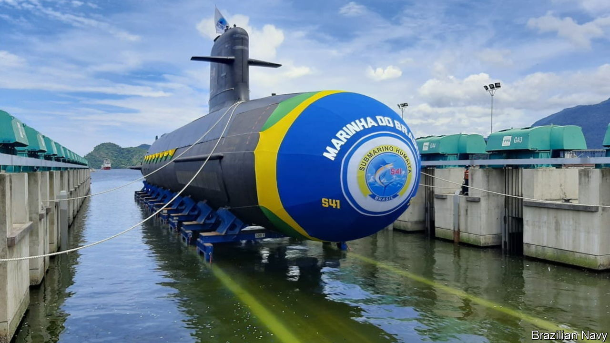
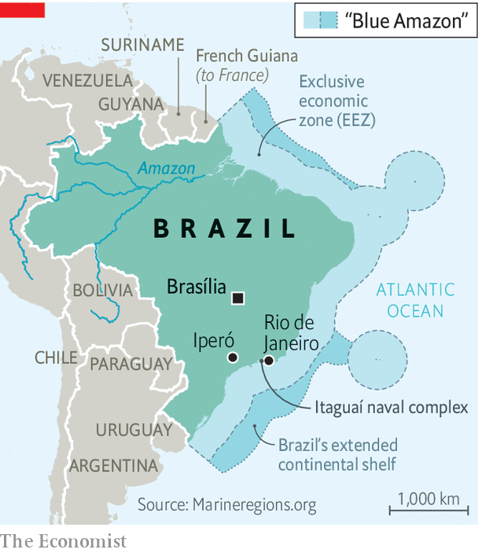

###### Underwater atoms

# Brazil might get nuclear-powered submarines even before Australia 

##### The country has been working on the technology for decades 

 

> Sep 30th 2021 

NUCLEAR SUBMARINES have caught the world’s eye in recent weeks. On September 15th the United States, Australia and Britain announced the  pact to help Australia , a military capability so potent that the United States has never shared it with any ally other than Britain. Yet on the other side of the Earth from Perth, where the Australian boats may one day be based, another middle-ranking power has been quietly honing the same technology for far longer.

At the Itaguaí naval complex near Rio de Janeiro, and other sites scattered across Brazil, hundreds of engineers are slowly designing and piecing together parts of the Álvaro Alberto, a nuclear-powered submarine named after a former vice-admiral and pioneer of the country’s nuclear programme. If all goes to plan, it could land in the water at Madeira island in Itaguaí in the early 2030s, before Australia gets a sniff at its own subs. That would make Brazil the first non-nuclear-armed country to operate a nuclear-powered submarine.


Brazil’s armed forces began serious nuclear work in the 1970s, with an eye on eventually producing nuclear weapons. The navy was the spearhead of that effort, deploying hundreds of staff in a secret programme to spin uranium in centrifuges—a process that enriches it for use in reactors (or bombs)—and to build the miniature reactors that can fit inside the cramped hull of a submarine. This work survived the end of military rule in 1985. It then languished for a while, but received enthusiastic support from Luiz Inácio Lula da Silva, Brazil’s left-wing president from 2003 to 2010.

Progress since then has been slow, though Jair Bolsonaro, Brazil’s current president, attended a ceremony marking the initial assembly of a prototype reactor in Iperó, 120km north-west of São Paulo, in October 2020. A month later the navy finalised the boat’s basic design. That was in no small part thanks to Naval Group, the largely state-owned French arms company whose jilting last month by Australia, as part of AUKUS, provoked a diplomatic incident. Under a deal agreed in 2008 under Lula, Naval Group signed a contract with Odebrecht, a conglomerate now synonymous with corruption, to sell advanced diesel-electric submarines to Brazil.

 


Many see Brazil’s quest for nuclear subs as a quixotic frippery. It is “a mad indulgence of Lula’s boom era”, says one foreign diplomat. Brazilian officials justify the programme by pointing to the “Blue Amazon”, a term coined by the navy. It refers to the country’s 8,000km-long coastline, the economic riches that lie off it and the importance of defending them. Brazil says its continental shelf gives it rights beyond the exclusive economic zone of 200 nautical miles (370km) set out in the UN Convention on the Law of the Sea (see map).

Yet one of the world’s stealthiest military platforms might be considered overkill for protecting fish, guarding oil rigs and warding off Argentine warships that are no longer hostile. Diesel-electric submarines, which are quieter in shallow water, and far cheaper to build, would be better suited to coastal defence. One reason for the programme’s survival may be that it has friends in high places. The minister of mines and energy, for instance, is a former admiral who commanded Brazil’s submarine force and ran the navy’s nuclear work. Mr Bolsonaro, a former army officer himself, has stacked his government with military folk and increased the armed forces’ budget this year (the amount for subs shrank by 31%, amid a wider fiscal crisis).

Geopolitical factors are at work, too. The subs have justified the need to master the complete fuel cycle—the process of mining, milling and enriching nuclear fuel—and thus placed Brazil “in the threshold between being a nuclear state and not being a nuclear state”, says Carlo Patti, author of “Brazil in the Global Nuclear Order”. That means the country can produce its own nuclear energy, without seeking help from rich countries which, in Brazil’s view, have monopolised such technology on the pretext of non-proliferation. It also means that Brazil could produce weapons-grade uranium if it chose to. Both capabilities are sources of “political and technological prestige”, says Mr Patti.

For largely the same reason, they make non-proliferation advocates nervous. Brazil once had a secret weapons programme. In 2019 Mr Bolsonaro’s son, a member of Congress, said that Brazil would be “taken more seriously” if it had nukes. Whereas most countries have signed a so-called Additional Protocol with the International Atomic Energy Agency, a nuclear watchdog, which allows for enhanced inspections, Brazil has long refused to do so, on the basis that nuclear-armed states have not done enough to disarm.

In practice, the subs are not much cause for worry. Brazilian nuclear material is monitored under a special bilateral pact with Argentina, which was signed in 1991. And unlike British and American subs, which use uranium enriched to the high levels suitable for a bomb, Brazil’s planned reactor will use low-enriched stuff that would need to be spun further for nefarious purposes. Brazilian naval officers are keen to show that their programme is above-board, and would not like to be lumped in with nuclear pariahs like Iran. “I'm not concerned,” says Togzhan Kassenova, an expert on non-proliferation at the State University of New York at Albany.

A nuclear submarine is one of the most sophisticated and complex pieces of military hardware that any country can build. Brazil’s programme has now survived military and civilian governments, and presidents of both the left and right. Its survival owes much to Lula, who has said he will run in next year’s presidential elections and enjoys a commanding 18-percentage-point lead over Mr Bolsonaro.

“The project appears to be irreversible,” noted Ms Kassenova and two other experts who visited the Itaguí shipyard in 2018. No country below the equator has ever owned or operated a nuclear-powered submarine. Brazil and Australia will now be vying to get there first.■

An early version of this article was published online on September 27th 2021

