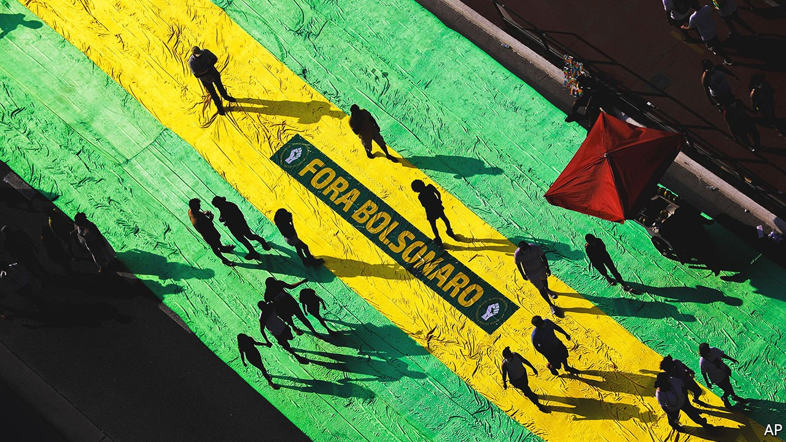

###### A conservative crack-up

# Some of President Jair Bolsonaro’s supporters are turning against him 

##### That could affect his chances of re-election next year 

 

> Oct 2nd 2021 

MOVIMENTO BRASIL LIVRE (MBL), or the Free Brazil Movement, is a group of angry young men who have a knack for using social media and the streets to achieve their political goals. Since being founded seven years ago, the right-wing group has helped bring down one president, leftist Dilma Rousseff, who was impeached in 2016, and has played kingmaker to another, the populist Jair Bolsonaro, who was elected in 2018. But MBL was nowhere to be seen on September 7th when Mr Bolsonaro’s fans filled the streets in support of his struggling government. Instead, it organised a counter-protest five days later that called for his impeachment.

“I voted for Bolsonaro and regret it,” says Luís Alberto Silva, a 37-year-old salesman and one of the protesters. Though smaller than both its bolsonarista precursor and previous anti-Bolsonaro rallies called by left-wing groups, the protest hints at a problem for the president. His base is often described as “beef, bullets and bibles”, referring to the interest groups that make up the biggest congressional caucuses. But equally important to his victory were the groups that champion free markets and decry corruption. If they defect en masse, it could cost him re-election next year—an outcome he is gearing up to dispute, with unpredictable consequences.


A decade ago most of these libertarian groups did not exist. After the military dictatorship ended in 1985 it was taboo to identify yourself as right-wing. One of MBL’s founders, Fábio Ostermann, recalls that when he started reading Friedrich Hayek and Ludwig von Mises in the early 2000s, “being young and not a leftist was seen as strange.” The left-leaning government of Luiz Inácio Lula da Silva, Ms Rousseff’s predecessor, also of the Workers’ Party (PT), was popular. Previous governments had been broadly centrist.

Two factors fuelled the rise of a “new right”, argues Camila Rocha of the University of São Paulo in a new book, “Menos Marx, Mais Mises” (“Less Marx, more Mises”). A vote-buying scandal in 2005 tainted the PT. The launch the previous year of Orkut, a social network that had 30m users in Brazil, offered a space for unconventional ideas. Free-market think-tanks, such as the Millennium Institute in Rio de Janeiro, flourished. Many of them desired a slimmed-down state, which became more salient when, in 2014, the Lava Jato (“Car Wash”) investigation revealed an even bigger graft scheme involving the PT. Alongside MBL, another group, Vem Pra Rua (“Come to the Streets”) led protests against Ms Rousseff. Partido Novo, a “new party” with a pro-market platform, fielded its first candidates in 2016.

The counter revolution

Although many of these groups proclaim themselves to be libertarian, several aligned themselves with more socially conservative viewpoints. In 2017 MBL joined protests to shut down an art exhibition on LGBT culture and, later, to ban Judith Butler, a philosopher, from an event because of her supposedly immoral (though to most readers impenetrable) views on gender. Rodrigo Constantino, a pundit and co-founder of the Millennium Institute, laments both the PT’s spending and its “satanic” sex-ed curriculum.

Mr Bolsonaro managed to appeal to this broad spectrum of conservative voters. He won “because he knew how to read the crowd”, says Sóstenes Cavalcante, a federal deputy and evangelical pastor.

Free-marketeers were cheered by Mr Bolsonaro’s choice for economy minister, Paulo Guedes, an economist who studied at the University of Chicago (and another co-founder of the Millennium Institute). But the honeymoon did not last long. MBL became dismayed by Mr Bolsonaro during his first year in office, when he ditched anti-graft plans after federal prosecutors filed money-laundering charges against one of his sons. They were further disappointed in 2020, when the justice minister, Sergio Moro, a former Lava Jato judge, resigned and accused Mr Bolsonaro of obstructing justice. By then, the president’s party had split into lavajatistas loyal to Mr Moro and ideologues wedded to the president, who quit the party. Other supporters abandoned Mr Bolsonaro when he botched Brazil’s response to the pandemic.

Some of these “new right” groups are trying to shift focus away from contentious social issues. “MBL is in a bit of an identity crisis,” says Mr Ostermann, who left in 2018 because he felt the group’s focus on defeating the PT would cost it its place at the “vanguard of liberal activism” (he is now a state deputy for Partido Novo). With Lula leading the polls for next year’s presidential election, MBL and other groups are trying to boost “third-way” challengers. If it comes down to Lula and Mr Bolsonaro, most say they will turn in blank ballots, even if that means Lula wins.

Around 30% of Brazilians still back Mr Bolsonaro. Some dedicated fans, such as evangelicals, have always cared more about social policies, such as keeping abortion illegal, than economic liberty or anti-corruption. Many millennials who frequented Orkut have been influenced by Olavo de Carvalho, a reactionary guru whose online lectures about how “cultural Marxism” is destroying Judaeo-Christian values have 1m subscribers, among them Mr Bolsonaro’s sons.

Mr Bolsonaro’s remaining supporters increasingly espouse views similar to the global alt-right, says Michele Prado, a researcher who studies bolsonarista groups on WhatsApp. Formerly fringe ideas such as the return of the monarchy or of military dictatorship have become political movements with elected representatives. Mr Bolsonaro’s election sparked a jump in the share of people identifying as right-wing.

Brazilians’ political identities are hardly coherent, points out Pablo Ortellado of the University of São Paulo. They have mostly “to do with the shirt of the team” that is winning, he says. But even if a split among conservatives undermines Mr Bolsonaro’s bid for re-election next year, the new right will not disappear as a political force. It may well evolve, or retreat into, a hard core of social conservatives, authoritarians and conspiracy theorists. Less von Mises and more Stephen Miller. ■

