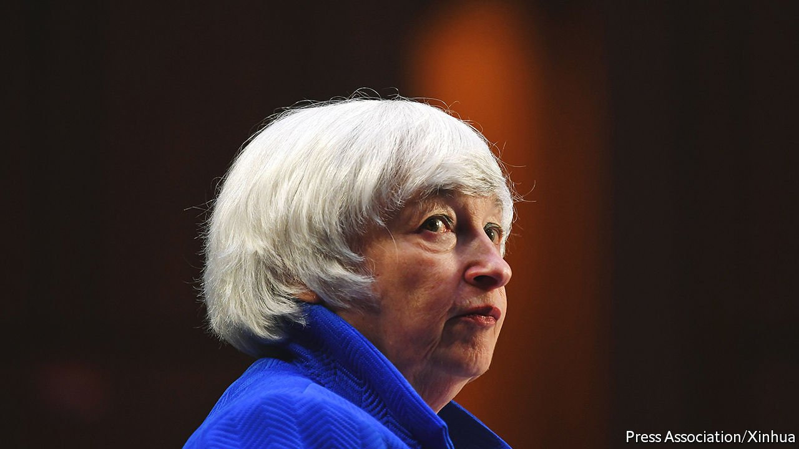

###### 

# Business this week 

#####  

 

> Oct 2nd 2021 

Janet Yellen, America’s treasury secretary, gave her strongest warning yet on the potential consequences of not raising the federal debt limit, saying it would be “catastrophic”. The Treasury estimates that it will run out of money by October 18th unless the ceiling is increased to allow the government to continue borrowing. Even with a stopgap resolution to avoid a government shutdown, the issue of lifting the debt limit still remains. Ms Yellen said the uncertainty was eroding investor confidence.

As if on cue…


Stockmarkets had their worst day in months on September 28th. The S&amp;P 500 dropped by 2% and the Nasdaq by 2.8%, its biggest decline in half a year. European and Asian bourses also fell. The prospect of a government shutdown was just one factor unsettling investors. Markets are also digesting moves by central banks to taper their stimulus programmes, which has led to a sell-off in bonds.

, but were still rising sharply in Asia and Europe, and to a lesser degree in America. That fed into oil markets, as some industries switch to the commodity to keep the lights on. The price of Brent crude crept up to $80 a barrel for the first time in three years.

Evergrande, China’s second-biggest property developer, sold part of its stake in a bank to a publicly owned investment group, raising $1.5bn. The bank has demanded that Evergrande, which has rattled markets by warning of a debt default, use its proceeds to repay a loan. It won’t make much of a dent in the company’s $300bn-worth of liabilities. Still, the fact that the stake was sold to a state investment firm was taken as a sign that the government is working behind the scenes to avoid Evergrande’s collapse.

Battle lines were drawn in the American Senate over a possible second term for Jerome Powell as chairman of . Elizabeth Warren, a left-wing Democrat, became the first senator publicly to oppose Mr Powell remaining in office because of his past support for financial deregulation. She called him “a dangerous man”. Joe Biden is expected to announce his decision on who should lead the central bank within the next few months.

Ford announced an $11bn plan to build three  and another plant to make its F-series of electric pickup trucks. The investment is in partnership with SK Innovation, a South Korean company; the carmaker is providing $7bn. Along with its Detroit rivals, General Motors and Stellantis, Ford has made a commitment to switch to greener motoring and wants 40% of its global sales to be electric by 2030.

Voters in Berlin backed a referendum proposal to expropriate apartments held by corporate landlords, the most visceral reaction yet in a big European city to property speculation that has priced out most families. The vote is non-binding and may end up in Germany’s Constitutional Court.

With one of the toughest  vaccine mandates in American business, United Airlines said that 96% of staff in the United States had been jabbed to protect themselves against covid-19, but that it was preparing to fire almost 600 who had not done so before the deadline of September 27th. They had a few days leeway to comply. About 2,000 employees sought a religious or medical exemption.

In Britain the furlough scheme introduced at the start of the pandemic in March 2020 came to an end. Over its course the programme covered 11.6m workers, paying up to 80% of their wages, though by July 2021 that had dropped to 1.6m. The government spent nearly £70bn ($94bn) on its support. Meanwhile, revised figures showed that the British economy grew by 5.5% in the second quarter, a faster pace than an initial estimate had suggested. GDP is now just 3.3% below its pre-pandemic level of late 2019.

A leading indicator of house prices in America rose at a record rate for the fourth consecutive month. The S&amp;P CoreLogic Case-Shiller national index jumped by 19.7% in July over the same month a year ago, with the biggest increases reported in Phoenix, San Diego and Seattle. The firm said it needed more data to tell if surging prices were being driven by a shift to the suburbs as a result of the pandemic.

Dealing in bricks of a different kind, Lego reported a net profit of DKr6.3bn ($1bn) for the first half of the year, up by 140% from the same period in 2020.

What could possibly go wrong

Amazon launched its first robot for the home, which will sell for under $1,000. Astro, an internet-connected roving device, has a periscope camera that its owner can access remotely. In a nod to privacy concerns, it can be programmed to stay out of intimate spaces, such as the bedroom or bathroom.

