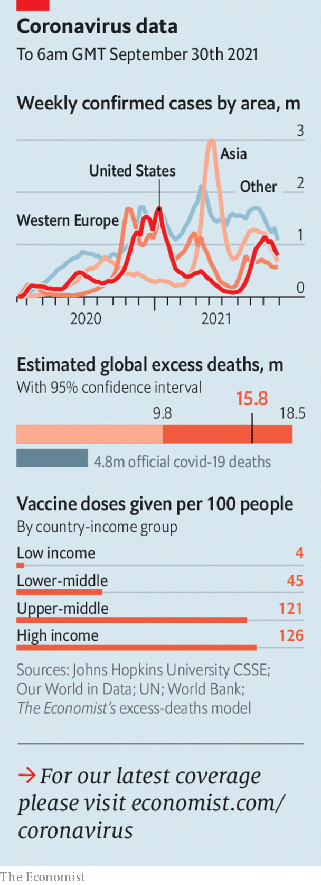

###### 

# Politics this week 

#####  

 

> Oct 2nd 2021 

After  the Social Democrats (SPD) emerged as the largest party, overtaking the Christian Democrats and their Bavarian allies who currently lead the ruling “grand coalition”. But forming a new government will probably take many weeks, as it will almost certainly involve a three-party coalition. Olaf Scholz, the SPD’s candidate for chancellor, is the most probable successor to Angela Merkel, at the head of a “traffic-light” coalition including the Greens and the pro-business Free Democrats, though this is by no means guaranteed. Armin Laschet, who led the Christian Democrats to their worst-ever defeat, is facing pressure to resign, but insists he still has a chance to construct his own coalition.

Iceland fell short of having Europe’s first parliament where women hold most of the seats, following a recount after its election. Women took almost 48% of the seats. The left-right coalition increased its governing majority.


An independent investigation claimed that 83 aid workers sexually abused girls and women while responding to an outbreak of Ebola in the Democratic Republic of Congo. Staff from the World Health Organisation are among the accused.

Fighting between jihadist groups in Nigeria left dozens dead. Islamic State West Africa Province is gaining the upper hand over Boko Haram, which has spent a decade kidnapping schoolgirls and strapping bombs to children. The latest fight was over which group gets to “tax” fishermen.

Jihadists from a previously unknown group claimed that they had killed six intelligence officers in Sudan. The country’s transition to democracy is looking fragile, two years after the overthrow of Omar al-Bashir, a bloody dictator who ruled for 30 years.

, suspended parts of the constitution and said he would rule by decree. This comes after a power grab in July when he suspended parliament and seized emergency powers.

A judge in Mexico refused to issue arrest warrants for 31 scientists whom the country’s attorney-general wants to prosecute for mishandling funds. The lack of evidence for the charges, and the fact that the law was not in force at the time of the alleged crime, has led to accusations that the government of Andrés Manuel López Obrador is trying to politicise public life.

Haiti’s general election was postponed yet again, when Ariel Henry, the prime minister, removed the council that was to oversee the poll. Mr Henry, mired in conspiracy theories about the assassination of the country’s president in July, says he would like to hold the election next year.

Fighting between rival gangs at a prison in Ecuador left 116 inmates dead. At least ten men were decapitated. The gangs have links to Mexico’s drug cartels.

, an executive at Huawei, a Chinese tech firm, was allowed to fly home to China from Canada after almost three years of fighting extradition to America. Ms Meng had admitted to misleading bankers about Huawei’s links to a company active in Iran. At almost the same time two Canadian prisoners in China, Michael Kovrig and Michael Spavor, were allowed to fly back to Canada. The two Michaels are widely thought to have been held as hostages, pending Ms Meng’s release.

, including many industrial areas. Reasons for the cuts ranged from the high price of coal to efforts by some provinces to meet strict environmental limits on energy consumption.

Officials announced that foreign spectators will be barred from the Winter Olympics to be hosted by Beijing in February, because of covid-19.

Safety first

 will be the next prime minister of Japan, after the ruling Liberal Democratic Party elected him as its president. The former foreign minister takes over from the increasingly unpopular Suga Yoshihide, who is stepping down amid widespread criticism of the government’s handling of the pandemic. Mr Kishida, who trumped the public favourite, Kono Taro, is seen by the party as a safe pair of hands.

 


Manny Pacquiao, a senator in the Philippines and a world-champion boxer, announced his retirement from the sport and his intention to run for president. The Philippine constitution limits presidents to a single term but Rodrigo Duterte, the combative incumbent, will still be on the ticket; he has said he will run for vice-president.

Appearing before a Senate committee in Washington General Mark Milley, the chairman of the Joint Chiefs of Staff, said that he and others had urged Joe Biden to retain 2,500 troops in Afghanistan in order to defend Kabul and slow the Taliban’s advance. This could have allowed for possible talks, though the general admitted that the outcome might have been the same. Mr Biden has said he received no such advice ahead of America’s speedy withdrawal in August.

A study from Oxford University found that the covid-19 pandemic has led to a drop in life expectancy not seen since the second world war in western Europe. Across the 29 rich countries studied the biggest fall in life expectancy was among American men, who saw a decline of 2.2 years in 2020 relative to 2019.

There were 21,570 homicides in America last year, according to the FBI, up by 29% from 2019. The homicide rate rose from 5.1 to 6.5 per 100,000 people. This was still well below its peak of 9.8 in 1991.

Fuelish things

. One cause was a shortage of lorry drivers to deliver the stuff, exacerbated by Brexit, which has made it harder and less attractive for foreign drivers to work in Britain. Another cause was panic-buying. Despite government assurances that there was plenty of fuel in depots, drivers flocked to fill their tanks. Other European countries also had fuel-supply problems, but Britain’s were especially severe.

