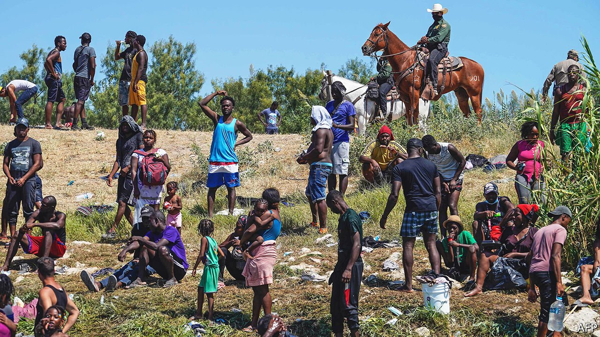

###### The rest is history

# Americans have forgotten how their government shaped Haiti 

##### The migrant crisis is partly America’s doing, but not for the reasons advertised by outraged activists 

 

> Oct 2nd 2021 

“I’M PISSED,” said Representative Maxine Waters outside the Capitol on September 22nd. “What we witnessed was worse than what we witnessed in slavery.” Ms Waters was referring to images of Haitian migrants stalked by border agents on horseback in Del Rio, Texas, on the border with Mexico. The agents appeared to be whipping them. The NAACP, a civil-rights organisation, compared the photos to an overseer lashing his slave. Entertainment outlets invited historians—and the vice-president—to muse on the antebellum symbolism of the pictures.

The border agents, it later transpired, had not whipped anyone. But Edwidge Danticat, a Haitian-American novelist, had seen another parallel. The images, she told NPR, a public radio station, recalled scenes of forced labour during the American occupation of Haiti, when white marines, also on horseback, had towered over Haitians. Unlike the slavery comparisons, these echoes were of a history few Americans know anything about.


Haiti once mattered to Americans. The revolution of 1791-1804 had seismic repercussions. “All of the mightiest armies in the world [were] defeated by an army of enslaved people,” explains Michael Harriot of The Root, a magazine. The Haitians defeated the British, the Spanish and the French. For black folk and white abolitionists, the first black republic heralded the promise of freedom; for American slaveholders it brought fear. When France moved to blockade the new republic, President Jefferson joined in. Duelling images of Haiti, both a beacon and a bother, competed in the public imagination for a century.

In the 20th century America expanded its sphere of influence, and took an increasing interest in Haitian affairs. It took Haiti’s gold reserves away on gunboats, then intervened to guarantee American banking interests. After the country’s president was assassinated in 1915, marines occupied Haiti for 19 years. The country was run much like the American South, with black people as second-class citizens. A photo of the resistance leader Charlemagne Péralte—Christ-like, spreadeagled on a cross—could have been snapped at a lynching back home. Ms Danticat’s uncle once watched marines kick around a cut-off Haitian head.

Later interventions were more subtle. America brought business opportunities to Haiti, but also backing for despotic dictators—namely the Duvaliers, from whom many Haitians fled between the 1950s and the 1980s. Subsequent American interference was viewed with suspicion. In 2019 protesters sacrificed a pig outside the American embassy to show their contempt for the Trump administration’s support for the unpopular Jovenel Moïse (the president backed by America until his assassination in July). Legend has it that a pig was sacrificed by Haitian revolutionaries the week before the uprising. But the Haitian equivalent of a re-enactment of the Boston Tea Party was lost on most Americans.

Some frame the current migrant crisis within the scope of American meddling. Daniel Foote, the US special envoy to Haiti, resigned on September 22nd citing the “hubris” of constant interventions. Others consider it unhelpful or misguided to rake through centuries of historical wrongs. America cannot be blamed for the devastating earthquake of 2010, for example, which drove many Haitians to South America (from where many of the most recent migrants arrived at the Texas border). But a country first has to know what it has done to understand whether it is responsible for the consequences.

Black Americans too have become too inward-looking, argues Ajamu Baraka of the Black Alliance for Peace. Too often, expressions of solidarity are empty theatre, such as Congresswoman Sheila Jackson Lee’s visit to the Del Rio camp after it had been cleared. In reality, the relationship between Haitian and black Americans at home is characterised by competition for jobs and livelihoods, not a shared admiration for Toussaint Louverture or Jean-Jacques Dessalines, explains George Wilson of the University of Miami.

In 1994, shortly before another American intervention, Joe Biden said that America would not notice if Haiti sank into the sea. When his comments resurfaced in response to the images of migrants deported to Haiti, hundreds voiced their disgust on social media. Meanwhile, a rally held on September 26th in downtown Chicago by a coalition of Haitian-American leaders attracted only a hundred people. Chicago’s founder, Jean Baptiste Point du Sable, was a Haitian immigrant, whose name adorns schools, parks and, officially, the famous Lake Shore Drive expressway. But not much has changed. Americans still don’t know about Haiti. ■

