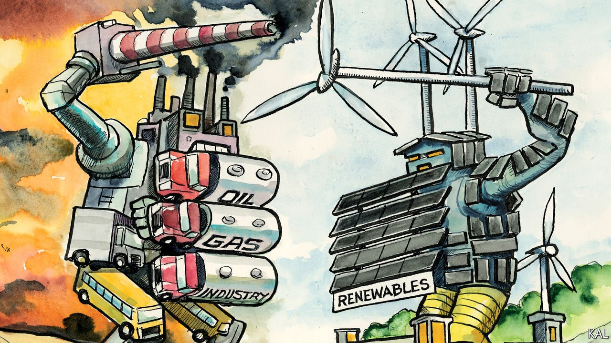

###### Lexington

# America’s green energy industry takes on the fossil-fuel lobby 

##### Renewable energy is growing fastest in conservative states. So why don’t Republicans love it? 

 

> Oct 2nd 2021 

ONE WAY TO read the Democrats’ wished-for budget bill is that it signals a new age of renewable energy in America. Once a laggard by European standards, the fast-growing industry is central to Joe Biden’s plan to decarbonise the grid. Hence the Democratic effort to make the tax credits that wind and solar companies enjoy more generous, push utilities to buy more of the electricity they produce, and penalise any that do not. The administration believes the boost this would give to wind and solar firms would enable them to supply over half of the country’s electricity by 2030.

Yet there are reasons to take a more cautious view of the industry’s prospects. Even if most of these boosterish measures made it into legislation, it would be on a partisan basis. That would leave them vulnerable to a Republican administration less friendly to renewables, as the last one was, and the next may well be.


Donald Trump, who falsely claimed that renewables were expensive and useless and that wind turbines cause cancer, tried to handicap the industry for the benefit of the fossil-fuel producers and lobbyists he stocked his administration with. He scrapped Barack Obama’s main effort to reduce emissions from thermal power-stations, from which renewables stood to gain. He hobbled the solar industry with import tariffs. He opened public land and sea to oil and gas exploration but not to renewables.

His administration also buried official research favourable to renewables—on which investors rely—and approved a fraction of the wind and solar projects its predecessor had. It is hard to imagine a second Trump administration (a distinct possibility) sticking with a bold pro-renewables strategy. And there are signs that Mr Trump has politicised the issue in his party more broadly.

Most Republican politicians have been at least acquiescent towards the rise of renewables—which is why Congress has routinely renewed the tax credits—even as they oppose unambiguous climate-change policy. Yet Mr Trump has inspired anti-renewables campaigns in several states, including North Carolina, North Dakota and Texas, which has more combined wind and solar capacity than any other. Its ambitious governor, Greg Abbott, blamed a catastrophic grid failure in February on intermittent wind power—despite official findings that poorly maintained gas power stations were mostly to blame—and ordered the state regulator to penalise the renewables industry.

It is Canutian politics. Even without subsidies, wind and solar power are often the cheapest new source available, so sure to grow. They are also popular, having created a lot of jobs, especially in Republican states. Iowa, Texas, Oklahoma and Kansas are the country’s top wind-energy producers. Texas employs almost as many people in wind, solar and electricity storage as the entire mining industry that Mr Trump used to harp on. Why are Republican leaders not more persuaded by such benefits?

The main reason is a familiar one. America’s fossil-fuel lobby is well-organised, ruthless and dug-in on the right. Once scattered across the country, it is concentrated in a handful of those same conservative states, especially Texas and Oklahoma, where no elected Republican dares cross it. Yet its influence extends further. It has one of the most powerful lobbying operations on K Street and, through the operations of Charles Koch and other hydrocarbon tycoons, a network of think-tanks and propagandists adept at blurring the lines between economics, libertarian ideology and conspiracy theory. The Koch-linked Texas Public Policy Foundation made the running in blaming wind for the state’s recent blackout. Like the pro-gun lobby, another skilful circumventer of public opinion, the fossil-fuels camp has also propagated a powerful conservative mythology. In contrast to cosseted renewables, it claims to be a preserve of wildcatting free spirits, which is half true, and unsubsidised, which is not.

The renewables industry’s ability to fight back has until recently been limited. It was for years too small to lobby effectively and its diverse technologies made it slow to get organised. It was therefore chiefly represented in the battle for influence by environmentalists. This was a good way to woo Democrats. But it helped its enemies on the right misrepresent the industry—now the source of around 20% of America’s electricity and over 400,000 jobs—as a left-wing boondoggle.

Early this year the main wind trade group was relaunched as the American Clean Power Association (ACP), a multi-technology lobby. Its members include the industry giant, NextEra Energy, which is no one’s idea of hairy greenery. The Florida-based utility, whose market valuation last year briefly exceeded that of Exxon Mobil, has lobbied against rooftop solar panels and hydropower and is led by a registered Republican. “As a trillion-dollar industry we need to make the economic argument for ourselves, not only the environmental one,” says the trade association’s CEO, Heather Zichal. Yet changing the politics of this issue will be harder than the economics might suggest.

Even where renewables create lots of jobs, they tend to be transient. It takes a lot of workers to build a solar or wind farm, but few to maintain them. Local support for such projects tends therefore to be shallow. It cannot be compared to the visceral attachment of a small Appalachian community to the coal industry, even years after its local mine has closed.

Winds, but no change

And the fossil-fuel lobby is not about to give up. By one calculation it outspent its renewables counterpart last year by 13:1. The enduring influence of mining also shows how long a well-organised lobby can outlast its economic relevance. Indeed, the sense of loss radiated by a dying industry was perhaps what made mining so attractive to the grievance-mongering Mr Trump in the first place. The economics of American energy is being transformed; the politics, not so much.■

For more coverage of climate change, register for The Climate Issue, our fortnightly , or visit our 

