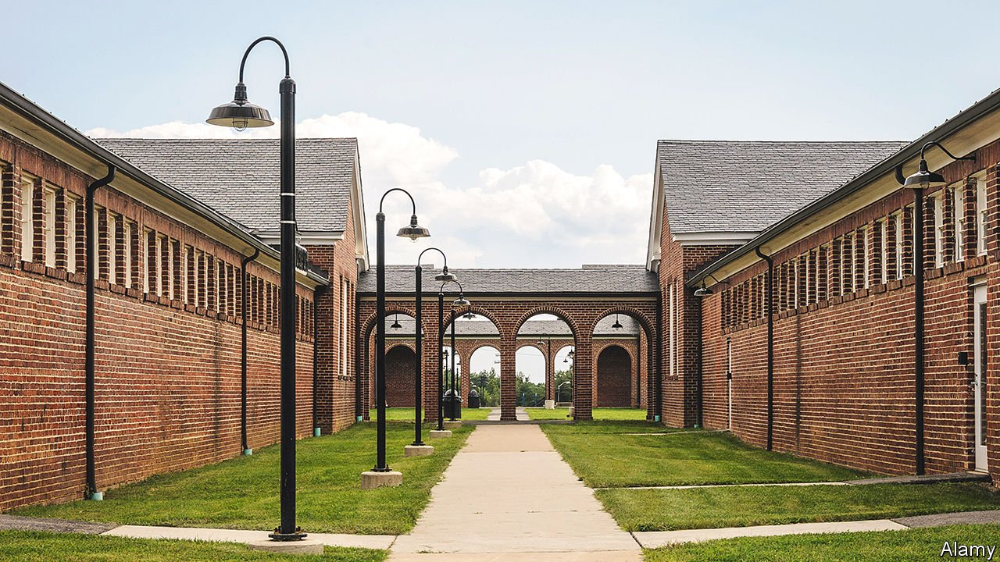

###### Fulsome

# Gentrifying prisons in America 

##### The curious appeal of disused penitentiaries 

 

> Sep 30th 2021 

“I WOULD CONSIDER Lorton a hell-hole, being that life is always on the line,” Andre Mitchell, an inmate at a prison in Virginia, told a researcher in 1990. “At all times really. I never get to relax.” How restful he would find it today. The building in which he slept has been turned into serene apartments, their patios dotted with deckchairs. An outdoor pool, surrounded by plants, glints in the sun. Nearby, within the vast, windowless walls of what was a maximum security unit, a shopping centre is being built, the final stage in the development of a once overcrowded prison complex into “Liberty”, a spacious “urban village”.

The 80-acre development is a public-private partnership between Fairfax County and two development companies. They were drawn to the prison’s site, in the tech hub of northern Virginia, and to its design. Established in 1910 as a model jail, Lorton Reformatory resembled a campus, with walkways between dormitories and lots of outdoor space. Its inmates were taught vocational skills. But as more punitive ideas about incarceration returned and its population swelled during the “war on drugs”, the prison became violent. It closed in 2001.


Transforming a prison into fancy homes while acknowledging its past is a balancing act, says Jack Perkins of Elm Street Development, one of the developers. In the 171 apartments, most of which are rented, 44 of them as affordable housing, the original windows (high in the ceiling) have been given larger openings. Signs warning against loitering and unauthorised gatherings remain, as do guards’ huts at the peripheral fence. There is a Reformatory Way and a Sallyport Street. Nearby, a museum named after Lucy Burns, a leader of the National Women’s Party, tells the history of the suffragettes imprisoned in a women’s workhouse in Lorton.

Marketing all this seems to have been a dream. Liberty’s logo is an image of a watchtower, of which there are eight, all renovated, dotted around the site. When Francis Cordor, a software engineer who emigrated from Liberia 20 years ago, saw that one of them loomed over one of 181 new houses, he knew he wanted to buy it. “It makes me think of the passing of time, how places can improve,” he says, adding that an elderly neighbour told him Lorton had once been synonymous with horror.

Though its architecture makes this a particularly habitable prison, it is not the only one: across America, former jails are being turned into housing. Even as the prison population has fallen, new jails continue to be built. That has left a stock of enormous, solidly constructed buildings, which tend to come with a lot of surrounding space. In the Bronx, a juvenile detention centre has been demolished to make way for a five-acre (20,000 square metres) affordable-housing development. In St Louis, Missouri, the former county jail will be converted into flats. Inhabitants of such developments like the modernist industrial design jails seem to encourage, and the space. They also like the fact that they can leave.

