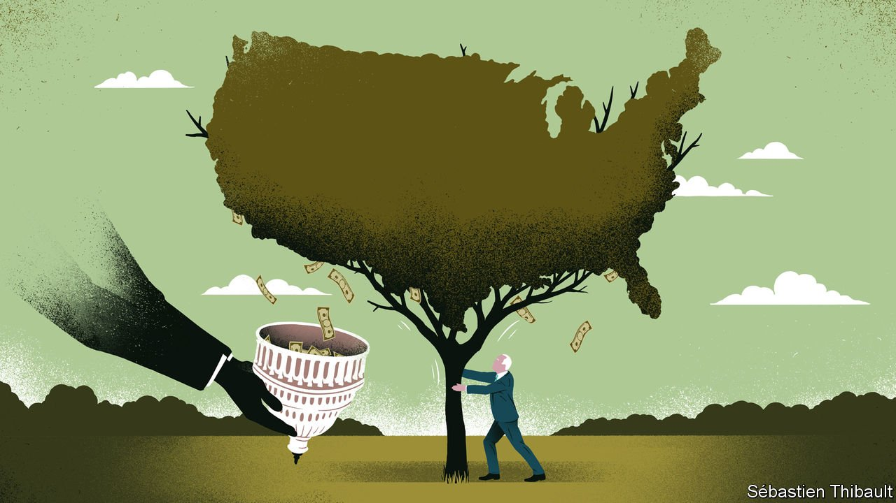
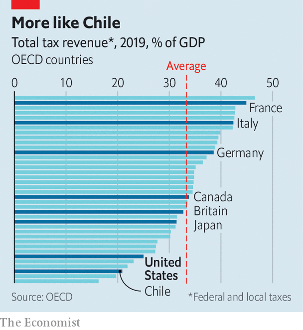

###### The Democrats’ tax plans

# New taxes will hit America’s rich. Old loopholes will protect them 

##### The first big tax rise in nearly three decades is just a first step 

 

> Oct 2nd 2021 

THE LAST time Congress passed a significant tax increase, Seinfeld won an Emmy award, Nirvana unplugged their guitars for MTV and lawmakers were pondering whether to vote for NAFTA. Early in Bill Clinton’s presidency, in 1993, Congress raised personal and corporate income taxes. Since then, almost every tax bill in Washington has lowered them. In aggregate America is now among the most lightly taxed countries in the developed world. Its overall tax-to-GDP ratio was 24.5% in 2019, nine percentage points below the average in the OECD, a group of mostly rich countries (see chart).

 


The $3.5trn social spending bill (equivalent to 1.2% of the next decade’s projected GDP) wending its way through Congress proposes to change this. Passage would require a party-line vote in the Senate, with all Democrats supporting it (which currently looks doubtful). Its provisions would touch many facets of American life: monthly payments to parents with children, funding for universal pre-kindergarten and incentives for power companies to use renewable energy. Just as significant is its potential impact on America’s tax system. “This bill will signal that Congress can actually raise taxes sometimes, as opposed to simply borrowing and kicking the can of financial burdens down the road to our children. I much prefer tax-and-spend to borrow-and-spend,” says Steve Rosenthal of the Tax Policy Centre, a think-tank.


America’s federal income taxes are already progressive: those at the top pay proportionally more. The proposal approved by the House Ways and Means Committee would make them more so, increasing the top rate for personal-incomes taxes to 39.6% from 37%. Those with more than $5m in income would face an extra 3% levy; the top rate on capital gains would climb to 25% from 20%; and the top rate for corporate taxes would rise to 26.5%, partly reversing cuts passed under Donald Trump in 2017 (his signature legislative accomplishment). Voting on the bill may take place in the coming weeks, possibly wrapped into a package that also raises the debt ceiling. In order to secure full backing from Democrats, some of these tax increases will be watered down.

Yet headline rates are not the same as what people actually pay. A series of deductions, from mortgage interest to local taxes, let the wealthy cut their bills. The ultra-rich have even more room to manoeuvre. Emmanuel Saez and Gabriel Zucman of the University of California, Berkeley have found that the 400 wealthiest Americans face lower tax rates than the middle class, because they collect much of their income as corporations. Reporting this year by ProPublica, a non-profit investigative news organisation, showed that tycoons like Jeff Bezos, founder of Amazon, and Elon Musk, the boss of Tesla, consistently paid little or no tax.

The House bill aims to change that. The Joint Committee on Taxation, a non-partisan research arm of Congress, found that most of its tax increases would land on households making $1m or more per year. Their taxes would rise by 11% in 2023. Meanwhile, taxes would drop for everyone making less than $200,000, with the biggest benefits flowing to people on the lowest incomes. “This will put a serious dent in inequality. The major thrust of the bill is that it will make major investments in the middle class and the working class, paid for by very significant tax increases on the rich and corporations,” says Seth Hanlon of the Centre for American Progress, a left-leaning think-tank.

Many businesses are, unsurprisingly, less enthusiastic. The US Chamber of Commerce has called the proposals “an existential threat” to American prosperity. Expert studies do not quite hit the same alarmist notes, but they do raise questions about the economic impact. The Tax Foundation, an independent policy group, concludes the bill would lower GDP by about 1% over the coming decades. Within the White House, economists disagree with such estimates. Instead, they argue that a more even distribution of incomes would put more cash in the hands of poorer people who generally spend a greater share of their earnings, thereby boosting growth.

The most stinging criticism from the left is that the bill will fail to close all those loopholes. As it stands, someone who strikes it rich on properties or stocks can put those profits beyond the reach of the Internal Revenue Service so long as they hold on to their assets. If their heirs cash out, the basis for their capital-gains level would be the value of the assets at the time of inheritance. The fix for this is relatively simple: tax capital gains at death. This was a key component of Mr Biden’s initial tax plans. But after much lobbying, the proposals now in Congress make no such change. “If you’re not going to tax at death, then you really do have to worry that the general increase in capital-gains taxes will be counterproductive. You’ll have fewer and fewer people selling their assets. Revenue could actually decline,” says Alan Viard of the American Enterprise Institute, a right-leaning think-tank.

Political calculations may also lead to an expansion of loopholes. One surprisingly progressive part of Mr Trump’s 2017 tax reform was a $10,000 cap on deductions of local taxes from federal tax bills. That, though, was unpopular in high-tax states such as New York and California. Democratic representatives from these states may prevail in getting the ceiling lifted for these deductions. The benefits of this change would flow mainly to the rich.

These revenue shortfalls magnify another problem. According to the abstruse rules of reconciliation—the legislative process by which this bill could pass—new expenditures must be roughly matched by new revenues. Yet Mr Biden promised during his campaign to raise taxes only on people with incomes of more than $400,000 (a pledge which, narrowly defined, the proposal honours). How to find the extra cash? Much of the answer comes from the increase in corporate tax. This, however, is an inefficient form of taxation, a roundabout tax on shareholders and a deterrent to investment by companies. Adding in state levies, the House bill would push America’s corporate taxes over 30%, among the highest in the rich world.

“If the United States wants to significantly increase spending, we should fund that in a less economically harmful way,” says Erica York of the Tax Foundation. One option, used by almost all rich countries except for America, would be a federal value-added tax on consumption. A carbon tax would be another. A third—more experimental—would be a wealth tax. But none of these ideas ever truly figured in the months of negotiations leading to the bill. America remains exceptional. ■

