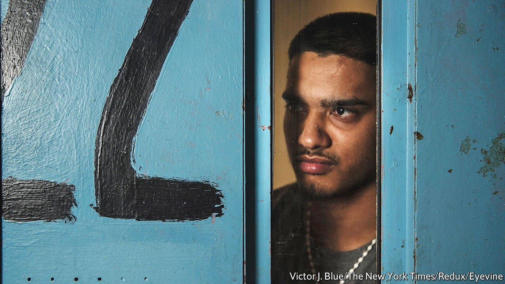

###### Aggravated robbery

# The jail on Rikers Island is both appalling and generously funded 

##### It costs $438,000 to jail one person for one year there 

 

> Oct 2nd 2021 

ISAABDUL KARIM, aged 42, was the 11th person to die on Rikers Island, New York’s penal colony, this year. “He shouldn’t have there in the first place,” says Corey Stoughton of the Legal Aid Society, which provides free legal assistance to the poor. Mr Karim was sent to New York City’s biggest jail in August for a minor parole violation, despite his parole ending in June. He was held in the “intake unit” for ten days. He slept in his wheelchair and contracted covid-19 in a crowded space. The city’s department of correction said his death appeared to be natural. Since then, another inmate has died on Rikers.

The death toll from covid-19 continues to mount—our excess mortality tracker shows that daily deaths from the virus in America are greater than in all other rich countries combined. Prisons, which are often crowded, poorly ventilated and where the value placed on a life is low, have been hit particularly badly. Yet Rikers is something else. It stands out as an example of how some institutions are unreformable.


Jessica González-Rojas, a member of the state assembly, saw an inmate attempt suicide during a recent visit. She also saw uncollected rubbish and vermin and had to step over faeces and urine. The incarcerated told her of not being fed and of not receiving medical care. This is not exactly news: the island has been poorly managed for a very long time, says Jullian Harris-Calvin, of the Vera Institute of Justice, a think-tank. The city council voted in 2019 to close Rikers permanently by 2027. Bail reform meant fewer people were sent to the island. In April 2020, in part because of covid, fewer than 4,000 were incarcerated there, a drop from the 11,000 when Bill de Blasio, the mayor, took office in 2014.

Rikers seemed to be an ex-problem, and was even sometimes presented as a model of how the prison population could be managed down. More recently, numbers have increased again, to 6,000. At the same time correction officers have stopped going to work. New York City’s guards are permitted to take unlimited sick days, and as many as a third call in sick on a given day, forcing those on duty to work double and triple shifts. There are not enough guards to transport the incarcerated to court hearings, further extending stays at Rikers.

The misery at Rikers is not for lack of resources. The jail’s population fell by half between 2012 and 2020, yet its budget grew by 24%. It costs $438,000 to jail one person there for one year. Of this $379,216 goes to personnel costs; less than 5% goes to services like substance-abuse treatment. The average salary for guards, after five and half years on the job, is $92,073. In 2012, the ratio of inmates to officers in the city was 7:5. In 2020 it was 1.6 officers per inmate.

And yet, the island’s chief medical officer said he is seeing “a collapse in basic jail operations”. On September 29th a federal judge issued an emergency order to safeguard inmates’ wellbeing. Ms Harris-Calvin says the only way to fix Rikers is to “get people off that island”. New York’s politicians and prosecutors seem to agree. Manhattan’s DA suspended bail for non-violent crime. Kathy Hochul, New York’s new governor, issued an executive order allowing virtual court hearings on Rikers. She also signed a bill which will remove minor bail infractions, such as missing curfew, as reasons to be locked up. It does not take effect until next year, but 191 people were released immediately. Mr Karim was eligible, but he missed the cut-off date by a day. ■

