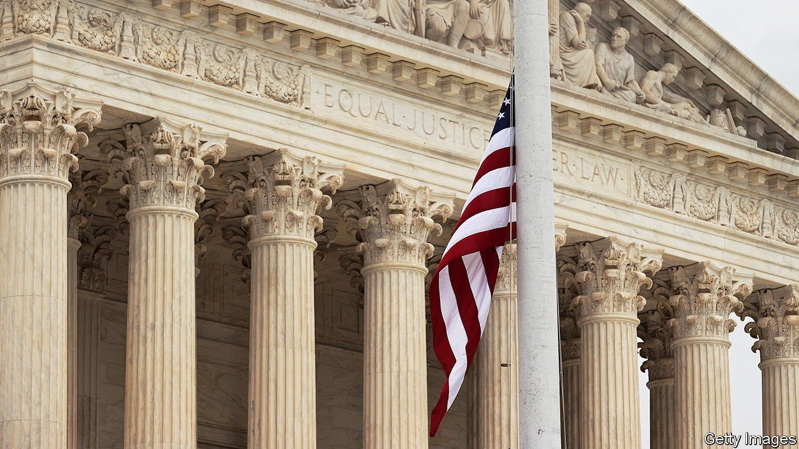

###### Term time

# The new Supreme Court term is about to begin 

##### The conservative supermajority faces disputes over abortion, guns, religion and more 

 

> Oct 2nd 2021 

TURTLES PEER down on visitors to America’s Supreme Court and support lamp-posts on its plaza. But for an institution engraved with the semiotics of slow, steady change, the Supreme Court has been on a bit of a tear. On October 4th, for the sixth straight year, the justices will take the bench with a lineup that differs from the previous term’s opening-day roster. After a tumultuous summer break, the first complete term with all three of Donald Trump’s appointees promises to reshape American law on its most contentious fronts.

Along with disputes over immigration policy and pandemic-inspired pauses on evictions, the most divisive issue in American politics reached the justices while they were on holiday, when the court declined to stand in the way of a Texas law that bans abortion after six weeks of pregnancy. That demurral has, in effect, erased Roe v Wade, the 1973 decision protecting abortion rights, for 7m Texans. But officially scrubbing Roe from the books is on the agenda on December 1st, when the justices take up Dobbs v Jackson Women’s Health Organisation. Dobbs concerns a 15-week ban enacted by Mississippi in 2018.


The Mississippi law gives the justices a chance to reconsider viability—the line (about 24 weeks’ gestation) that, since Roe, has distinguished between protected terminations and those which states may bar in the interest of protecting fetal life. In June 2020, Mississippi told the justices that its law could be upheld without undermining Roe and other long-settled cases. A year later—after Justice Amy Coney Barrett had succeeded Ruth Bader Ginsburg to create a 6-3 conservative majority—Mississippi sharpened its tune. With a more receptive audience, the state spent the bulk of its brief contending that the court’s abortion precedents are “egregiously wrong” and should be overruled, not merely tinkered with.

Another contested liberty—the right to keep and bear arms—has a brighter future. On November 3rd, in New York State Rifle &amp; Pistol Association v Bruen, the justices will hear a challenge to New York state’s rules governing concealed-carry licences. New York issues “restricted” permits for people to hunt or carry a handgun to target practice, but it requires “proper cause”, a special justification, before it grants a general licence to carry a gun outside the home for self-defence. The challengers say New York “cannot reserve for a happy few a right that the constitution protects for all ‘the people’”. The state’s lawyers respond with historical examples of gun restrictions from medieval England to the founding era and beyond. In the decade-plus since the Supreme Court first recognised an individual right to own a firearm in the home, gun-rights activists have been pressing to expand the range of the Second Amendment. The justices seem to be on the brink of doing just that.

Carson v Makin, to be heard on December 8th, may buttress another project of the conservative legal movement. Maine pays private-school tuition for students in more than 100 small towns that lack a public high school. But parents may not use state money at schools that promote a particular faith—an exclusion the plaintiffs say violates the First Amendment. In 2017 the Supreme Court ruled that religious pre-schools could not be excluded from secular benefits like playground resurfacing. Last year, a 5-4 majority sided with Montana parents who wanted to use state scholarship funds at religious schools. Carson will push this principle one step further if it requires states to fund explicitly sectarian education whenever it offers state money for private schooling.

With only 32 cases on the docket (about half its recent load) as The Economist went to press, a momentous term could soon become more so. The justices are mulling whether to hear a showdown over affirmative action at Harvard University. This could up-end precedents, dating back to 1978, allowing schools to pursue diversity through race-conscious admissions. Challenges to private-sector union rules and the power of the Environmental Protection Agency are in the pipeline, too, along with still more abortion and gun cases.

Justice Stephen Breyer, the 83-year-old leader of the court’s depleted liberal bloc, has been out promoting his new book on the purported non-political nature of the place where he has worked since 1994. His colleagues to the right, Clarence Thomas and Amy Coney Barrett, have made similar remarks in recent speeches. Those assurances come amid plummeting support for the institution. Last week Gallup reported that just 40% of Americans approve of the Supreme Court. That is the lowest percentage since 2000, but support could dip further if the court ends its term next spring by reneging on half a century of protections for women while fortifying gun rights. There is little doubt the court will continue to move the country to the right. The question is how far and how fast. ■

