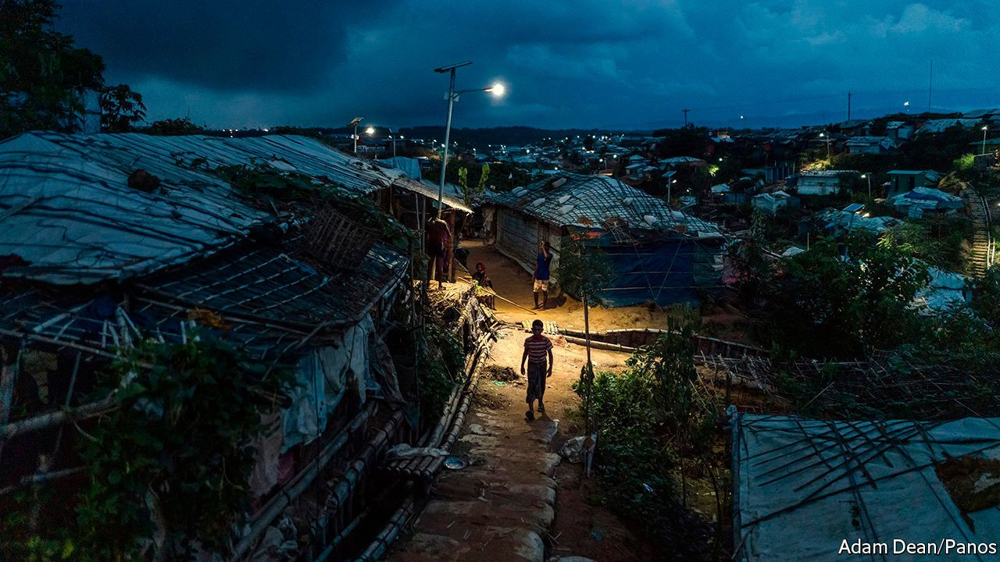

###### Shadowed by violence

# A Rohingya leader’s murder highlights rising insecurity in refugee camps 

##### Militias and gangs terrorise the residents and wage war against each other 

 

> Oct 9th 2021 

DEATH THREATS did not appear to faze Mohib Ullah. “If I die, I’m fine. I will give my life,” he told reporters in 2019. A science teacher in Myanmar before he and hundreds of thousands of other Rohingya refugees were forced to flee in 2017, the 46-year-old became one of the displaced community’s most prominent voices on the international stage. He compiled databases of Rohingyas killed in Myanmar, organised huge rallies and spoke at the UN. Yet his fame and his resistance to violence also earned him enemies. On September 29th gunmen burst into his shack in the Kutupalong refugee camp in southern Bangladesh and shot him dead.

A persecuted ethnic minority in their native Myanmar, some 700,000 Rohingyas were chased from their homes by the Burmese army and allied militias four years ago. Their accounts of rape, murder, and mutilation shocked the world. Yet the violence did not stop at the border. The sprawling refugee camps in Bangladesh—now home to more than 1m refugees—have become bases for Rohingya militant groups and criminal gangs. The most powerful is the Arakan Rohingya Salvation Army (ARSA), a cross-border insurgency. (Bangladeshi security forces deny that there are any militants in the camps.)


Mr Mohib Ullah’s brother, who was with him when he died, blamed ARSA for the assassination. The insurgents opposed Mr Mohib Ullah’s peaceful approach and tried to co-opt him, which he resisted. ARSA denied responsibility for his shooting, pointing the finger instead at criminal gangs.

These gangs run drug- and people-trafficking rings and wage bloody feuds against one another, terrorising the camps’ residents. Violent crimes take place “all the time at night”, says a Rohingya woman. These include robberies, assaults, hostage-takings and killings. So afraid is she to go outside after dark, she says, that she uses a corner of her tiny shelter as a toilet. Kidnappings are common, too. One Rohingya man tells of a friend who was abducted by an armed group. They threatened to kill him if his family did not pay 50,000 taka (US$583), says the man.

Rohingya women have come under particular attack, as men—often linked to gangs or militias—try to impose conservative gender norms. When Nur (not her real name), a young Rohingya woman, won a scholarship to university, men affiliated with ARSA from within her camp gang-raped her and then extorted money from her family, she says. They continue to harass her parents, insisting her father marries her off. He refuses. Other women, especially those who work with NGOs, are threatened with violence if they do not stay home or hand over a slice of their earnings.

Covid has made matters worse. Tight restrictions imposed on the camps by the Bangladeshi government have slashed the number of aid workers allowed inside. Bangladeshi forces still patrol the camps, including after dark, but their presence is patchy, says John Quinley of Fortify Rights, an advocacy group. They drive through the main road maybe once or twice at night, says the Rohingya woman. Many parts of the camps are inaccessible by road. Naimul Haque, a commander of Cox’s Bazar Armed Police Battalion, which is responsible for security in the camps, disagrees, saying that police patrol in cars and on foot throughout the day and night. The Rohingya “are living here very peacefully”, he says. “They’re very happy.”

In the past reports of rising insecurity in the camps have been met with curbs on residents’ freedoms. In 2019 Bangladesh’s government banned refugees from owning SIM cards and cut mobile-internet networks in the camps. At the start of 2020 it erected barbed-wire fences and watchtowers around them.

Bangladeshi authorities have launched an investigation into the murder of Mr Mohib Ullah, and have arrested five suspects. The foreign minister has vowed to bring the killers to justice. Yet even as Rohingyas in the camps mourn Mr Mohib Ullah, some fear the fallout will be yet more restrictions on their lives.■

