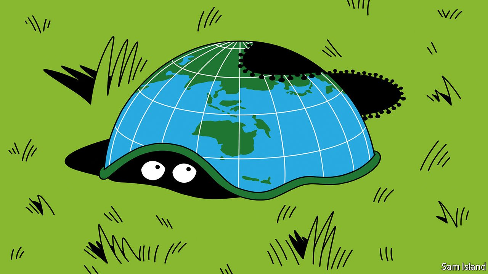

###### Banyan

# Asian countries are at last abandoning zero-covid strategies 

##### Despite the risks, they are right to do so 

 

> Oct 7th 2021 

FOR MUCH of the pandemic, many of the wealthier countries and territories in the Asia-Pacific region have pursued a “zero-covid” strategy, whether explicit or not. The success of the approach, involving closed borders, quarantine hotels and severe lockdowns, has generally been spectacular. Hong Kong has had no locally transmitted infections since mid-August. In the pandemic’s first year, Taiwan officially counted about a dozen deaths from covid-19. New Zealand is the standout zero-covid state, with just 27 deaths. Indeed, because fewer people died of things like flu or road accidents in lockdown, both countries recorded fewer overall deaths than in a normal year, according to The Economist’s excess-deaths tracker.

Yet those with a good first act are struggling in the second. The coronavirus, especially the highly infectious Delta variant, usually has the last word. In Taiwan cases leapt in May, and the official death toll has risen to nearly 850. In Singapore daily infections have risen from low double digits in early July to more than 3,000 now. Australia, with some 2,000-odd daily cases, is following a similar trajectory. Even in New Zealand, now with double-digit daily cases, the dam has broken.


“The Delta variant is already out there. It’s too late to stop it,” says Tikki Pangestu, the WHO’s former head of research policy, now at the National University of Singapore. It is therefore appropriate for countries to abandon zero-covid strategies. Singapore was the first. In June its government said it was time to live with the virus. Singapore’s vaccination programme is Asia’s most successful, with 82% of the population fully jabbed. That boosts the case for reopening.

In late August Scott Morrison, Australia’s prime minister, announced the end of his country’s “covid zero” approach. Cases would be allowed to rise, provided that hospitals could cope with them. Once vaccination rates top 80%, perhaps by the end of the year, most restrictions would be eased. “It is time”, as Mr Morrison puts it, “to give Australians their lives back.”

Vietnam ditched its zero-covid strategy last week. This week came New Zealand’s capitulation. Though the prime minister, Jacinda Ardern, won praise for her sure handling of the pandemic, the mood has soured. On October 2nd Auckland residents defied stay-at-home orders to protest against restrictions. Two days later Ms Ardern acknowledged, “The return to zero is incredibly difficult.” She announced a “new way of doing things” that included lifting lockdown restrictions.

It remains unclear what abandonment means in practice. In New Zealand less than half the population is fully jabbed. The vaccination programme is about to go into overdrive. Yet lockdowns will probably remain on the menu, and open borders are still a long way off. Ms Ardern seems to want it both ways, promising to continue a “very aggressive approach”.

Likewise, Australia’s ending of zero covid still leaves the full reopening of borders a distant prospect. The first goal, from next month, is to allow all citizens and permanent residents back in. Many of them, astonishingly, have struggled for 18 months to get home. The idea is to let vaccinated returnees quarantine at home rather than force them into hotels. Even for such small moves, Australians deliberate every detail. The country is a long way from accepting risk and getting on with living with the virus.

As for Singapore, jitters are growing with rising cases. A rare public petition calls for mandatory quarantine for all overseas travellers. The government has reimposed local restrictions, including home-based schooling for children. One innovation, “vaccinated travel lanes” allowing quarantine-free travel with certain countries, is likely to be expanded only slowly from the current jurisdictions of Germany and Brunei.

Yet if abandonment looks like no strategy at all, then consider the alternative. Hong Kong has stuck doggedly with zero covid. A harsh, mediocre government whose public-health messaging either goes unheard or is little trusted has meant a slow vaccination drive. Less than 15% of those over 80 have had at least one jab. Because the virus is not present (for now) in Hong Kong, no level of herd immunity has been bestowed by past infections there or in the other zero-covid countries. And the low risk of infection dissuades people from getting their shots. Hong Kong’s approach condemns the territory to endless limbo. Abandonment of zero covid—for all the inevitable hesitations and temporary reversals—is the way to go.

Dig deeper

All our stories relating to the pandemic and the vaccines can be found on our . You can also find trackers showing ,  and the virus’s spread across .

