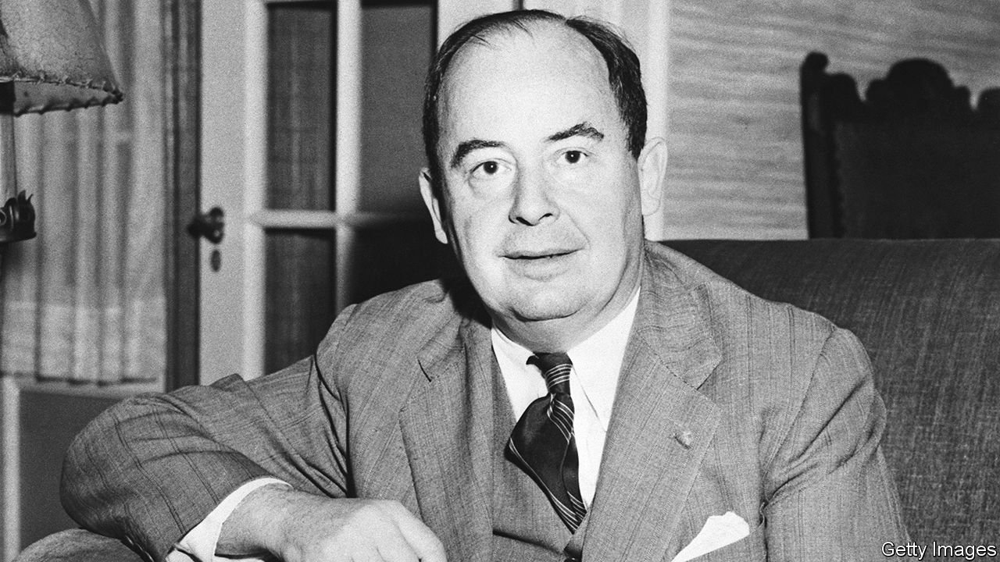

###### The history of science

# A new biography explains the genius of John von Neumann 

##### His peers transformed science. He transformed daily life 

 

> Oct 7th 2021 

The Man from the Future. By Ananyo Bhattacharya. Allen Lane; 368 pages; £20. To be published in America in February by W.W. Norton &amp; Company; $30

IN 1945, WHILE in a state of exhaustion, the mathematician John von Neumann had a kind of stammering premonition. He was in Los Alamos, working on the atom bomb, and he told his wife Klari that the “energy source” he was helping to develop would make scientists “the most hated and also the most wanted citizens of any country”. Then he informed her that his other ongoing project, the computer, would one day be even more important—and potentially even more dangerous.


Good biographies of some of the greatest mathematical minds are rare: because they were polymaths, biographers who can interpret their manifold achievements for the ordinary mortal are themselves thin on the ground. This has been von Neumann’s fate, and the upshot is that he has not had the recognition he deserves. Ananyo Bhattacharya, a science journalist formerly at The Economist, sets out to correct that injustice, and so fill a yawning gap in the history of science.

Von Neumann belonged to a small group of brilliant Hungarians, of mainly Jewish backgrounds, who in the 1930s fled Nazism for America, where they were dubbed “the Martians” because of their strange language and even stranger brains. All would transform science, but von Neumann would transform daily life, and he did so in varied and profound ways. He was undoubtedly a genius, and reading this book gives you an inkling of what that overused word really means. More than one highly intelligent acquaintance remarks that it was as if von Neumann was the only person who was really awake.

The problem facing the biographer of a mathematician is that conveying mathematical concepts in mere words risks either boring the cognoscenti or bemusing the uninitiated. Rather like the books of Stephen Hawking or Carlo Rovelli, though, this one is rewarding on different levels. Everyone can grasp the significance of the puzzles posed, and if readers want to follow the genius through the steps of his solutions then Mr Bhattacharya is a clear and authoritative guide.

Perhaps it was because he was fluent in the language of the universe that von Neumann flitted so easily between disciplines. While still a young man he made important contributions to quantum mechanics. Later he played a seminal role in the Manhattan Project that built the bomb, and devised the architecture for the first programmable computers. He laid the foundations of game theory (introducing the term “zero-sum” along the way), stimulating revolutions across the social sciences and biology. At times he was in such demand that a US Air Force plane was kept on standby to whisk him from one top-secret government lab to another.

He was equally comfortable in basic and applied research, sitting with pencil and paper in his dining room in Princeton or debating with top military brass out in the New Mexico desert; but his interests were clearly linked. He needed programmable computers to calculate the size and force of shock waves from explosions, and game theory to address the thorny question of nuclear deterrence. The years of the second world war were especially productive for him, as if he were propelled by the destruction of the “perfect intellectual setting” that was the Central Europe of his youth, not to mention the deaths of millions of its inhabitants.

And yet, Mr Bhattacharya argues, the reputation that von Neumann acquired as the coldest of cold warriors was undeserved. He knew the depths to which humankind could sink, but he was by nature more co-operative than competitive. The man from the future had seen for himself that science could be used for both good and bad, and considered the only legitimate response to be the exercise of intelligent judgment. “For progress,” he wrote, “there is no cure.” ■

An early version of this article was published online on October 6th 2021

