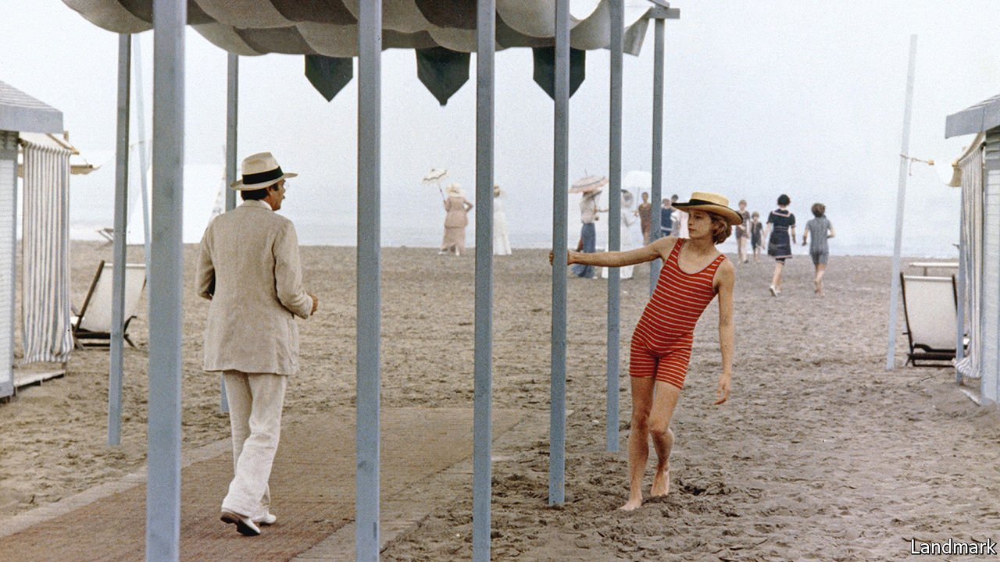

###### Literary lives

# Colm Toibin’s new novel brings Thomas Mann to life 

##### “The Magician” is a grave homage flecked with irony and mischief 

 

> Oct 7th 2021 

The Magician. By Colm Toibin. Scribner; 512 pages; $28. Viking; £18.99

THOMAS MANN’S last, unfinished novel tells of a confidence trickster named Felix Krull. In “The Magician”, Colm Toibin’s fictionalised portrait of the great German writer, the ageing Mann thinks of himself as a similar “dodger” who “got away with things”. He believes that the skill to “reverse their own story as the wind changed” is a hallmark of humankind.


In Mr Toibin’s immersive novel about the author’s life and times, Mann is a consummate actor. His “distant, bookish tone” and “personal stiffness” mask a restless and conflicted soul. Most obviously, this long-married father of six, an upright pillar of German-speaking culture, learns how to cloak his homosexual desires. After brief encounters during his bourgeois upbringing in Lübeck and Munich, Mann’s taste for younger men settles into chaste flirtations, private diaries, or just “the secret energy in a gaze”.

In politics, too, Mann knows how to dissemble and compromise. Even when his conservative patriotism has given way to outrage at the Nazis, his courage falters and he prevaricates over taking a public stand. Slowly, when an honoured exile in America, he rises to become a champion of democracy. It takes almost until the end of his 80-year life for this great pretender to feel “he could freely speak the truth”.

The saga has other threads. Mann’s unruly brood of troubled children act out all the emotional drama that the Nobel-prizewinning author of “Death in Venice”, “The Magic Mountain” and “Doctor Faustus” forbids himself. After the suicide in Cannes of Klaus Mann—reckless, outspoken, openly gay—Michael, another of Thomas’s sons, tells him that “we, your children, do not feel any gratitude to you.” The literary prophet, touted as a post-war president of liberated Germany, earns little reverence at home.

Many chroniclers, including four of Mann’s six children, have told his story. So “The Magician”, which invents dialogue but takes no flagrant liberties with facts, rests on a mountain of prior testimony. Yet admirers of Mr Toibin—best known for “Brooklyn” and “The Testament of Mary”— will see what drew him to this tormented dynasty. The Irish author has often explored same-sex love in hostile climates, unpicked the entangling bonds that parents and children share, and, especially in “The Master”, his novel about Henry James, probed the mysterious links between self-denial and creativity.

From Bismarck’s Germany to the cold war, “The Magician” covers a lot of history alongside its personal tumult. With such a wagonload of baggage, the narrative sometimes feels like a trudge. But Mr Toibin shines in close-up scenes of thwarted longing, delivering a grave homage that is nevertheless flecked with irony and mischief—just the tone Mann himself perfected. The novel gently removes a con-man’s wardrobe of disguises, while celebrating this “dull interloper become magician” for the enduring spell his art has cast. ■

