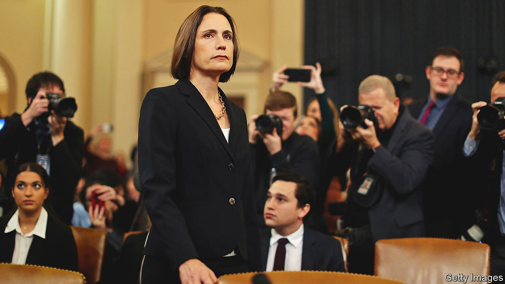

###### The Russia option

# How an English miner’s daughter rose to work in the White House 

##### Fiona Hill has a unique perspective on the dangers to American democracy 

 

> Oct 9th 2021 

There is Nothing for You Here. By Fiona Hill. Mariner Books; 432 pages; $30

WHO WAS the woman with the strange British accent testifying to Congress during the hearings for President Donald Trump’s first impeachment, suddenly in the spotlight and trending on Twitter? For the many who wondered, Fiona Hill now explains: she is a miner’s daughter from Bishop Auckland, a long-neglected town in the north-east of England, who, against the odds, went to university, won a scholarship to Harvard and became a leading expert on Vladimir Putin’s Russia. For two years she was the top adviser on European and Russian affairs in Mr Trump’s National Security Council—hence her starring role in the probe into his efforts to smear Joe Biden via Ukraine. A few in Mr Trump’s White House cruelly dubbed her “the Russia bitch”.


Readers in search of fresh insider revelations about the Trump presidency may be disappointed by her new memoir. To be sure, she is damning about her former boss. He is a misogynist, a shallow showman and supremely selfish. “I don’t believe Trump was intentionally doing something for Putin or for anyone else,” Ms Hill writes. “Trump was only ever concerned with himself.” He is incurious about details, with the significant exception of matters relating to nuclear-arms control. His vanity and fragile self-esteem make him “exquisitely vulnerable” and a liability to the country. He abused his position to attempt a “self-coup” after his defeat to Mr Biden in last year’s election. But most of this is well-known, at least among the former president’s critics.

The freshness of Ms Hill’s story lies instead in the description of her background, and the unique insights she believes this gives her into global affairs—a very different perspective from most national-security experts in Washington. With the closure of mines and other local industries, Bishop Auckland became a forgotten place devoid of opportunity. People had jobs, not careers. Her family’s poverty prevented her from taking up a place at a private girls’ school, even though it offered to waive the fees; Ms Hill’s father balked at the cost of the uniform, transport and school trips. An interview for the University of Oxford was a disaster, as she felt hopelessly out of place. A familiar trifecta of English questions (where are you from, what does your father do, what school do you go to?) kept swatting her down.

She went instead to the University of St Andrews in Scotland, where she studied Russian. Eventually, America offered an escape from British pigeonholing of accent and class. Other obstacles stood in her way, notably because she is a woman. When working on reforms in post-communist Russia she was assumed to be a prostitute on entering a hotel for a meeting. As a speaker at a conference she was mistaken for a tea lady. In the White House Mr Trump supposed she was a secretary. For years she was paid less than men who were doing equivalent jobs.

Not only did Ms Hill overcome these difficulties, she turned them to her advantage, drawing on her experiences to spot patterns and connections. In particular, she sees striking similarities between the impoverished region of her roots and disadvantaged areas of both America and Russia. The cold war had concealed the fact that Britain, America and Russia had much in common: visiting grim parts of Russia she “encountered the north-east of England on a vast scale”.

The similarities extend to politics, she argues. The chasm between ordinary people in such neglected places and the political elites creates fertile ground for populists claiming to represent their interests. Once the hope was that Russia would in time become more like America. Instead, Ms Hill suggests, the reverse has happened: “Trump would come more to resemble Putin in political practice and predilection than he resembled any of his recent American presidential predecessors.” As she watched his coup attempt develop, the parallels with Russia became striking, and alarming.

Lest they forget

Her journey from disadvantaged origins to success has echoes of the bestselling tales of Tara Westover’s “Educated” and J.D. Vance’s “Hillbilly Elegy”. In all cases education is the key. Ms Hill weaves policy wonkery into her story, liberally referring to studies by colleagues at the Brookings Institution, the think-tank where she now works. An afterword includes a checklist of ideas for how individuals, from business executives to teachers and students, can do their bit to help remove barriers to opportunity and overcome the drawbacks of “forgotten places”.

Ms Hill calls this one of the greatest imperatives of the 21st century. She may exaggerate the parallels between America and Russia (the differences in political institutions and culture are enormous). Yet the alarm she sounds is urgent. America’s political polarisation is not just a domestic problem, but a national-security one too. “I have seen first-hand just how vulnerable America is to the political afflictions that have befallen Russia,” she warns; Russia’s slide into authoritarianism since 2000 could become America’s. Just as Boris Yeltsin amassed executive powers and paved the way for Mr Putin, so the Trump presidency could allow a more capable populist to “pull a Putin in America”. ■

