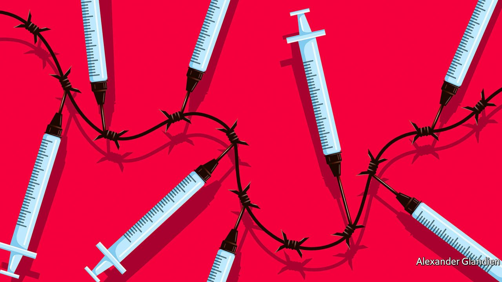

###### The world after the pandemic

# Two new books assess the geopolitical lessons of covid-19 

##### They are bleak, say “Aftershocks” and “Geopolitics for the End Time” 

 

> Oct 9th 2021 

Aftershocks. By Colin Kahl and Thomas Wright. St. Martin’s Press; 464 pages; $29.99 and £23.99

Geopolitics for the End Time. By Bruno Maçães. Hurst; 240 pages; £18.99


THERE ARE few monuments to the tens of millions of victims of the Spanish flu, overshadowed as it was by the death and destruction of the first world war. “It is difficult to assign great historical meaning to a pandemic, which is perhaps why they tend to be forgotten,” notes Bruno Maçães. Nevertheless, a catastrophe like covid-19 cries out for interpretation. It is too early to discern all the ways in which this pandemic has changed the course of history. But has it revealed anything about the structure of international politics today?

Two new books attempt an ambitiously early answer to this question. Colin Kahl, now an under-secretary of defence at the Pentagon, and Thomas Wright of the Brookings Institution, a think-tank, draw on a detailed chronicle of the pandemic in “Aftershocks”. Mr Maçães, a former Europe secretary in the Portuguese government, gives a more philosophical tour of the horizon in “Geopolitics for the End Time”. Both books seek insights into the future in the events of the past 18 months. “Conflict between great powers is back with a vengeance,” argues Mr Maçães. Messrs Kahl and Wright agree. Their collective conclusions do not bode well for future crises.

The pandemic might have become a moment for global co-operation. It did not. Instead, borders were closed and states rushed to develop their own vaccines. Little was done to protect the poorest countries from the economic damage of lockdowns or to distribute vaccines equitably. Conflicts in Syria, Yemen and elsewhere raged on; pleas for ceasefires from the UN went largely unheeded.

Mr Kahl and Mr Wright show how, even before the pandemic, strains between America and China had impeded co-operation on public health. When the virus arrived, they argue, a more even spread of geopolitical power than in past decades, along with rising nationalism, stymied both meaningful international partnership and effective American leadership. They cite COVAX, the vaccine-sharing scheme in which neither China nor America originally participated, and which struggled to compete with national procurement programmes. Partly, perhaps, because central bankers are relatively insulated from domestic politics, the financial system—quickly stabilised through collective efforts—was an exception to the general dog-eat-dog response.

Meanwhile the pandemic opened up new opportunities for competition. The supply chains that undergird the global circulation of goods became a point of contention, as Americans and Europeans quickly discovered how dependent they were on exports from China, including those of ventilators and other vital medical kit. Mr Maçães observes that China saw the pandemic as a national-security threat, rather than simply as a public-health emergency, and acted accordingly. It tried to extract political concessions in exchange for masks and vaccines, using the crisis to expand its influence. Mr Kahl and Mr Wright suggest that President Donald Trump, in turn, formulated American policy as a reaction to China.

Even supposedly neutral institutions became geopolitical battlegrounds. Among the most interesting of Mr Kahl’s and Mr Wright’s insights is the way the World Health Organisation (WHO) fell victim to political pressure. Its boss, Tedros Adhanom Ghebreyesus, at first took a conciliatory approach to China, resisting American urgings for him to be more confrontational. Dr Tedros lost patience only when the Chinese authorities made a mockery of a WHO investigation in Wuhan, denying scientists access to data and pushing them to discount the idea that the virus originated in a laboratory.

Devil take the hindmost

The two books differ in their interpretation of this renewed competition. Mr Maçães thinks geopolitical conflict is the new normal. Responses to the virus by the world’s governments have become a yardstick of their performance; their handling of future crises will be judged and compared according to the same template. States now compete with one another indirectly, he says, using technology to master threats that, like diseases, emerge from the environment rather than from their rivals.

For their part, Mr Kahl and Mr Wright detect a vicious circle in which “great-power rivalry made the pandemic both more likely and harder to contain”. Henceforth, they think, America must be prepared to confront transnational threats without expecting to collaborate with China and Russia. Both books note, as others have, that technology will increasingly be a key measure of power. Mr Kahl and Mr Wright dwell on the dark temptations of new technologies for authoritarian leaders.

Looming over these analyses is the climate calamity. Both books see the experience of the pandemic as a gloomy omen for co-operation against climate change. Mr Maçães speculates that in the future competition may focus on access to resources, such as cobalt, which are essential to green technologies. Countries that excel in decarbonisation will share their knowledge—but for a price.

Mr Kahl and Mr Wright have little faith that America and China will find a way to reform the global public-health system, much less unite to fight climate change. Instead, they hope America can lead the world’s democracies to address such challenges and fend off a more assertive Chinese foreign policy. Whether the effects of a warming planet can—or will—be abated by either virtuous competition or an alliance of democracies is dubious. Neither of these perceptive books offers much reason for optimism. ■

Dig deeper

All our stories relating to the pandemic and the vaccines can be found on our . You can also find trackers showing ,  and the virus’s spread across .

