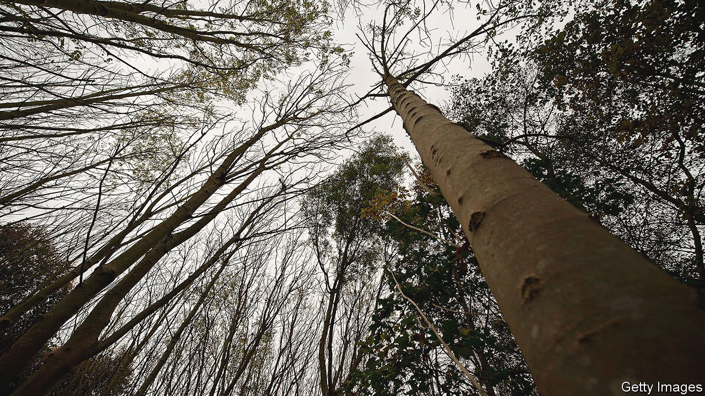

###### Treedemic

# Britain’s trees are being felled by diseases 

##### Millions have died; millions more will 

 

> Oct 9th 2021 

THE FIRST signs may go unnoticed. An individual might sicken here; another might die there. As few need reminding in 2021, death enters countries quietly. For trees, as for people, a whisper of unease may mark the arrival of a new disease. But as from tiny acorns, mighty oaks, so from small beginnings, devastating diseases.

Nobody is counting the trees Britain has lost to diseases, because it is difficult to keep track of millions of hectares of woodland. But on ash and elm, oak and beech, horse chestnut, alder and larch, diseases are spreading. Some kill. In London the leaves of horse-chestnut trees curl, brown and wither long before autumn arrives. In Devon and in Cumbria, ailing ash trees lift their skeletal silver fingers to the sky. In Dumfries and Galloway, hillsides of larch have been felled.


This is the era of the treedemic, which is not one disease, but many. Some are mild; others reshape the landscape. When Dutch elm disease swept across Britain in the 1960s and 1970s it was described as a national tragedy, but it was not the whole tragedy. It was the messenger speech, a warning of what is to come. Twenty-odd diseases have come to Britain since the 1960s; over 40 others, it is feared, might yet come. Attempts are being made to slow them. Forestry Commission helicopters hover over Britain, searching for signs of disease and issuing felling orders.

On an autumn day at the edge of Lake Windermere in the Lake District, Great Knott Wood sits in sunshine. This is archetypal English woodland, not particularly dark or deep but with cultural roots that spread far into the national story. Wordsworth wandered here, exulting at “Nature’s fairest forms”. Now some of those forms are threatened. Sudden larch death, which arrived in Britain in 2002, has just been found here. Within six months, says Heather Swift, the Cumbria site manager for the Woodland Trust, a charity, every larch tree in this area will have been felled.

The reason for all this devastation is simple: trees are not meant to move. Seeds might travel a few metres, or a few miles if eaten by a bird or animal. But outside Middle Earth and “Macbeth”, the plant itself should stay put. Instead vast numbers are travelling, more and farther every year. Over the past three decades, the global horticulture industry has grown so rapidly that it puts weeds in the shade. Forests are on the move and, as when Birnam Wood came to Dunsinane, this bodes ill.

Buy a potted plant and you may assume that you have bought a single species. You have not. In a recent paper in the Journal of Fungi, Alexandra Puertolas and three co-authors analysed the soil in 99 woody plants bought in Britain and the Netherlands: 90% contained organisms capable of causing diseases, some serious. It is perhaps better to think of bought trees less as plants in pots than as Petri dishes of potential pathogens which also contain a tree.

Worse still, they often do not contain the diseases of one area alone. Many enjoy an arboreal “grand tour” of Europe before being planted in British soil. Trees are not obliged to carry the country of origin, or of where they are grown, on their labels. Dieback led to regulations for ash trees being tightened in 2012, explains Richard Buggs, a senior researcher at the Royal Botanic Gardens at Kew, but other trees travel far. A single sapling might start life in the Netherlands and then be sent to Italy (trees grow faster where it’s sunnier) before returning, via Germany, to Britain. Like many a European grand tourist, such a tree can become riddled with disease.

The globalisation of tree cultivation means that many countries are experiencing similar problems. But they are unusually severe in Britain, which has few tree nurseries and is one of the least wooded countries in Europe, a fact it is trying to change. The value of tree imports has increased from £6m in 1992 (£12.5m in 2019 prices; $16m), to £93m today, an increase of nearly 650%. The Forestry Commission counted 4.25m new trees planted in Britain in the 12 months ending in April; the Woodland Trust, a charity, has pledged to plant 50m trees by 2025.

The potential impact of tree disease, however, dwarfs such numbers. Britain is home to 150m ash trees, and many more saplings, all of which might be infected by ash dieback. Of the trees infected, it is estimated that 90-99% will die. Dead trees must be removed (especially if they overhang roads and railways) and their environmental benefits are lost. Researchers at Oxford University have estimated that the cost of tree death on such a scale will be £15bn (0.7% of GDP).

Root cause

Humans have been exploiting forests for millennia. Ancient Roman bathers were warmed by fires kindled with North African trees. Captain Cook returned from Botany Bay with a ship filled with botanical samples. But Roman merchants and Enlightenment explorers transported dead trees and live seeds. Now, live trees are being moved. The analogy is less with dead timber than with live animals, in particular humans. “When Europeans colonised America they took with them diseases like flu and chickenpox that for them caused fairly mild symptoms,” says Mr Buggs. When they met populations unused to such diseases, the result was catastrophic.

Moving trees less would reduce the spread of disease. So would building more nurseries and cutting imports. Brexit means Britain is better able to impose phytosanitary restrictions at its borders. That would come at a cost, but it would probably be lower than the potentially catastrophic losses caused by new diseases. The Oxford researchers point out that imports and exports of all live plants, not just trees, were worth £300m in 2017—a mere 2% of the potential costs of ash dieback. It is time to see the wood for the trees. ■

