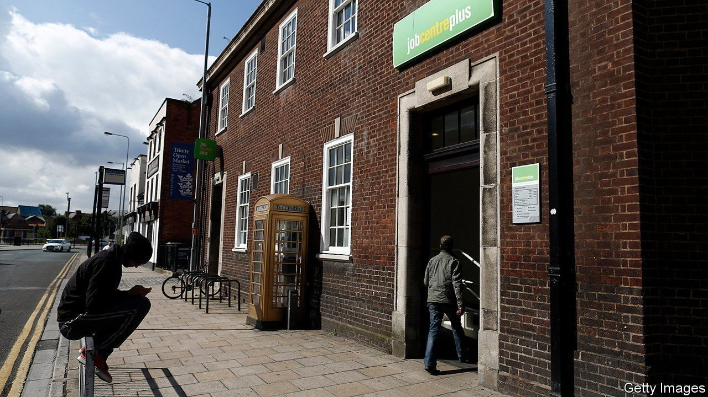
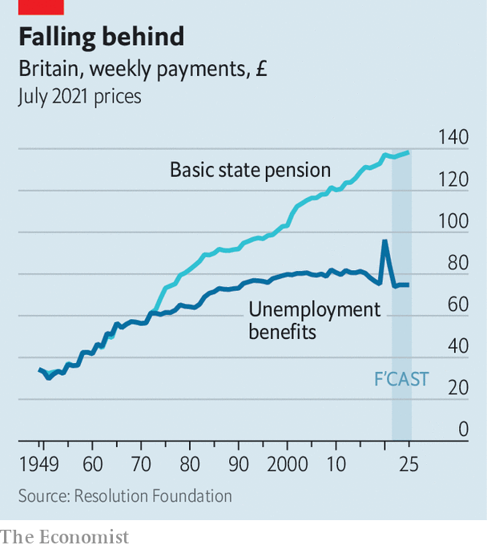

###### Help wanted

# Britain’s welfare state offers little protection for workers 

##### Pandemic-era measures changed that, but only temporarily 

 

> Oct 7th 2021 

“PICTURE THIS,” said Rishi Sunak, the chancellor, on October 4th, before describing a young family keen to provide the best for their children. “Is the answer to their hopes and dreams just to increase their benefits?” The response “no” was implied in his speech and demonstrated by his government’s actions, as just two days later it cut universal credit, a benefit for low-income households, by around £20 ($27) a week.

 


A welfare state is supposed to insure against shocks such as job loss, to shuffle cash from rich to poor and to smooth income between youth and old age. In recent years Britain’s government has been least concerned by the first of these. Spending on pensions has risen, but out-of-work benefits—jobseeker’s allowance until 2013 and universal credit thereafter—have stagnated (see chart). Across the mostly rich countries of the OECD, a typical childless, single person who became unemployed in 2019 saw up to 55% of earnings replaced by benefits. In Britain, that figure was just 12%.


A report in 2019 by Laura Gardiner of the Resolution Foundation, a think-tank, considered other trends in welfare spending. Non-cash support, such as free school meals, grew. Benefits became increasingly linked to recipients’ outgoings, such as those related to disability or child care. Eligibility rules were tightened, and more support was offered to help people back into work. Meanwhile benefits for middle-income households were trimmed. In 2013, for example, child benefit became means-tested. All this, on top of a rising state-pension age, meant that whereas in 2005 the share of people receiving a benefit or tax credit was 72%, by the eve of the pandemic that had fallen to 62%.

Changes to working-age benefits were largely the consequence of a desire to cut costs, not a thought-through strategy. But taken together, they imply that Britain’s welfare state envisages middling and higher earners insuring themselves against joblessness by saving. The pandemic revealed that system’s inadequacies. When covid-19 hit, ministers in the Department for Work and Pensions wanted to provide specific help for people whose income was affected. But civil servants were unable to distinguish between those who were already receiving universal credit and new claimants.

So the £20 increase went to everyone, and a furlough scheme acted as targeted pandemic support. It replaced previous income at an average rate of over 90%, compared with just 53% if claimants had had to rely on universal credit. As furlough ends and universal credit returns to its previous level, redistribution is being unwound. And the insurance role of the welfare state is returning to its former Cinderella status, too.

