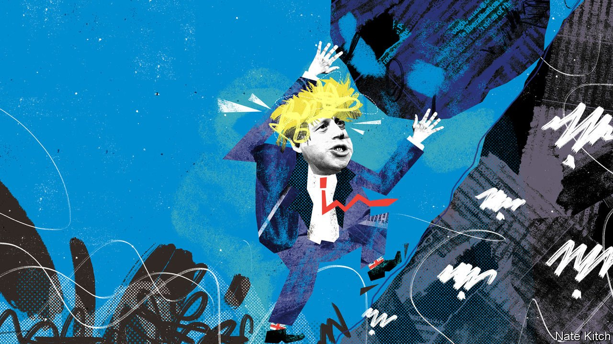

###### Bagehot

# The Tories are deadly serious about levelling up 

##### Boris Johnson uses his party’s conference to flesh out his signature policy 

 

> Oct 7th 2021 

JOSEPH SCHUMPETER, one of the 20th century’s greatest economists, argued that capitalism is shaped by two countervailing forces: creative destruction and popular resentment. Creative destruction drives economic progress but also whips up resistance by destroying old ways of doing things and creating giant fortunes. The historical role of the right is to promote the destruction; that of the left is to mobilise resentment. Schumpeter thought that the left would win in the end. “Can capitalism survive?” he asked himself glumly. “I don’t think it can.”

Schumpeter reckoned without the Conservative Party’s shape-shifting powers. In the 1980s Margaret Thatcher turned it into the party of creative destruction. Boris Johnson rode into power on resentment against globalisation and technological change, winning first an intra-party power struggle over Brexit and then a general election. Conservative MPs now represent parts of northern England that were once flattened on the Thatcherite anvil.


The Tories’ next task is to tackle the root causes of the resentment they so successfully articulated. Critics like to dismiss their stated priority, “levelling up”, as a mere slogan. But as their conference in Manchester, which ended on October 6th, showed, they are as serious about it as their predecessors were about deregulation and privatisation. Levelling up was not only the theme of Mr Johnson’s rollicking address, but also of many of the hundred-odd meetings on the fringe. These featured champions of levelling up, such as Paul Ormerod, an economist who runs the Rochdale development agency and owns the local rugby team. And they were remarkably policy-heavy, with references to Michael Porter’s work on clusters and post-neoclassical endogenous growth theory.

Levelling up means different things in, say, a village with a strong sense of identity but no transport links, and an anonymous housing sprawl near a motorway. Unlike opportunity, ability is evenly distributed, Mr Johnson likes to point out: levelling up means closing this gap. Michael Gove, the secretary of state for the new department of Levelling Up, Housing and Communities (the “Housing and Communities” bit is silent) adds community to opportunity: “You shouldn’t have to leave the places you love to enjoy the future you crave.” Neil O’Brien, the new minister for levelling up, promises a white paper that will not just give a clear definition of levelling up, but also suggest ways to measure it.

The conference saw some bold examples of what it might mean in policy terms. The most striking was the prime minister’s insistence that he would not buckle to employers’ demands for more immigration: he wants to move from an economic model where immigration is high and wages, skills and productivity are low to the reverse. Three more emerged on the fringe. The first was a shift in focus from the golden triangle of Oxford, Cambridge and London to many mini-clusters, such as wind power in the north-east, plant science in Aberystwyth and nuclear-submarine technology in Barrow-in-Furness. George Freeman, the minister for innovation, pointed out that Britain is good at disruptive innovation, such as fintech, but that such clusters may call for the sort of incremental innovation that require close co-ordination between entrepreneurs and local authorities.

The second is that levelling up cannot work without handing power to local government or community associations. Until very recently, it looked as if the government was pulling back from radical devolution in favour of a more top-down approach. But the overwhelming consensus of the conference was that the grip of the gentleman in Whitehall must be loosened. Mr O’Brien waxed lyrical, not only about giving more power to existing mayors (who represent 40% of the population and a slightly higher share of the economy), but about extending devolution to the counties.

The third is that levelling up is as much about quality of life as about infrastructure and economic development. Rachel Wolf, one of the authors of the party’s 2019 manifesto, argued for paying close attention to small signs that a community is cared for or neglected—such contrasting indications as the prevalence of hanging baskets and graffiti on war memorials. This way of thinking not only strengthens the case for giving people power to make decisions about their own communities, but shifts the policy focus away from conventional tools of regeneration, such as building a new retail park, to smaller, bespoke ways to improve lives.

Is Britain capable of levelling up? It has a long record of promising, and failing, to decentralise its economy and to upgrade technical education. The prime minister’s determination to cut off cheap foreign labour could also prove counter-productive in the short term by starving care homes of carers and road-builders of navvies, and, in the longer term, by slowing growth. Mr Johnson’s allies claim that depriving the labour market of workers will force companies to increase productivity. But economy-wide improvements will not be easy. The population is much older than in the 1980s, when the Tories last set about restructuring Britain. Increasing productivity is also much harder in a service-oriented economy such as Britain’s: such obvious measures as shifting to remote consultations in the health service and remote lectures in universities have provoked widespread opposition.

One more heave

As a classicist, Mr Johnson will be familiar with the tale of Sisyphus, who was punished for cheating death by being forced to roll a boulder up a hill, only to have it roll back down every time it neared the top. There is a good chance that, thanks to Britain’s longstanding bias towards London and problems with productivity, levelling up will amount to another such endless, thankless grind. There is no reason to think the economy is less London-centric now than it was when Mr Johnson took over. But there is also no doubt that the Conservatives are determined to put their shoulders to the task. ■

An early version of this article was published online on October 6th 2021

