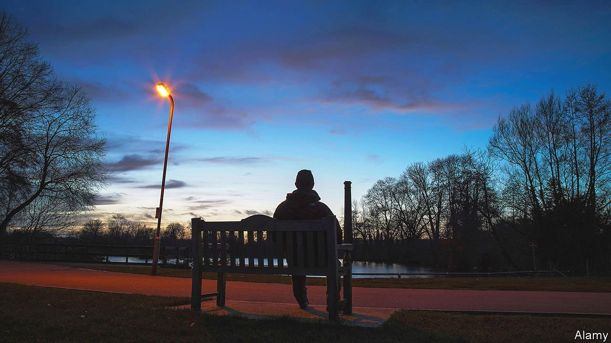

###### Street lighting

# The lamps are going out all over Britain 

##### Oddly, the people who care most about climate change are most opposed 

 

> Oct 9th 2021 

BRITAIN WAS one of the first countries to light its streets at night. In 1782 Karl Philipp Moritz, a German essayist, was astounded by the “festive illumination” of London; a visiting German prince thought the lamps had been lit for his benefit. But Britain has also been ambivalent about providing light. Whereas streetlamps in Paris expressed state power (hence revolutionaries hanging their enemies from them), street lighting in Britain was often the responsibility of households and businesses. Even today, local authorities are not legally required to light the streets.

Outside big cities, they are doing so less. Over the past decade councils have replaced sodium-vapour lamps with light-emitting diodes (LEDs), which use less energy and can cast light precisely on the pavement. They seldom run on full power. Since 2009 Hampshire has gone from dimming its lights by 25% in the middle of the night, to dimming them by 65%, to switching them off in residential areas. North Yorkshire is beginning to permit residential developments without streetlights.


For some, the point is to reveal the beauty of the night. Andrew Griffith, the Conservative MP who chairs the All-Party Parliamentary Group for Dark Skies, grew up in suburban London. His first sight of a truly dark sky, in Morocco, was a revelation. Others care about bats or moths. Councils must cut their electricity use in order to reduce carbon emissions.

Overwhelmingly, though, the aim is to save money. Despite rising electricity prices, Lincolnshire County Council has managed to cut spending on streetlights by a fifth in the past decade, to £4.6m ($6.2m). That is less than in some London boroughs, where the lights blaze on. Richard Davies, the councillor in charge of Lincolnshire highways, says complaints often fade when people hear that the savings have gone on social care and filling potholes.

In general, young people, women and left-wingers are the most concerned about climate change. But when Lincolnshire County Council surveyed residents, it found that the young were most opposed to turning off the lights. Female students at the University of Lincoln have lobbied for all-night lighting. Conservative rural districts are often content with darkness; urban ones dominated by Labour and the Liberal Democrats, less so. The borough of Ipswich in Suffolk restored all-night lighting following the murder of Sarah Everard, who was abducted in London in March.

Local authorities that have reduced public lighting tend to argue that crime does not increase as a result. That may be true. But Jemima Unwin, who studies attitudes to light at University College London, says that darkness appears to deter people from walking around, at least in the evenings. She also finds that pedestrians feel reassured when vertical objects, such as walls and other pedestrians, are well-lit. Sodium-vapour lamps do that better than carefully focused LEDs.

The truth, however, is that few people outside big cities are out in the middle of the night. “Most residents don’t know whether the lights are on or off,” says Alasdair Ross, a Labour councillor in Ipswich. Paul Gilmore, North Yorkshire’s electrical engineering manager, did on-the-ground research before the council switched off the lights. Loitering in the middle of the night, he usually found no one else was around, on foot or in a vehicle. The lights were only helping foxes find their way.■

