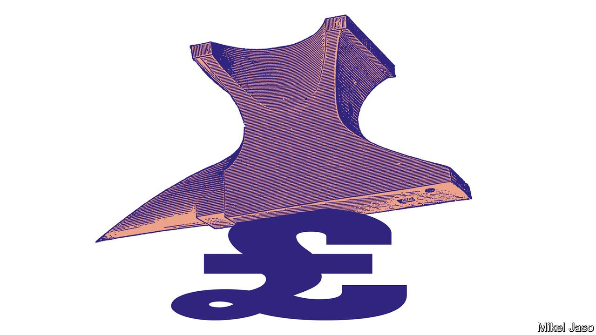
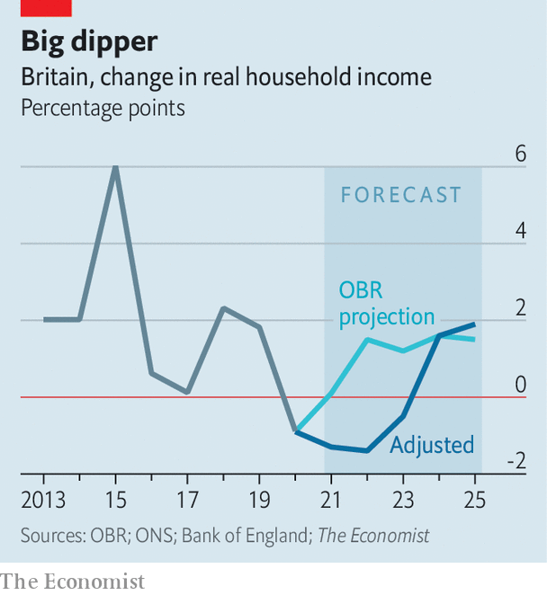

###### Flattened

# Wages are rising in Britain, but so are prices and taxes 

##### Meanwhile, benefits are being cut, crimping disposable incomes 

 

> Oct 9th 2021 

BRITAIN, PROCLAIMED Boris Johnson, the prime minister, is a country in transition, away from “the same old broken model” to a “high-wage, high-skill, high-productivity” economy. On October 6th, addressing the party faithful gathered in Manchester for the Conservatives’ annual conference, he promised that workers would soon begin to feel better off. Wages are indeed rising. But so too are prices. Moreover, payroll taxes are due to rise in the spring. And on the same day as Mr Johnson’s speech the main working-age benefit, universal credit, was cut by £20 ($27.10) a week. Britons look set to experience a tight squeeze on disposable incomes in the months ahead.

 


An analysis by The Economist based on government forecasts that predate some of these changes suggests that total household income, after tax and corrected for inflation, will fall in both 2022 and 2023 (see chart). After two years in which household incomes fell because of the pandemic and Brexit, the result will be the longest decline since the mid-1970s.


First to feel the squeeze will be the 5.5m low-income households in receipt of universal credit, which is both an out-of-work benefit and a supplement to the earnings of the low-paid. The loss of £1,040 a year is the biggest single cut to social security since the foundation of the modern welfare state. The Joseph Rowntree Foundation, a charity, estimates that more than 500,000 people, of whom 200,000 are children, will fall into poverty. More than a third of those affected are in work.

The cut to universal credit, which unwinds a temporary increase at the beginning of the pandemic, at least featured in projections by the Office for Budget Responsibility (OBR), an official forecaster, when it last ran the numbers for household income in March. Since then the government has announced a 1.25% rise in both employer and employee payroll taxes, to take effect next April, in order to pay for social care and help clear a post-pandemic health-care backlog. And the OBR, like the Bank of England, underestimated how quickly inflation would increase as the economy recovered.

Mr Johnson points to rising wages as evidence that voters will soon feel better off despite rising prices. And he has sought to draw a political dividing line with the Labour Party over the issue of immigration. In his speech he brushed aside concerns about stretched supply chains that have seen petrol pumps run dry and supermarkets struggle to fill shelves in recent weeks. This is part of a remarkable pivot: having previously said that staff shortages were nothing to do with Brexit, he now argues that these shortages are in fact among Brexit’s main benefits. The logic is that without an endless supply of European immigrants, firms will be forced to raise wages and improve working conditions in order to attract British workers.

Such claims helped the prime minister win good headlines from his party’s conference. But in the longer term he may come to regret making higher living standards so central a measure of his success. As he emphasised in conference-season interviews, recent data on real wages has indeed been strong. According to the Office for National Statistics (ONS), real wages grew by 5.1% in the year to July. Over the late spring and early summer, the annual rate of growth in real weekly earnings was the highest in two decades.

But the numbers require careful handling and the ONS has plastered its recent releases with more than the usual number of caveats. At the moment, annual figures are artificially boosted by “base effects” because current readings are being compared with those from mid-2020, when the economic hit from the pandemic was at its worst. This is compounded by a “compositional effect”: low-paid workers were the most likely to lose their jobs during the recession, meaning that average wages for those still in work increased automatically, even without anyone being paid more. Underlying growth, therefore, is surely weaker than the headline measures. Data from Indeed, an online-recruitment company, show that wages on advertisements posted on its website rose by an average of just 0.8% between February and July, not accounting for inflation.

In fact, the best period for real wages may already be past. Inflation rose at an annual rate of 3% in August, up from 2.1% in July. Analysts now expect an annual pace of over 4% by the end of autumn, driven by surging energy prices and disrupted supply chains. Higher prices will eat into real wage growth. Meanwhile, underlying wage growth may also be set to slow. The government furlough scheme, which covered part or all of the wages of workers temporarily sent home, closed last month. More than a million people were still on the scheme at the start of September, and many will now be seeking work. Increased slack in the jobs market should restrain pay growth in the months ahead.

Despite rising energy bills, empty petrol stations and supermarket shortages, the Conservatives have enjoyed an upbeat party conference. They have sought to turn a crisis into an opportunity by recasting a shortage of drivers for heavy-goods vehicles as an omen of good things to come for all workers. For the moment, this seems to be working, with the government maintaining a decent lead in the polls. But the opposition Labour Party is beginning to spy an opportunity. One shadow cabinet member riffed off Mr Johnson’s former career as a journalist, dubbing his approach as “government by newspaper column”. The prime minister may have marshalled the facts to present a plausible story. But as households feel the squeeze, they may start to doubt its conclusion. ■

