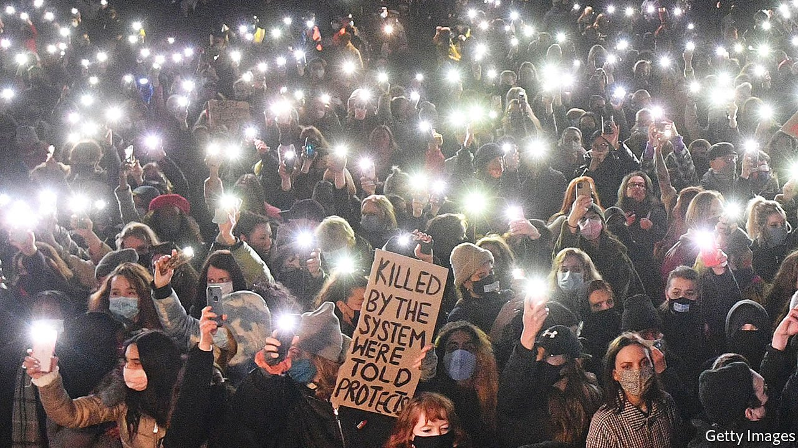

###### In the spotlight

# What Sarah Everard’s murder means for the Metropolitan Police 

##### Her killer is sentenced as the handling of violence against women is already under scrutiny 

 

> Oct 7th 2021 

SENTENCING WAYNE COUZENS on September 30th for the murder of Sarah Everard, Lord Justice Fulford said that he would spend the rest of his life in prison because he was a police officer, and because he had abused that position to abduct Ms Everard. If the public consent upon which authority of the police relies was undermined, the judge wrote, “one of the enduring safeguards of law and order in this country is inevitably jeopardised”.

In the days following, the seriousness—not of the crime, but of its ramifications—appeared to escape many officers. The Metropolitan Police, which had employed Mr Couzens, issued strange advice for women who felt unsafe when apprehended by a police officer, including that they call 999 to check the officer’s bona fides or flag down a bus. Only after criticism, and after another officer in Mr Couzens’s unit had been accused of rape, did Dame Cressida Dick, the force’s commissioner, announce a review of police standards and culture.


The Met sits at the apex of 43 territorial police forces in England and Wales. It is a national-local hybrid, responsible for policing the capital and for counter-terrorism and protecting VIPs. It reports to the Home Office and the mayor of London, and sets the agenda for policing across the country. The case’s consequences remain uncertain. But, says Ben Bradford, a policing expert at University College London, “it feels like this might be another post-Stephen Lawrence inquiry moment.”

The Lawrence inquiry concluded that the Met’s investigation into the teenager’s murder in 1993 had been “marred by a combination of professional incompetence, institutional racism and a failure of leadership”. Published in 1999, it led to sweeping changes, including an overhaul of complaints procedures and making it possible for people acquitted of serious crimes to be re-prosecuted if new evidence emerged.

Such a shift, says Professor Bradford, depends on whether a case “crystallises a problem in policing, and makes it very visible”. That seems increasingly likely this time. Other Met officers are reportedly under investigation for racist and misogynistic WhatsApp messages. Female officers are going public about sexism at work.

Moreover, the verdict came on the same day that judges on the Investigatory Powers Tribunal ruled that the Met had violated the human rights of a woman tricked into a relationship with an undercover cop in the 2000s. In April two Met officers were charged with misconduct after allegedly taking and sharing selfies with the bodies of Nicole Smallman and Bibaa Henry, two sisters who had been murdered.

The police’s handling of crimes against women was already under scrutiny. Victims have complained that they are treated insensitively. A backlog in the courts means that the number of rape prosecutions completed has fallen by more than two-thirds in the past five years. Dame Vera Baird, the government’s victims commissioner, has described the offence as in effect “decriminalised”. On October 3rd Boris Johnson, the prime minister, admitted that prosecutions are “going wrong”.

After the sentencing of Mr Couzens, the Met announced operational changes, including deploying plain-clothes officers in pairs whenever possible, and promised a new strategy for violence against women. The review announced by Dame Cressida will seek ways to improve vetting: Mr Couzens passed the procedure despite having been accused of indecent exposure and despite his creepy behaviour inspiring former colleagues at the Civil Nuclear Constabulary to nickname him “the rapist”. On October 5th Priti Patel, the home secretary, announced another investigation into what had gone awry.

Who watches the watchman?

The big question is whether either will change police culture. A recent inquiry into the unsolved murder in 1987 of Daniel Morgan, a private investigator, declared the Met “institutionally corrupt”—not in the sense of the 1980s, when backhanders were common, but because it remains unwilling to admit mistakes and to be transparent. Like that inquiry, the one planned by Ms Patel will not be on a statutory footing, and will therefore be unable to compel witnesses to appear. Although the separate Met one will be led by an outsider, that person will report to Dame Cressida.

Dame Cressida is popular among coppers, not least because she goes out of her way to defend them. Having just reappointed her, neither of her superiors—Ms Patel and Sadiq Khan, the mayor of London—has shown much desire to apply pressure. The former believes that being tough on crime requires being pro-police; the latter does not want to draw attention to the capital’s knife-crime problem. Even with pressure, the police are often slow to change. Two decades after the Lawrence inquiry, the share of ethnic-minority officers in the Met has risen from 3% to 16%. That is progress, but the force still does not represent those it is meant to protect.

In the same period, the share of women officers has risen from 15% to 29%. Three years ago the Met launched its first female recruitment drive, boasting of improved maternity support and new career pathways. Blatant misogyny was meant to be a thing of the past. In parts of the police, it is. But the Everard case reveals there is a lot further to go. ■

