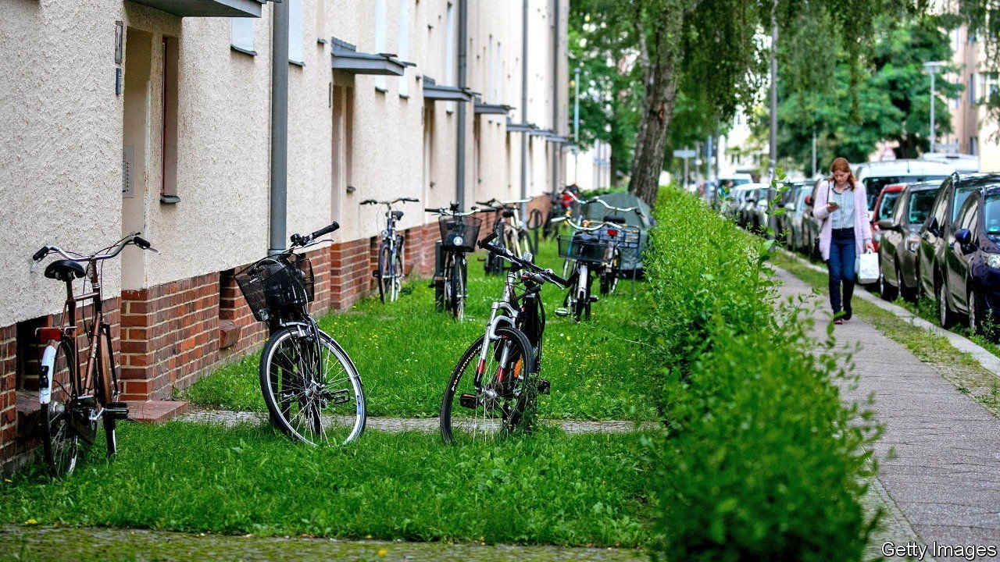
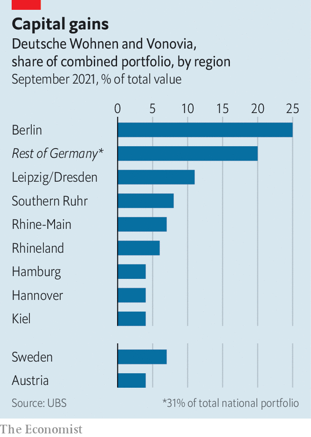

###### Berlin walls and windows

# Germany’s biggest developer will be under pressure in Berlin 

##### Vonovia’s takeover of Deutsche Wohnen is complete. The struggle against expropriation is not 

 

> Oct 7th 2021 

ROLF BUCH has no time to rest on his laurels. On October 4th the chief executive of Vonovia, Germany’s biggest residential-property firm, managed after a long ordeal to seal the creation of Europe’s biggest such company through a merger with Deutsche Wohnen (DW), its main rival. But DW comes with a new headache. In a non-binding referendum last month Berliners backed a proposal obliging all private firms that own more than 3,000 flats to sell them to the city, which could rent them out more cheaply. DW owns more than 110,000 flats in Berlin. Vonovia has another 43,000. A quarter of the combined firm’s properties are in the German capital (see chart).

 


Mr Buch’s deal with DW almost did not happen, which would have probably sent the 56-year-old Rhinelander into premature retirement. After trying and failing to buy DW in 2015 with a hostile bid, Mr Buch launched another takeover offer in May, this time with the agreement of Michael Zahn, the chief executive of DW. That €18bn ($22bn) all-cash deal collapsed in July after failing to win the approval of at least half of DW’s shareholders.


Mr Buch did not give up. He increased his offer slightly. More unusually, DW’s board agreed to issue primary shares without pre-emption rights and sell them directly to Vonovia if Mr Buch needed more help to get his deal done. The prospect of a deliberate dilution of existing shareholders by DW, which does not need additional capital, did not go down well with Davidson Kempner, an American hedge fund that owns 3.2% of DW, as well as a chunk of Vonovia. It said in a statement that it “raises serious corporate governance concerns”.

Union Investment, a German asset manager, and Deka, a German bank, which also own stakes in DW, agree with Davidson Kempner. They do not buy DW’s justification that it is better to be taken over by a big rival than to have it as the biggest non-controlling shareholder. They speculate that DW’s bosses could have been lured by lucrative golden handshakes or the prospect of higher salaries after the merger and so may not have acted in the best interest of shareholders. Mr Zahn will become deputy CEO of the merged giant and Philipp Grosse, DW’s chief financial officer, will become its CFO. The episode has raised red flags among German investors. “We need to revise our rules on the duty of neutrality of the bosses of target companies,” says Marc Tüngler of the German association for the protection of shareholders.

DW dismisses any suggestions of impropriety. It responded in a statement that it was “common practice” for executives of a target company to join the enlarged group. Moreover, the planned capital increase to get the deal over the finishing line was in line with German securities law. And in the event, it never came to pass.

Even the fiercest critics of the deal concede that it is almost certainly irreversible. But if the merger was a pain, the expropriation vote may prove to be a migraine. The newly elected mayor of Berlin, Franziska Giffey, cannot ignore the burghers’ demands. These reflect a growing frustration with property speculation and rocketing rents. After reunification in 1990 housing costs in Berlin were lower than in other big German cities. Waves of immigrants and young Germans lured by cut-price flats, a hip art scene and a thriving job market have helped push rents up more than two-fold in the past ten years in real terms. Incomes have not kept up.

If, as looks likely, the mayor drafts the law and Berlin lawmakers pass it, affected property firms would sue to overturn it. The developers are likely to prevail in the federal Constitutional Court, which in April declared Berlin’s earlier experiment with rent control unlawful. But the case could drag on for a year or more.

Expropriation is not a solution for Berlin’s housing problems. Instead, Mr Buch says, construction may be part of one. If it were not for Berlin’s labyrinthine bureaucracy, Vonovia alone could have built 7,000 new flats in Berlin in the past few years. Ms Giffey should focus on speeding up building permits and reforming arcane building codes. The city needs fewer pitchforks and more shovels. ■

For more expert analysis of the biggest stories in economics, business and markets, , our weekly newsletter.

