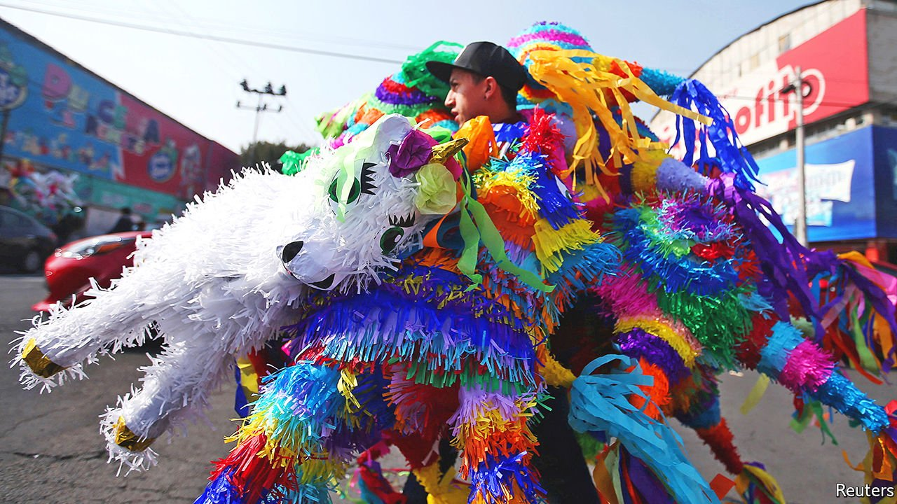
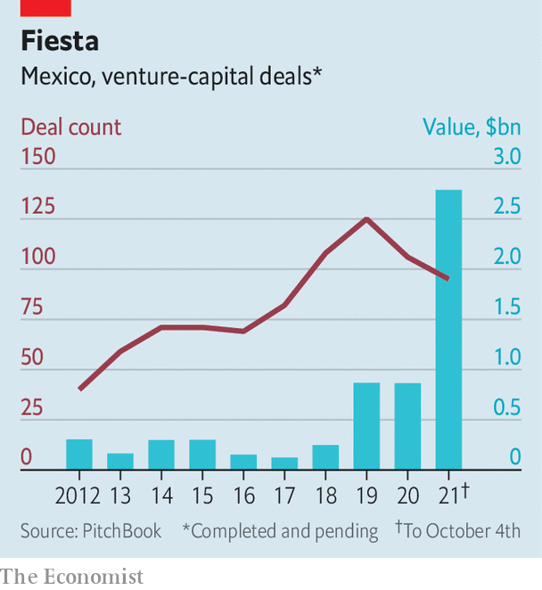

###### Mexican wave

# Mexico is finally seeing a startup bonanza 

##### About time 

 

> Oct 9th 2021 

KAVAK, A MEXICAN startup, provides an elegant solution to a glaring problem: how to buy a used vehicle in a market that is both one of the world’s biggest and its most informal second-hand car markets. Few buyers trust a seller’s assessment of the good’s quality. Few sellers trust the buyer to cough up the money. Transactions often involve “meeting someone at a corner store and seeing how it goes”, says Alejandro Guerra, Kavak’s general manager in Mexico. On Kavak’s app people can buy and sell cars with the company acting as a trusted middleman.

 


Kavak, which last month raised $700m in a funding round that valued it at $8.7bn, is part of a startup explosion in Mexico. Since the firm became the first Mexican startup to be valued at more than $1bn last year it has been joined by three more such “unicorns”. So far this year unlisted Mexican tech firms have raised nearly $3bn, roughly as much as in the previous nine years combined (see chart).


Mexico’s 126m people are on average young and almost in the upper-middle-income bracket. Some 54% own a smartphone, according to Newzoo, a research firm, a slightly higher share than among similarly novelty-loving Brazilians. Mexico is among the five biggest markets for tech stars like Uber in ride-hailing or Spotify in music-streaming. It is a huge one for Rappi, a Colombian food-delivery darling. Until recently, though, domestic founders struggled to make a name for themselves.

That is in large part because of a dearth of money. Mexican entrepreneurs had to go cap in hand to local venture capitalists with comparatively shallow pockets. This began to change in 2019, when SoftBank launched a LatinAmerica fund. In September the free-spending Japanese technology-investment group announced a second fund of $3bn, bringing its total investments in the region to $8bn, a lot of it in Mexico. Others have been piling in, including Sea, a Singaporean tech conglomerate, Founders Fund, a prominent Silicon Valley venture-capital (VC) firm, and Tiger Global, an aggressive New York hedge fund that has recently been shaking up the VC world.

This money has been pouring into home-grown businesses that, like Kavak, solve what Philipp Haugwitz of McKinsey, a consultancy, calls “pain points” in Mexico—of which there are plenty, from horrible traffic to a lumbering financial sector. With just one in three Mexicans owning a bank account, loans hard to get and too many businesses cash-only, fintech startups in particular are thriving, in part thanks to a fintech law from 2018. According to Fintech Radar, an industry newsletter, Mexico now boasts more fintechs than Brazil, the historic hub of Latin American enterprise. Albo, a digital-only “neobank”, makes it easy to set up an account. Clip offers credit-card readers for smartphones. GBM makes loans to smaller businesses without credit histories. Kavak helps to finance transactions on its platform.

Obstacles remain. Like many startups, Mexican ones face a hazy path to profitability. Dealing with bureaucracy is a nightmare; it can take Kavak days to process a transaction in Mexico, compared with under 40 minutes in Brazil. Yet investors are upbeat. Marcelo Claure, who heads SoftBank’s Latin American fund, calls Mexico “the land of opportunity”. It has helped his fund’s returns exceed those in every other region, he says. And what works in Mexico may work in other emerging markets. Kavak, which expanded to Argentina last year and Brazil this year, is now eyeing those across the Pacific and the Atlantic. ■

For more expert analysis of the biggest stories in economics, business and markets, , our weekly newsletter.

