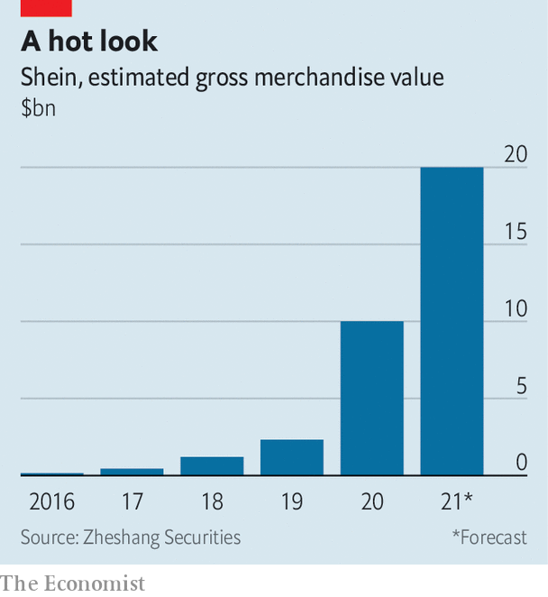

###### A new Chinese supermodel

# Shein exemplifies a new style of Chinese multinational 

##### The fast-fashion label has adapted to a more digital and less open world 

 

> Oct 7th 2021 

AMANCIO ORTEGA, founder of the Zara fast-fashion empire, got his start selling bathrobes in northern Spain. Erling Persson of H&amp;M peddled women’s clothing in a small-town shop in Sweden for decades before going global. Xu Yangtian had none of their tailoring experience when he founded Shein (pronounced she-in) in 2008. Instead, the creator of the fashion world’s latest sensation was a specialist in search-engine optimisation.

 


This expertise gave Mr Xu an understanding of how to draw shoppers’ attention in the digital world. He has brought to Western fashionistas a Chinese style of “social commerce”, which combines social media with online shopping. Add a revolutionary approach to manufacturing and the results have been spectacular. In 2019 Shein’s gross merchandise value (GMV), e-commerce groups’ preferred measure of total sales on their platforms, was $2.3bn, estimates Zheshang Securities, a Chinese broker. This year it is forecast to surpass $20bn (see chart). By 2022 analysts expect Shein’s GMV to overtake Zara’s revenues. In May Shein became the most downloaded shopping app in America, beating Amazon.


Mr Xu has also grasped how to navigate the growing commercial and geopolitical tensions between China and the West. It is hard to say for sure, given how secretive his privately held company remains, but Shein has probably had more success selling directly to Western consumers than any other Chinese firm in history. America is its biggest market, accounting for 35-40% of GMV. Another 30-35% comes from rich parts of Europe. It has won the backing of both big American venture capitalists (like Sequoia Capital) and Chinese ones (such as IDG Capital). Stitch all this together and you get a new model of a successful Chinese multinational company.

Shein’s success has three threads. The first is a turbocharged version of the fast-fashion formula of offering a constantly updated range of garments at bargain-basement prices. Whereas Zara launches about 10,000 new products a year, Shein releases 6,000 fresh “stock-keeping units” (including old designs in new colours) every day. Some are quickly discontinued. Still, its permanent virtual wardrobe now numbers 600,000 individual items. And with a typical price tag of between $8 and $30, Shein’s rags cost roughly as much as those of Primark, a resolutely offline British retailer, and 30-50% less than similar ones from Zara or H&amp;M, reckons Douglas Kim of Smartkarma, a research firm.

Shein has pulled this off by combining a mastery of fashion supply chains with on-demand manufacturing originally enabled by Chinese e-commerce giants like Alibaba. It starts with design. A team trawls the web for the latest trends using algorithms to determine what is grabbing attention. One of its members told Chinese media last year that he visits thousands of websites to come up with ideas. These concepts are sent to another group that draws up designs, which are then manufactured in batches as small as 100 items, compared with a typical order of thousands.

Next, learning from Alibaba, Shein tests the new designs simultaneously on its app. With all sales happening digitally, managers have a real-time view of the performance of each item. If a new design is popular the company quickly orders more. If consumers shrug at the new style, no more orders are placed. By centralising inventory in a small number of large warehouses and then shipping directly to customers, Shein has pushed inventory turnover down to just 30 days, compared with an industry average of 150 days, according to a consultant who works with the company.

To streamline the entire process Shein has moved from the eastern Chinese city of Nanjing to Guangzhou, a huge southern manufacturing hub. It has also been offering factory bosses better terms than most fast-fashion rivals. The firm guarantees it will purchase the entire batch and pay within 14 days rather than the 90 days common in the industry, in exchange for guaranteed supply. Around 400 of Shein’s 3,000 or so suppliers in China have signed up to this deal, says Chen Tengxi of Zheshang Securities. A bespoke software interface lets them know when production needs to be stepped up.

Insta-catwalk

Shein has deployed digital savvy not just in its procurement but also in sales and marketing—the second thread of its success. Besides handing out products free of charge to thousands of influencers, a common practice nowadays, it has recruited hundreds of local designers in America and several other countries. As well as dreaming up new clothes, they market its products and backstories on social media. The company plans to hire another 3,000 such third-party designers in 2022.

The strategy has helped Shein amass 250m followers across Instagram, TikTok and other social-media platforms. About 70% of them shop on Shein’s mobile phone app, which boasts 24m daily active users. On any day, one in two of the world’s shoppers who buy apparel online do so using its app. This approach has been so effective that others are trying to copy it. Gabby Lewis, a designer in Los Angeles who works with Shein, reports that as soon as the Chinese firm began featuring videos of her promoting her products on social media, rival fashion groups got in touch to see if she would do the same for them.

The third ingredient in Mr Xu’s winning formula is deft avoidance of geopolitical controversy. Shein wears its Chineseness lightly. Unlike other Chinese brands that have tried to conquer the world, such as Huawei, a telecoms-equipment giant, or Xiaomi, which makes smartphones, it sells next to nothing domestically. That weakens its already loose association with China in Western eyes. Western consumers assume, correctly, that like most of their clothing, including Western brands, Shein garb is made in Asia. Few realise (or care) the label is Chinese. Helpfully, most shipments to individual customers in America are small enough to dodge tariffs on Chinese exports imposed as part of a trade war between the two countries.

Shein has also evaded scrutiny from the Chinese Communist Party. In part that is because selling frocks is less contentious than making semiconductors or writing artificial-intelligence software. Its tiny presence at home has also spared it the sort of headache that has afflicted Alibaba and other internet groups with a large domestic business as President Xi Jinping intensifies his campaign to right the perceived wrongs of Chinese capitalism.

For all its stupendous success, Mr Xu’s formula is not without risks. Some of these relate to its industry. Like others in the fast-fashion business, Shein has come under fire for waste and a heavy impact on the environment. Many fast-fashion brands are facing questions over whether they source cotton from the Xinjiang region in far-west China, where the government is accused of using forced labour. And its products’ low price sometimes goes hand in glove with shabby quality. Pictures comparing Shein garments received by customers with the catalogue images have turned into online memes, hurting its reputation in Europe, notes one consultant.

Other dangers may be more specific to Shein’s heavily digital business model. Although venture-capital funding rounds have valued the company at $15bn and it has reportedly approached investment banks about an initial public offering, no one outside the firm seems to know whether it makes any money. In recent years Shein executives have given few media interviews, and none to Western journalists. Chinese media have consistently dubbed it China’s “most mysterious unicorn”. Analysts are left scratching their heads over its profitability and margins.

That may not be a problem, at least in the short term. Investors’ appetite for tech-adjacent startups, even loss-making ones, is undiminished. Another Shein-specific risk may prove harder to manage in the long run. The company relies on collecting lots of data from American shoppers. As a result, it may face the same problems that befell TikTok, another hit Chinese export to America. Last year the short-video app’s Chinese owner, ByteDance, barely averted a forced sale of its prize asset to American investors over fears that Americans’ data could fall into the hands of China’s Communist rulers (an accusation that TikTok has always vociferously denied).

As with TikTok’s social-media rivals in America, Shein’s Western competitors may invoke national security as a reason to curb its relentless rise. That would be a compliment—after a fashion. ■

For more expert analysis of the biggest stories in economics, business and markets, , our weekly newsletter.

An early version of this article was published online on October 3rd 2021

