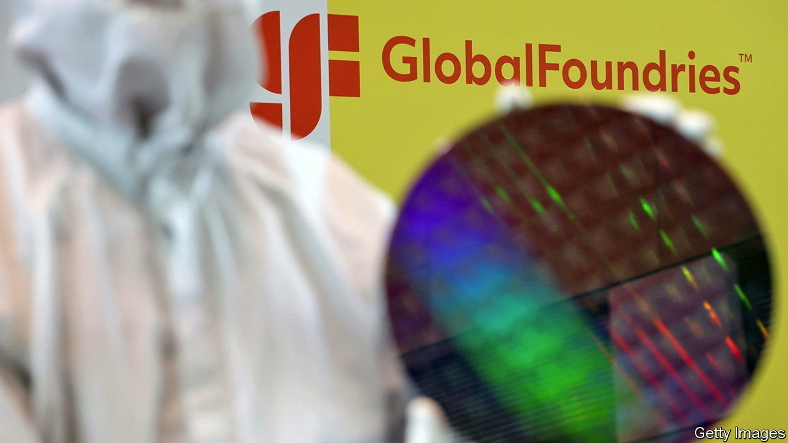

###### A golden-ish age

# The IPO of GlobalFoundries is perfectly timed 

##### It is also a risky bet for the chipmaker 

 

> Oct 9th 2021 

IT LOOKS LIKE the perfect time to be a chipmaker. The market for semiconductors continues to grow rapidly. By the end of the decade it will exceed $1trn globally, up from $500bn this year, forecasts VLSI Research, a firm of analysts. Demand keeps outstripping supply; the chip shortage is now expected to last well into 2023, paralysing factories of everything that needs processors—which in this day and age is basically everything. Western governments have earmarked billions to build chipmaking capacity within their borders in order to become less dependent on Asian suppliers. America alone is planning to spend $52bn over the next five years.

In this context the initial public offering (IPO) of GlobalFoundries, a contract manufacturer which makes chips for other firms, seems a safe bet. The firm, which unveiled its prospectus on October 4th and is expected to list soon, is the world’s fourth-biggest chip foundry by revenues. The typical characteristics of an IPO—a lowish offering price and a small proportion of shares available to public investors, both of which have yet to be decided—should ensure a healthy “pop” in the share price in the early days of trading. But GloFo, as semiconductor aficionados endearingly call the firm, is also an example of how tough the chip business has become, notwithstanding the favourable climate.


GloFo is a product of consolidation, caused by the industry’s unforgiving economics that demand ever-tinier silicon furrows and hence ever-costlier fabrication plants (or “fabs”). The most advanced of these now cost more than $20bn apiece. After a spin-off in 2009 from AMD, which designs processors for personal computers and servers in data centres, GloFo later acquired Chartered Semiconductor, another foundry, and the chip-manufacturing business of IBM, a purveyor of assorted information-technology wares.

With billions from Mubadala Investment Company, a sovereign-wealth fund from the United Arab Emirates, which currently owns all of GloFo, the firm tried to keep up with rivals in the race to forge cutting-edge electronic circuitry. In 2018 it gave up and started catering to the lower end of the market. These are semiconductors which go into products such as cars and machine tools, and therefore do not need the highest-performing processors, rather than data centres or smartphones. This niche is still a $54bn market, according to Gartner, another market-researcher.

Today GloFo operates a handful of fabs across the world, employs around 15,000 people and has a market share of 7% in the chip-manufacturing business. Most of its customers, which include AMD, Broadcom, another American chip designer, and NXP, a Dutch one, are “single sourced”. That means their chips cannot be made by other foundries, such as Samsung of South Korea and in particular Taiwan Semiconductor Manufacturing Company (TSMC), the world’s mightiest chip manufacturer, which controls more than half the market.

The difference in size goes a long way to explaining why TSMC is hugely profitable whereas GloFo struggles to generate cash. In the first six months of this year the Taiwanese giant boasted sales of $26bn and profits of $9.8bn. Although GloFo’s revenues rose to $3bn in the same period, up by nearly 13% on a year ago, and its accounting losses have been narrowing, it still lost $300m between January and June.

Investing in GloFo will therefore be a wager that the company can ride the current tailwinds in its industry and start making serious money. But it may also be a bet that another firm snaps up GloFo for itself. In July it emerged that Intel, the world’s largest chipmaker by revenues, was in takeover talks with the firm. These did not go anywhere because the parties could not agree on a price. Once GloFo is listed it should be clearer how much it is worth. Negotiations could restart. Then again, with GloFo’s numbers now public, Intel may have a hard time convincing its shareholders that it needs to pay the $25bn that GloFo is expected to fetch. ■

For more expert analysis of the biggest stories in economics, business and markets, , our weekly newsletter.

