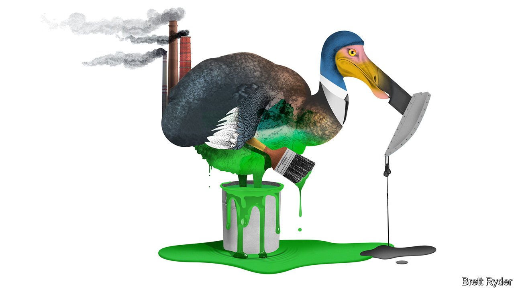

###### Schumpeter

# What if firms were forced to pay for frying the planet 

##### If governments get serious, a swingeing carbon tax is almost inevitable 

 

> Oct 9th 2021 

MANY QUESTIONS are on the minds of business leaders in the run up to the UN’s COP26 climate summit from October 31st to November 12th. For CEOs making the trip to Glasgow, they range from the mundane (travel by train? eat only plant-based food?) to the profound (why am I going in the first place?). The most important question, though, is barely asked: what would happen if governments agreed, sooner or later, to commitments serious enough to limit global warming to 1.5-2.0°C above pre-industrial levels, as stipulated in the Paris climate agreement of 2015? This question has an answer most multinationals shy away from. It would send shock waves through their entire business models.

Businesses, as a rule, do not like being forced to do anything. They prefer to make voluntary gestures—just enough to keep governments off their backs. Right now they are throwing around promises to cut carbon emissions to “net zero” like confetti, on the grounds that such vows attract investors, employees and customers. It is a step in the right direction. And yet some of those pledges are paper-thin. Of more than 4,200 firms in the G20 club of big economies that have disclosed their climate ambitions, only a fifth have committed to so-called science-based targets that would keep the world on track to meet the Paris agreement’s goal. That requires firms to start slashing emissions within years, not decades. For big emitters this poses an instant threat to profitability. It strains credulity to think that altruism is enough to convince firms to act. Governments will have to apply the thumbscrews.


Even business folk realise that the best way to apply pressure is by imposing a global system of carbon taxes, with some form of redistribution to ease the pain on the poorest thumbs. The trouble is that only about one-fifth of global emissions is covered by a price on carbon. As a result the global average price is just $3 per tonne of carbon dioxide. To meet the ambitions of the Paris agreement, the IMF says the global carbon price needs to rise to $75. Others believe it should be almost double that. For some heavy emitters covered by the European Union’s emissions-trading system, it is already above €60 ($69). In China’s new (limited) scheme, by contrast, it is a pittance. America has no federal scheme of any kind.

A higher global price would affect all businesses—albeit unevenly. For now, it is treated as too much of a long shot to take seriously. But assume for the moment it actually happened.

The first important thing would be to separate out the heavy emitters from the rest. Early adopters of bold emissions targets come from industries such as retail, where abating is relatively easy. In countries like Britain, where the grid is decarbonising fast anyway, that may require no independent effort on the part of energy users. A small number of sectors responsible for the bulk of listed companies’ emissions—power utilities, oil and gas firms, steel- and cement-makers—have a much harder challenge. As demand for carbon-intensive stuff collapses, they would have to find new ways to generate cashflows. Some are dabbling in renewables. Some see a future in low-carbon plastics and materials. But if they cannot turn these swiftly into huge sources of income, they would be better shutting down operations and returning cash to shareholders. Western firms may hope they can sell off their dirtiest assets to state-owned companies in the developing world. Yet these, too, would be subject to a truly global carbon tax. For some, the sooner they start lightening their carbon load, the better.

For a broader set of businesses, supply chains would be the main issue. Standard Chartered, a bank, says almost three-quarters of multinationals’ emissions come from their suppliers. Tackling those is an immense task. Take coal-addled China, where many of them are based. Guido Giacconi of the EU Chamber of Commerce in China says that though the country is investing heavily in renewables, it is “difficult if not impossible” to guarantee that a firm’s energy use is free from coal, because of the opacity of the electricity grid. That makes it hard for firms like Apple to certify that their supply chains in China (where iPhones are made) are carbon-neutral. If its Chinese suppliers were consequently subject to a carbon tax, it might have to raise prices of iGadgets.

Moving supply chains out of China would bring costs, too. In some Asian alternatives, such as Vietnam or Indonesia, fossil fuels are more prevalent than in China. In emerging markets with a lot of clean energy, such as Brazil, the costs of bad infrastructure and red tape are unappealing. Reshoring is unpalatable for many Western firms; the costs of rich-world labour are just too high.

This feeds into a third problem: consumption. A high carbon tax is bound to push up prices, which will change consumer behaviour, especially among lower earners. The tourism industry, for instance, would have to rely less on customers arriving by cheap flights. Supermarkets would need to provide more local foods. People might start tracking the carbon trail of some things they buy, creating headaches for retailers like Amazon.

The flip side would be more innovation. The International Energy Agency, which represents energy-consuming countries, said last year that investments in low-carbon research and development had barely budged since 2012, and was a fifth of what was spent on health and defence. This is pitiful. A carbon tax would change that. Think of hyperloops for long-distant transport; eating bugs, seaweed and lab-grown meat; an endless stream of virtual-reality entertainment as people stay at home rather than consume goods that become less affordable owing to the carbon bill.

Extinction rebellion

Inevitably, some firms which fail to see the writing on the wall will die. But others will swiftly realise that the future is “adapt or perish”. This is not a mantra CEOs will chant at COP26. It should be. When it comes to action on the climate, they are all-too-keen to show off their halos. The thumbscrew is a less appealing accoutrement—but a far more necessary one. ■

For more expert analysis of the biggest stories in economics, business and markets, , our weekly newsletter.

For more coverage of climate change, register for The Climate Issue, our fortnightly , or visit our 

