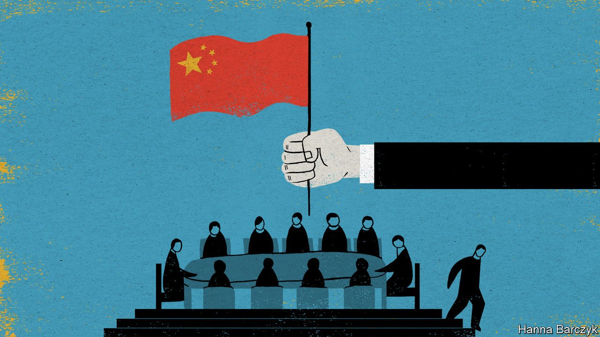

###### Chaguan

# A Chinese vision of free trade 

##### China’s motives for joining the CPTPP range from benign to worrying 

 

> Oct 7th 2021 

SOMETIMES CHINA makes shrewd decisions. At other times it is capable of grave mistakes, even acts of wickedness. But the Chinese government is rarely silly. In particular, officials do not stake the prestige of their supreme leader, President Xi Jinping, on a whim. That makes it worth revisiting dismissive foreign reactions to a move that, though dry-looking, is important and revealing.

On September 16th China formally asked to join the Comprehensive and Progressive Agreement for Trans-Pacific Partnership (CPTPP), an 11-nation trading block that is home to 500m consumers in Asia and the Americas. Though China’s timing was sudden, the move was predictable. Months ago Mr Xi said China would “favourably consider” applying. His word is law. But many foreign analysts (and in private, some foreign government officials) confidently predict that China will never be admitted.


Scepticism is understandable. In the name of market opening and fair competition, the CPTPP’s current members—Australia, Brunei, Canada, Chile, Japan, Malaysia, Mexico, New Zealand, Peru, Singapore and Vietnam—agree to limit subsidies for large state-owned enterprises (SOEs), permit most cross-border flows of data and outlaw forced labour, among many other promises. If those standards seem hard for China to meet, given its statist, security-obsessed turn in recent years, that is no accident. The CPTPP is the orphaned offspring of an earlier, American-led agreement, the TPP. That was crafted by the Bush and Obama administrations with the aim of making Asia and the Pacific into a bastion of rules-based free trade, leaving China with the choice of reforming its model of state-dominated capitalism or remaining on the outside. Then came President Donald Trump, whose scorn for free trade and indeed rules led him to quit the TPP on his first full day in office. When Japan guided other founding members to forge a Trump-less alternative, the CPTPP, China spotted an opening.

Officials in Beijing have spent two years studying how hard it will be for China to join. Their conclusion is that China will find accession arduous, not least because of strained relations with existing members who have a veto, notably Australia, Canada and Japan. But they also reckoned that China would face still harsher scrutiny were America to be inside the CPTPP—a distant prospect currently, due to Biden administration pledges to put American workers ahead of corporate profits and expanded global trade.

China, in short, is serious. Its ambition is best explained by different forms of rising confidence, some more alarming than others. Start with a benign, cautious optimism among those sometimes called reformers. That camp once promoted economic liberalisation. In a China intently focused on political control, stability, security and self-reliance, reformers now find it safer to push for a more efficient state, not a smaller one. These scholars, technocratic officials and business types argue that China is so strong and technologically advanced that it gains, on balance, from removing barriers to trade and upholding common international rules, for instance to protect Chinese intellectual property. Such advocates of openness believe that China can compete in a free-trading world, but is not yet ready to write trade regulations on its own. They welcome a chance to help shape norms during negotiations such as the CPTPP-accession process, which they expect to take years. They hope that external pressure will overcome special interests at home, as happened when China joined the World Trade Organisation (WTO) in 2001. Given the consensus in official Beijing that America is bent on thwarting China’s rise, pressure from the CPTPP—a pact without America in it—is especially welcome. Wang Huiyao runs the Centre for China and Globalisation, a think-tank that champions CPTPP entry. China’s economy has grown 11-fold since admission to the WTO, he notes. It is “an easy sell” to call CPTPP a new chance to join a mini-WTO.

A different sort of confidence moves nationalists, including government leaders, who embrace the CPTPP. They do not just think China’s state-led system capable of competing in the world. They think it is manifestly superior. Nationalist-minded Chinese officials and scholars think that market forces bring desirable efficiencies, but their priority is stability, which they see as China’s secret weapon. As exhibit A they point to their strict, collective handling of the covid-19 pandemic, in contrast with grim death tolls in the freedom-obsessed West. Their gamble is that joining the CPTPP will increase foreign trade and impose useful disciplines, without undermining strong political control of the economy. They sense a historic chance to advance a cherished goal, namely to make the world respect China’s political system.

Sceptics about China’s chances assert that CPTPP rules ban subsidies and aid for state firms. In fact there are exemptions for local-government SOEs and those delivering unprofitable domestic services. In accession talks China may accept regulation of SOEs operating abroad in profitmaking commercial sectors, while insisting that state firms at home are needed to supply jobs, manage critical resources or maintain an orderly financial system. China’s ever-stricter rules about cross-border data flows will be harder to finesse, though public-order exemptions may help. China simply denies it has forced labour, daring trade partners to disbelieve it.

America vows to work with allies, then doesn’t

The biggest barrier to China’s entry is not this or that rule, but trust. A senior Japanese official expresses worry about China offering to write domestic laws that purport to comply with the CPTPP, but fall short. It would be easier to challenge such moves with America at the table, he sighs. Fears are justified. China has a free-trade pact with Australia, but is currently blocking many exports from that country, in an unofficial boycott imposed after Australian leaders called for a global probe into covid-19’s origins. Some CPTPP members think China is too big a bully to join. China’s bet is that, for a decisive number, it is too big to keep out.■

