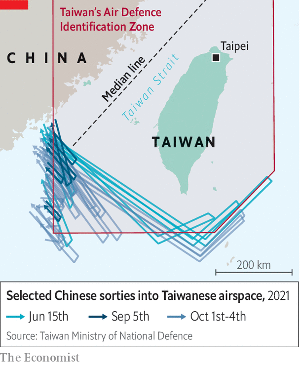

###### Too close for comfort

# China is ratcheting up military pressure on Taiwan 

##### Its aerial sorties near the island are increasing the risk of a crisis 

 

> Oct 7th 2021 

IT WAS A deliberate provocation, patriotically timed. On October 1st, the country’s national day, China flew 38 aircraft, including fighter jets and bombers, towards Taiwan (one type, the J-16, is pictured). They entered the island’s Air Defence Identification Zone (ADIZ), a buffer region where intrusions often prompt military alerts. It was the year’s daily record. Over the next three days China sent another 111 planes. In response, Taiwan scrambled jets, broadcast warnings and tracked the Chinese aircraft with missile systems. The island’s defence minister, Chiu Kuo-cheng, called it “the toughest situation I have seen in more than 40 years of my military life”.

The skies around Taiwan were quieter as The Economist went to press. On October 6th China flew no military planes through the ADIZ. So far none of the flights has crossed into Taiwan’s territorial airspace, which extends 12 nautical miles (about 22km) from the island. The intruders typically fly 35 nautical miles or more from the Taiwanese coast. But American officials clearly share Mr Chiu’s anxiety. On October 6th America’s secretary of state, Antony Blinken, called on China to halt its “provocative” activity near Taiwan. Also that day, Jake Sullivan, President Joe Biden’s national security adviser, conveyed America’s concern at a meeting in Switzerland with Yang Jiechi, China’s most senior diplomat and a member of the ruling Politburo.


China is unabashed. Its state media have described the sorties as a demonstration of the country’s ability to conduct “a wartime air attack”. In recent years China has been ratcheting up displays of its growing military capability, especially at sea and in the air, as a warning to Taiwan. Its message is that if the island refuses to accept China’s claim to sovereignty over Taiwan, China may use force. Mr Chiu, a retired general, told Taiwan’s parliament on October 6th that China would be able to mount a full-scale invasion of Taiwan by 2025, at a cost that the Communist Party in Beijing may consider bearable.

 


Taiwan’s ADIZ extends over a part of China’s coast, so it is not surprising that Chinese military aircraft often fly into it (see map). But China has taken to probing parts of the ADIZ that are much closer to the island, skirting around the south-western end of what is known as the “median line”, an informal boundary in the Taiwan Strait midway between the island and the mainland. China now conducts such flights near southern Taiwan almost every day. They could be intended to wear down Taiwan’s defences (its air force is much smaller than China’s) and condition it into treating big sorties as normal in order to make it easier for China to disguise the early phase of an attack as an exercise.

Assessing China’s intentions is extremely difficult. It is fond of sabre-rattling when it believes that Taiwan is moving too close to asserting permanent separation from China, or when America cosies up to the island. Recent sorties may relate to such developments. Earlier this year the Biden administration secured public statements of support for Taiwan from the European Union, the G7, Japan and South Korea. September was an especially irksome month: Taiwan sought entry to a trans-Pacific free-trade group just after China had made the  and American and British naval ships sailed through the Taiwan Strait. On September 15th America, Britain and Australia agreed to a security partnership, AUKUS, that is viewed in Beijing as an alliance aimed at keeping China in check. In the days that followed, China ramped up its flights into Taiwan’s ADIZ.

If China’s planes were to edge closer to airspace over the island itself, it is unclear how Taiwan would respond. Tsai Ing-wen, Taiwan’s president, has said that Taiwanese pilots should not be the ones to shoot first—at least not without explicit orders. Taiwan’s latest Quadrennial Defence Review, produced this year, was vague about this, saying only that the island’s responses should get stronger the closer that Chinese aircraft get to the island.

Some analysts wonder whether a Taiwanese fighter would be authorised to fire anything more than a warning shot, even if a Chinese plane were to fly over Taiwanese land. In a forthcoming article, two think-tankers in America, Bonny Lin of the Centre for Strategic and International Studies and David Sacks of the Council on Foreign Relations, note Taiwanese press reports which say that Taiwan may have divided its airspace into three zones of engagement: a “surveillance zone” of 30 nautical miles, a “warning zone” of 24 nautical miles and a “destruction zone” of 12 nautical miles. Ms Lin and Mr Sacks say that if any engagement were to lead to the death of a pilot, even accidentally, “both sides would be ill-equipped” to keep tensions under control.

There has been no such casualty since 1958. But accidents have happened nearby. In 2001 a mid-air collision off the coast of southern China between a Chinese fighter and an American naval spy-plane killed the Chinese pilot. The crippled American plane landed at a Chinese military airbase. Ten days of tension ensued before the crew were allowed to leave. Twenty years later, such an encounter may be far harder to resolve. Relations between America and China are considerably worse. China suspended official contacts with Taiwan after Ms Tsai became president in 2016 and she failed to endorse the view of leaders in Beijing that there is only “one China”.

Should a crisis occur in Taiwan’s skies, nationalist sentiment in China could further complicate matters. Global Times, a jingoistic party tabloid in Beijing, declared in April that if Ms Tsai’s government were to continue its “hostile” behaviour (working closely with America counts as such, it suggested), China’s fighter planes would be prepared to fly across the island and disregard the “red line” relating to territorial airspace. Ms Tsai appears unfazed. In an upcoming issue of Foreign Affairs, she writes that Taiwan hopes to “shoulder more responsibility by being a close political and economic partner of the United States and other like-minded countries”. She warns that people in Taiwan will “rise up should the very existence of Taiwan be under threat”. Such words will not stop the sorties, nor assuage fears that a mishap could turn into something far bloodier. ■

