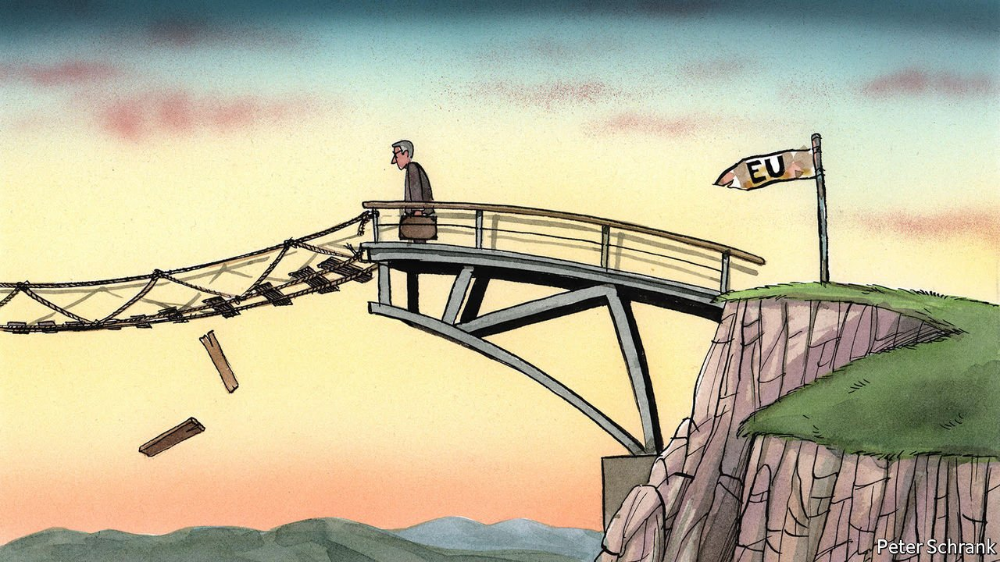

###### Charlemagne

# The European Union should not give up on enlargement 

##### If the EU wants to be a global power, it needs to be a local one first 

 

> Oct 9th 2021 

FLANKED BY THE leaders of Croatia and Bosnia-Herzegovina, Ursula von der Leyen, the European Commission president, hailed the opening of the Svilaj bridge, linking the two countries. It was part of her tour of the western Balkan region, a term used by the EU to define the Balkan countries that have not yet joined the club and which have sat waiting on the doorstep since being promised eventual membership back in 2003. The happy integration between the EU and its Balkan neighbours was cast as nothing less than inevitable. “All the western Balkans belong in the European Union,” said Mrs von der Leyen. “It’s in our common interest, but I also believe it’s our destiny.”

Kind words collided with reality a week later. At a summit in Slovenia on October 6th of all 27 EU leaders and their six counterparts from Albania, Bosnia-Herzegovina, Kosovo, Montenegro, North Macedonia and Serbia, the prospect of new countries joining the EU any time soon was absent. Instead, the western Balkan countries emerged with a pledge to cut roaming fees when their citizens visit the EU. An attempt by Slovenia to guarantee their membership by the end of the decade was dismissed as an outrageous publicity stunt. Literal bridge building was not accompanied by the metaphorical kind.


Enlargement of the EU is, bluntly, dead. Across the western Balkans, governments are hurt. North Macedonia may have dutifully jumped through every hoop required to begin accession talks, including changing its name to settle a dispute with Greece. Yet an arcane row about the origins of the Macedonian language led to Bulgaria vetoing the start of negotiations. Albania, whose application is linked to North Macedonia’s in a futile attempt to stop such political gamesmanship, is also stuck. Its prime minister compared its relationship with the EU to a failing marriage. Normally, there is at least a wedding first. The EU wants to be a global force, but it is in danger of losing control of its own backyard.

A realistic prospect of joining the EU is the bloc’s main tool for dealing with its neighbours. Yet at the moment, all sides know it is a fantasy. Countries such as France are deeply sceptical, preferring a deeper EU to a wider one. Diplomats from other cautious countries such as Denmark and the Netherlands insist their governments are fine with the idea of enlargement, as long as stringent criteria are met. Domestic politicians are, however, not always so nuanced. There is no chance of new countries joining the EU, even while the club’s leadership says otherwise.

This is a problem. If incentives for good behaviour disappear, so do disincentives for bad behaviour. Tantrums in the western Balkans are now common, in the knowledge there is little to be lost. Why bother taking on vested interests or reforming the judicial system for naught? Those with little to lose have least to fear. Hence a row over number plates between Serbia and Kosovo led to special forces being deployed at the border. In the western Balkans, damned foolish things happen increasingly often.

Sceptics insist that the club cannot digest new members. Former poster-children of EU enlargement, such as Poland, have become problem children. An EU without Poland or Hungary would spend less time worrying about nobbled judges or dodgy use of funds within the club. It is easy to find diplomats who think enlargement was a mistake. But this counterfactual is one that leaves the EU with an even more troublesome frontier. If the EU’s eastern members had remained outside the club, they might have followed the trajectories of other countries beyond the EU bubble, such as Ukraine. Exclusion is no happy solution.

A sense of perspective comes from across the Atlantic. American diplomats remind their more sceptical European counterparts that life would be much easier with the western Balkans firmly inside the European tent, rather than outside getting wet, with other countries offering shelter. Montenegro has already got itself into trouble with a $1bn loan from China. Serbia has become a canny diplomat, accepting vaccines from everywhere and then distributing them to neighbours. Emmanuel Macron, the French president, sees Bosnia as a font of Islamist instability. In short, it is not a region that the EU can afford to lose.

Instead, a dangerous complacency lurks among EU governments. The EU has dished out vaccines. It accounts for almost 70% of trade in the region. It invests about €3bn ($3.5bn) a year, which is a fair sum for a poor region of 20m people. Whatever Russia and China can offer, the EU can more than match, runs the logic. Threats of a geopolitical switch are brushed off by EU officials as diplomatic bravado by their Balkan peers.

Size does matter

Attention thus drifts elsewhere. Leaders would rather focus on the other side of the world, instead of the EU’s chaotic courtyard. On the eve of the Slovenian summit, leaders discussed the club’s strategy in the Pacific, which is a far sexier topic for those who dream of European might. The idea of spending hours discussing Kosovan number plates or the etymology of Macedonian words makes the eyes of European leaders roll into the back of their heads. In the Pacific leaders see history being made. In the Balkans they see history being repeated—to the point of tedium.

Yet it is the western Balkans that is the more pressing test of the EU’s foreign-policy capability, rather than seemingly larger and more global topics. A coherent common policy on North Macedonia, Albania and their neighbours should be simple, compared with more difficult choices that lie ahead for the EU. At the moment, the EU’s China policy designates the country as partner, competitor and rival. Eventually it will have to pick, deciding what is in its collective interest. So the club may be better advised to begin with what should be the easier choices. If the EU wants to be a global power, it needs to become a local one first. A revived enlargement policy is the place to start. ■

