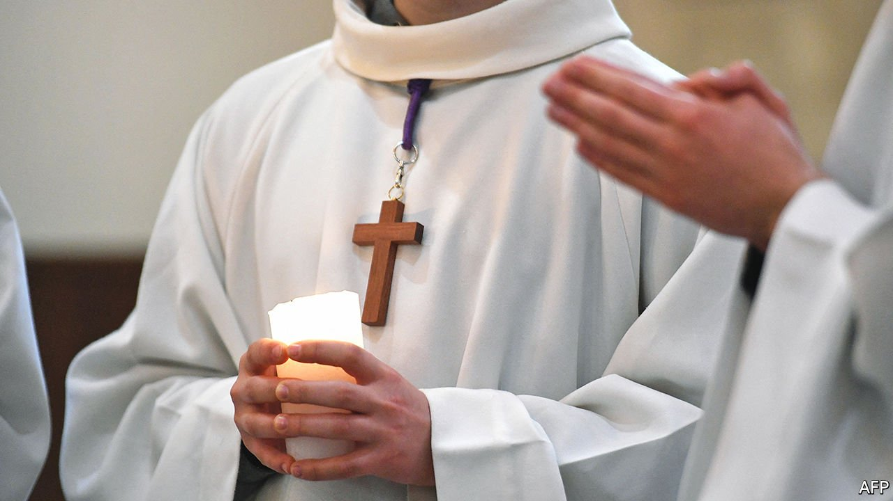

###### The weight of silence

# The French Catholic church acknowledges a staggering pattern of sexual abuse 

##### Hundreds of thousands were victimised over 70 years 

 

> Oct 9th 2021 

THE SHEER number was overwhelming. Between 1950 and 2020 at least 216,000 children were sexually abused in France by Catholic clergy. Thus, on October 5th, concluded a two-year independent inquiry commissioned by the church. Jean-Marc Sauvé, who led it, said it uncovered “the lead weight of silence smothering the crimes” committed by 2,900-3,200 clergy. If lay molesters involved in church activities were also included, the number of abused could reach 330,000.

Mr Sauvé’s introduction to the report is chilling and unflinching: “The Catholic church’s immediate reaction was to protect itself as an institution” and it “has shown complete, even cruel, indifference to those who suffered”. About 90% of the victims were boys, many between ten and 13 years old. He called for “a humble acknowledgement of responsibility from the church authorities for the mistakes and crimes committed under its auspices”.


As was revealed by reports into sexual abuse by Catholic clergy elsewhere, the crimes in France involved a sinister web of misplaced trust, manipulated authority, concealment, silence and shame. The abuse was countrywide: in local parishes, scout groups, catechism classes and within families. Pope Francis expressed “great sorrow” for the victims. François Devaux, who suffered sexual abuse at the age of ten and later founded a victims group, called what they had gone through simply “hell”.

It was the efforts of survivors such as Mr Devaux that forced the church to confront its denials and cover-ups. He and others came forward in 2015 to accuse Bernard Preynat, a priest and scout leader, of sexual abuse. Mr Preynat was convicted last year. In 2019 the accusations prompted the resignation of Cardinal Philippe Barbarin, convicted of covering up the Preynat affair (the conviction was overturned on appeal).

France has an unusual link with Catholicism, due to strict secular rules, known as laïcité, designed to keep the state neutral in religious affairs. It lacks the wide network of church-linked boarding schools and state institutions that helped to conceal paedophilia in some other countries. Yet this proved no protection for the victims.

Today the Catholic church in France is a hollowed-out version of its former self. Numbering 12,000, the priesthood is half what it was 20 years ago—and half of those serving are over 75. Only 49% of the French say they believe in God. Two years ago 56% said in one survey that they had a bad image of the Catholic church. This week’s report will entrench these trends.

The church is not the only French arena in which denial of sexual abuse has been exposed. Another is politics, where, until #MeToo, sexual violence towards women tended to be hushed up. Two recent books also reveal how members of Left-Bank Parisian circles deployed the principle of sexual liberty to mask abuse and incest. By exposing the manipulation and cruelty of the predators, those brave enough to speak out may in future help prevent such abuse from going undetected for so long. ■

