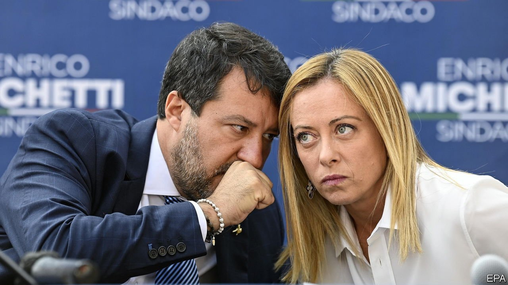

###### Rattling the right

# The Northern League and the Brothers of Italy both wobble 

##### Scandals and election woes on all sides 

 

> Oct 9th 2021 

FOR MORE than two years, the common wisdom has been that Italy’s next government will be right-wing—and radically so. Polls have consistently indicated that the Brothers of Italy party, with its origins in neo-fascism, and the populist Northern League should together secure enough seats at the next election to form a parliamentary majority, perhaps even without needing help from Silvio Berlusconi’s more moderate Forza Italia movement.

But local elections on October 3rd and 4th showed how fragile the support underpinning the hard right is. Centre-left mayoral candidates won with more than half the votes in Milan, Naples and Bologna. Others in Rome and Turin look set to win in run-offs on October 17th and 18th.


The elections followed a nightmarish campaign for the League’s leader, Matteo Salvini, and for the leader of the Brothers—who is in fact a sister, Giorgia Meloni. On September 26th it emerged that Mr Salvini’s social-media guru, Luca Morisi, was under formal investigation on suspicion of supplying narcotics. Mr Morisi denies any wrongdoing. Four days later, Ms Meloni’s drive to give her party a moderate, voter-friendly image suffered a grievous blow when a video was released showing some of her followers joking about Hitler, giving fascist salutes and apparently arranging for the Brothers to receive money illicitly. An investigation has since been opened into a suspected breach of Italy’s law on funding political parties.

All this comes against a background of increasing division in the League. Mr Salvini’s position has become sufficiently tenuous for him to have spoken openly of being replaced. “If there is someone better than me,” he told an interviewer recently. “I’ll gladly enjoy [spending] a few hours more with my children.”

The origin of his troubles is his decision earlier this year that the League should join Italy’s current government—a broad coalition headed by the former president of the European Central Bank, Mario Draghi. The League’s support for Mr Draghi earned it three places in the cabinet and a say in the spending of around €200bn ($230bn) from the EU’s post-pandemic recovery funds.

But backing a government headed by a central banker who once defined himself as a liberal socialist was diametrically at odds with Mr Salvini’s populist instincts. It has also offered the Brothers a chance to steal the League’s populist thunder by remaining in opposition. Mr Salvini did opt to stay out of the cabinet, but has cut an increasingly awkward figure. In his efforts to hang on to the populist vote, he has repeatedly sniped at policies that ministers from his own party have endorsed.

Nowhere has his predicament been more obvious than in the contrast between his courting of the anti-vaccine lobby and the government’s vaccine mandates. He originally described the EU’s plans for a pass for the vaccinated, those who had recovered from covid-19 or been tested in the previous 48 hours, as “insane crap”. Ignoring his objections, Mr Draghi’s government has since made the pass obligatory for access to a host of venues and services.

Later this month Italy will become the first European country to require the pass for entry to both private and public workplaces. Even more embarrassingly for Mr Salvini, the government’s policies have been openly backed by the business minister, the League’s Giancarlo Giorgetti, and its regional governors in the industrial north—united in a desire to avoid further economically crippling lockdowns.

The League has been steadily losing electoral support since mid-2019 and now polls around 20%, down from 30% or so two years ago. In recent months, and for the first time, it has been overtaken by the Brothers. It is not clear whether Ms Meloni’s party will be able to shrug off the latest allegations and hang on to that lead. But Italy’s right looks badly weakened. ■

