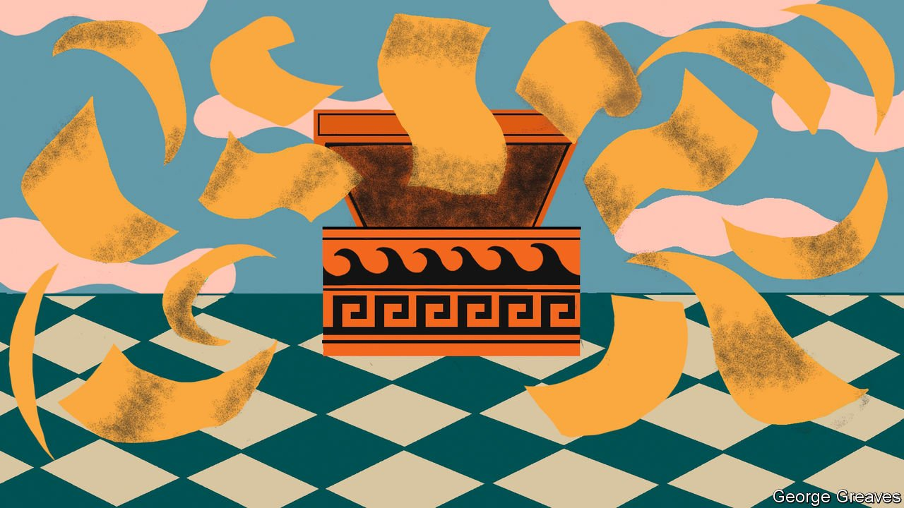

###### Embarrassing riches

# The “Pandora papers” ensnare a Czech leader and a Dutch minister 

##### Leaked documents show Andrej Babis and Wopke Hoekstra made investments via tax havens 

 

> Oct 7th 2021 

POLITICIANS’ PRIVATE finances are a big political issue in central Europe, as Andrej Babis well knows. Mr Babis, a billionaire who is prime minister of the Czech Republic, faces a general election on October 8th and 9th. A week before it, the International Consortium of Investigative Journalists, a reporters’ alliance, released an extravaganza of leaks from 14 financial firms, which it called the “Pandora Papers”. It charges that Mr Babis transferred $22m through shell companies in the British Virgin Islands (BVI), a tax haven, in order to buy a villa near Cannes anonymously. Mr Babis was already facing years-long investigations over alleged conflicts of interest and improper receipt of EU subsidies by Agrofert, an agricultural business he founded. He denies any wrongdoing.

Mr Babis was not the only politician tagged. Wopke Hoekstra, the Netherlands’ finance minister, was shown to have invested €26,500 ($30,500) in a friend’s safari company, also through a shell company in the BVI. Mr Hoekstra kept his shares while serving as a senator but sold them before becoming a minister, and broke no laws. But his Christian Democratic party has officially promised to take “firm action” against the use of tax havens.


Like the consortium’s earlier investigations (which include the Panama Papers in 2016 and the Paradise Papers in 2017), the Pandora Papers show that secretive financial networks that can aid tax avoidance and money-laundering involve not just countries typically seen as corrupt, but many of those viewed as cleanly governed. Russians, Saudis and Americans are all heavily represented in the leaks. Besides the British Virgin Islands, the jurisdictions they used include Luxembourg and South Dakota.

For the politicians concerned, the leaks are embarrassing but not devastating. The Netherlands has been mired in coalition talks for more than six months, but Mr Hoekstra seems likely to keep his job. As for Mr Babis, he is a skilled populist whose supporters tolerate the accusations against him. His party is in first place in the polls. According to a survey, two-thirds of Czechs think the government is run mainly by private interests. But whereas Czechs complain that their politicians are dirty, they do not seem to bother to elect cleaner ones.

