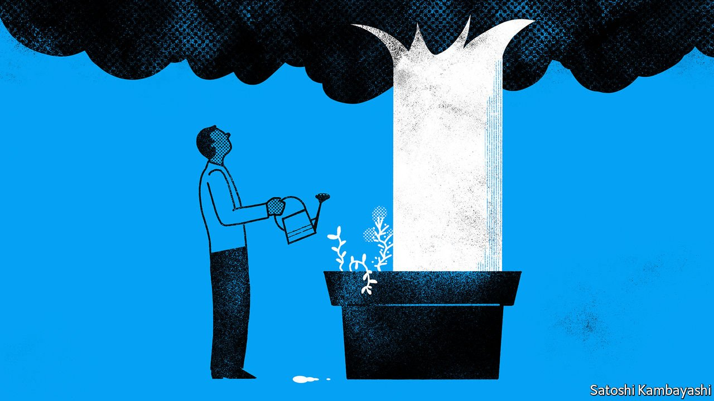

###### Buttonwood

# A different approach to investing in developing countries 

##### The concept of emerging markets is strained. Time to think about economic growth models instead 

 

> Oct 9th 2021 

FORTY YEARS ago Antoine van Agtmael of the International Finance Corporation pitched the idea of a “Third World Equity Fund” to sceptical fund managers, and the concept of emerging markets entered global investing. The aim had been to offer diversified exposure to fast-growing countries outside the rich world. Since then emerging and developing countries have, in aggregate, gained economic and corporate clout. But the vast disparities between them makes lumping them all into a single category increasingly odd. What might a new framework for investing outside of the rich world look like?

In the early 1980s emerging and developing countries made up about 25% of global GDP, according to the IMF. Today they account for about 40%, and more than 20% of total global market capitalisation. The market cap of the MSCI emerging-markets index, as a share of the global gauge, has risen by 13 times.


Yet countries’ economic situations vary widely. Consider, for instance, the MSCI emerging-markets index. In 1988, when the gauge was launched, the income per person of countries that were included ranged from $1,123 in Thailand to $7,598 in Greece. In 2019 the range was over four times that, stretching from India’s $2,100 to South Korea’s $31,846. The fortunes of some economies, such as Brazil and Russia, are tied to the vagaries of commodities markets; those of East and South-East Asia, by contrast, are powered by manufacturing.

Existing definitions of emerging markets do not capture such complexity. Most people, including many investors, think of the category as linked to income levels. But index providers also consider whether trading in markets is as frictionless as in the rich world. This is why, although South Korea and Taiwan are wealthy, their markets are not considered “developed”. The result is a grouping that is highly concentrated: the two East Asian countries together make up 27% of the MSCI emerging-markets index.

How then to think about gaining exposure to more than three-quarters of the world’s population, and two-fifths of the global economy? A framework that is organised by geography seems only slightly less arbitrary than the emerging-markets classification: the Turkish and Saudi Arabian markets, say, have little in common. Another approach would be to segment countries by income. But this too can have odd results. The low-income category, for instance, would combine places that have failed to develop for decades with those that could soon take off. The Republic of Congo and Vietnam have similar levels of income per person, but share few other economic qualities. Kuwait and Taiwan are broadly as rich as each other, but their stockmarkets are vastly different. Income levels alone do not say much about a country’s prospects.

Perhaps a more promising approach is to think of countries in terms of their growth models instead. This framework would apply to the familiar big emerging economies, as well as to the edgier, “frontier” markets. Investors who want more exposure to export-oriented powerhouses could turn not just to China, South Korea and Taiwan, but also to later adopters of the model, such as Bangladesh and Vietnam. These are still minnows compared with the incumbents’ market capitalisation of about $16trn. But adding them makes sense, since they are already beneficiaries of rising Chinese wages, and could expand into technologically advanced manufacturing.

A second category could include countries that rely instead on services-led growth, with all the promise of healthy middle-class consumption. Here, India and Indonesia are possible candidates; Kenya might be a frontier market worth investigating. And a third group could include commodity exporters, such as Brazil, Russia and South Africa. These have provided dismal returns over the past decade and shrunk as a proportion of emerging-market indices. But climate change and the green transition could create new winners and losers, as some resources, such as battery metals, become sought-after, and others fall out of favour.

Such a taxonomy is far from perfect. Growth models can change over time, for a start. Just think of China, which is seeking to become more consumption-led. Many smaller countries have long had hopes of boosting exports, only to be tripped up by poor policymaking. Still, the strategy of lumping much of the world’s population and output into one category is no longer useful. Time to experiment.

For more expert analysis of the biggest stories in economics, business and markets, , our weekly newsletter.

