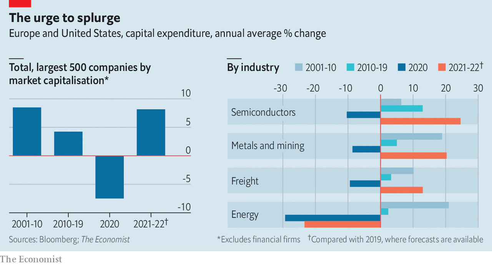

###### Capital ideas

# Companies cast off their reluctance to invest 

##### Many are promising an investment bonanza 

 

> Oct 7th 2021 

COMPANIES' enthusiasm for investment faded after the global financial crisis, and took a huge hit when covid-19 struck. But even those that have been stingy in the past decade, such as miners and shipping firms, are expected to loosen the purse strings this year and next. One exception is oil-and-gas companies, many of which, given the global push to decarbonise, may see little point in expanding capacity.

 


For more expert analysis of the biggest stories in economics, business and markets, , our weekly newsletter.

