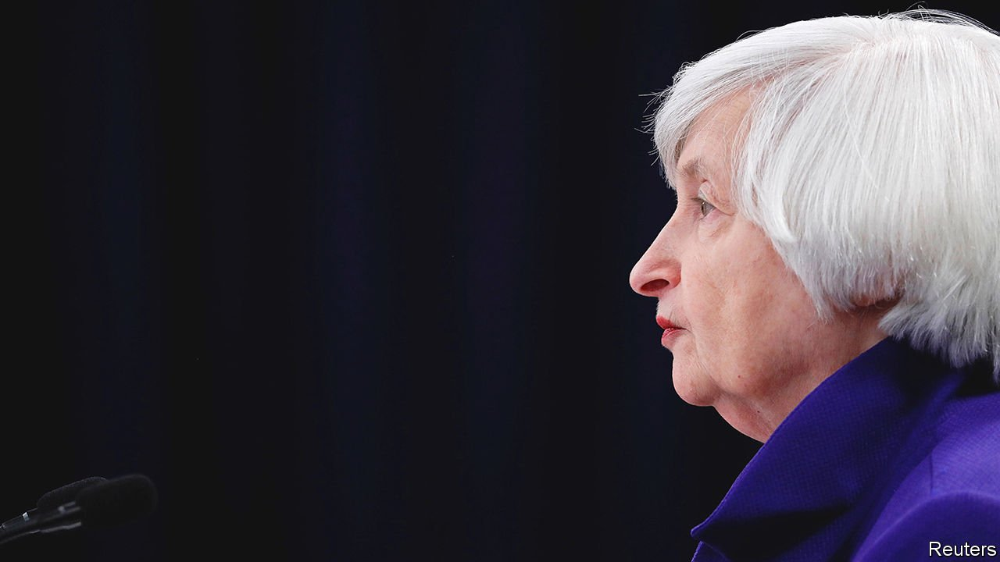

###### #Mintthecoin

# Could a $1trn coin end America’s debt-ceiling showdown? 

##### Proponents argue that the zany proposal is the government’s least bad option 

 

> Oct 9th 2021 

“IT IS A mining rock of such resistance, that it is not easy to cut with the force of blows on a steel anvil.” So wrote Antonio de Ulloa, a Spanish traveller to America, about platinum in 1748. Such an image may resonate with those frustrated by regular showdowns over America’s debt ceiling. Janet Yellen, the treasury secretary, has said the country risks running out of money by October 18th if the federal-debt limit is not raised, something that the Republicans had been unwilling to countenance doing. On October 6th, as The Economist was going to press, Mitch McConnell, the Republicans’ leader in the Senate, offered to stop obstructing a small rise in the debt ceiling, which would put off the issue until December (see United States section). But a deal is yet to be done.

Platinum is at the centre of a more unorthodox campaign to avert a debt crisis. In 1996 Congress directed the United States Mint to begin a commemorative coin programme. This included minting gold $5 coins depicting George Washington, and silver $1 coins to mark the 125th anniversary of the creation of Yellowstone National Park. But in 2010 Carlos Mucha, a lawyer, argued that he had found a loophole in the legislation. Whereas the Mint may not produce gold and silver coins in denominations of more than $50, no such limit applies to platinum coins. In 2011 a campaign began to encourage the Treasury Department to mint a “$1trn coin” as a way to sidestep a row over the debt ceiling. The campaigners argued that the coin would be “money” rather than “debt”, and that the Treasury could hand it over to the Federal Reserve in return for the right to draw down funds, in order to keep paying the bills while politicians haggled over the debt limit.


Social media have made the idea something of a meme this time round. The proposal has been promoted enthusiastically by a small core of supporters on Twitter using the hashtag #Mintthecoin. Nobel prizewinner Paul Krugman has lent his support to the campaign, despite conceding its “gimmickry”; two Democrats in the House of Representatives, Jerry Nadler and Rashida Tlaib, are in favour. There is nothing to suggest that Ms Yellen or others in President Joe Biden’s administration back the idea. Barack Obama, who ruled it out during the debt-ceiling crisis in 2013, has alluded to it as “wacky”. But Senate Republicans were sufficiently worried to have tried to introduce legislation to close the loophole in February this year.

If the coin were minted, it would not have to contain $1trn-worth of platinum bullion (currently around 30,000 tonnes). But the legal and constitutional obstacles to the scheme would be significant. Neil Buchanan of Levin College of Law argues that the coin would still be subject to the debt ceiling, and believes that any attempt to mint it would face court challenges. The coin could also undermine the established norm of Fed independence. George Selgin of the Cato Institute, a think-tank, points out that, by dumping a huge non-interest-bearing coin on the Fed, the net effect of the plan would be to reduce the central bank’s net interest income and, potentially, to create a situation in which the Fed is more financially dependent on Congress.

Yet past political brinkmanship has led to higher interest payments and, in 2011, a sovereign downgrade. A default could have much graver consequences because of the key role Treasuries play in the global financial system. This is why some observers think that, for all its flaws, the coin proposal is worth keeping on the table.

Mr Buchanan argues that, even if the scheme is illegal, it might be worth risking court challenges and adopting it, if the government needs to buy time. That, he says, is the risk the Biden administration took when it recently extended a moratorium on rental evictions, first introduced last year. Whether the government would ever take such an unusual step as minting the coin, though, is far from clear. But one of the lessons of the past few years in Washington may be that ideas that once seemed unconstitutional or downright bizarre can go on to become reality. ■

For more expert analysis of the biggest stories in economics, business and markets, , our weekly newsletter.

