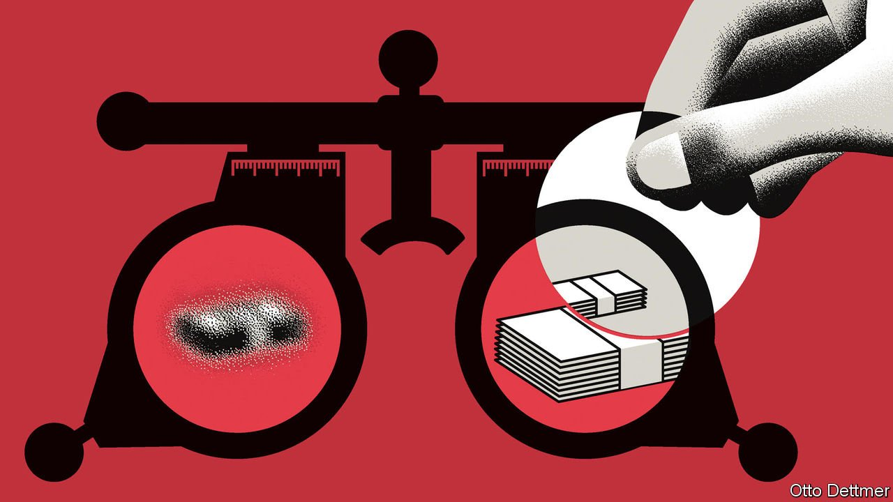

###### Free exchange

# Does anyone actually understand inflation? 

##### A pugnacious paper sets off a debate about the role of expectations in shaping prices 

 

> Oct 9th 2021 

FOR ECONOMICS writing—a genre that stylistically is often closer to computer manuals than to literature—a discussion paper recently posted on the Federal Reserve’s website is a blessed relief. Jeremy Rudd, a Fed researcher, includes quotations from William Butler Yeats and Dashiell Hammett. He uses such phrases as “ill-tempered pettifogging” and “arrant nonsense”. And, as if channelling David Foster Wallace, he has fun in his footnotes, notably one in which he casually observes that mainstream economics may serve as “an apologetics for a criminally oppressive, unsustainable and unjust social order”. Little wonder his paper has become, by central-bank standards, a social-media sensation.

But it is the substance, not the style, of Mr Rudd’s paper that is most provocative. He directs his arguments at an axiomatic idea in economics: that expectations determine inflation. The conventional story is straightforward. When workers expect prices to rise, they demand higher wages. When firms expect costs to rise, they set higher prices. In both cases, inflation becomes a self-fulfilling prophecy. Central bankers’ task is to pin down expectations at a low, stable level. If they succeed, they can control inflation.


This idea also appears to have been remarkably successful. For the past three decades inflation in the rich world has been quiescent. Whenever it has shot above target, it has, soon enough, fallen back. Expectations are, in the parlance, well-anchored. Indeed, this is why many economists are sanguine about the current bout of inflation: supply disruptions will eventually pass, and price pressures will ease. It is a comforting thought.

Enter Mr Rudd, the author of more than a dozen papers on inflation over the past two decades. The idea of inflation expectations “rests on extremely shaky foundations”, he writes. First, he says, the theory is flawed. Models of inflation mostly include expectations as a short-term variable (that is, what prices will be in the next month or two). Insofar as expectations matter, though, central bankers and analysts think of them as a longer-term force, an underlying trend impervious to cyclical ups and downs. Empirically, however, this is hard to document. And whose expectations matter? There are ordinary people, businesses, forecasters and investors. None, he argues, is much good at predicting prices.

Nevertheless, it is true that the past three decades have seen both subdued inflation and low expectations, however measured. But Mr Rudd’s contention is that the causality has been misdrawn. It is not that low expectations led to low inflation, but rather that low observed inflation led to low expectations. As he notes, it was only after a recession in the early 1990s, when inflation fell sharply and then stayed low, that expectations were ratcheted down. Mr Rudd concludes that obsessing over inflation expectations is useless and dangerous. Useless, because it is observed prices that count. Dangerous, because central bankers might grow unjustifiably confident in their powers of mind control.

The reaction to Mr Rudd’s provocation has been fierce. Tyler Cowen, a prolific economist at George Mason University, points to the extreme example of hyperinflation as proof that expectations matter. When people think their currency will be worth much less tomorrow, they switch out of it. Ricardo Reis of the London School of Economics, who has studied inflation as deeply as Mr Rudd, notes that no variable—neither expectations nor money supply, unemployment or interest rates—is perfect in predicting inflation. Yet each contributes to the picture. Moreover, he adds, there is plenty of evidence about expectations. Studies show, for example, that firms that think costs will rise tend to set higher prices.

For all the heat in the debate, there may be some common ground. Adam Posen of the Peterson Institute for International Economics, a think-tank, makes a sensible distinction. Over the long term, inflation expectations and, specifically, whether people believe the central bank will quell soaring prices, are important. Mr Rudd implicitly concedes this, writing that it is best for inflation to “be off of people’s radar screens”. Put differently, it is good to expect that inflation is and will be a non-issue.

Yet “that is different from saying that fine differences in inflation expectations are either well-measured or policy-relevant over shorter time horizons,” says Mr Posen. There is little evidence that communication alone by central banks can control inflation, without policy measures. And their credibility stems more from responses to crises than from attempts to manage expectations.

Janet Yellen drew a similar distinction when she was chair of the Fed. Stable long-term inflation expectations appear to be linked to stable long-term inflation, she said in a speech in 2015, in line with conventional wisdom. But she then pronounced herself “somewhat sceptical” that central banks can influence expectations simply by announcing an inflation target. Instead, she said, expectations may only take hold after a central bank keeps inflation near its target, a process that could take years.

Inspect the unexpected

Some commentators have concluded from Mr Rudd’s paper that economics is a mess and no one understands inflation. Yet sifting through the arguments, there are shared ideas of profound importance. First, central-bank credibility is precious. Second, expectations of inflation are formed by experiences of inflation. And third, in the long run, such expectations probably matter.

What does that mean for the rising inflationary pressures now facing much of the world? The hawkish view is that central banks must rein in prices before it is too late and expectations lose their anchor. Yet there is also a doveish take. Central banks in the rich world remain credible. By letting inflation run a little higher now, they may help reset expectations. After all, before covid-19, the big worry in rich countries was too-low inflation. Or, at least, that was what some economists and investors had expected of the future—whatever their expectations are worth. ■

For more expert analysis of the biggest stories in economics, business and markets, , our weekly newsletter.

