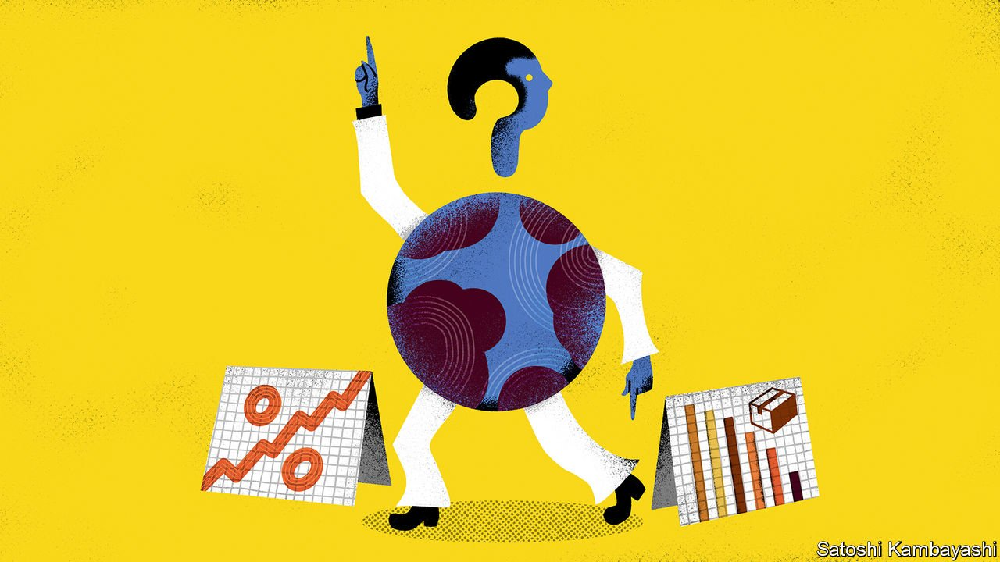
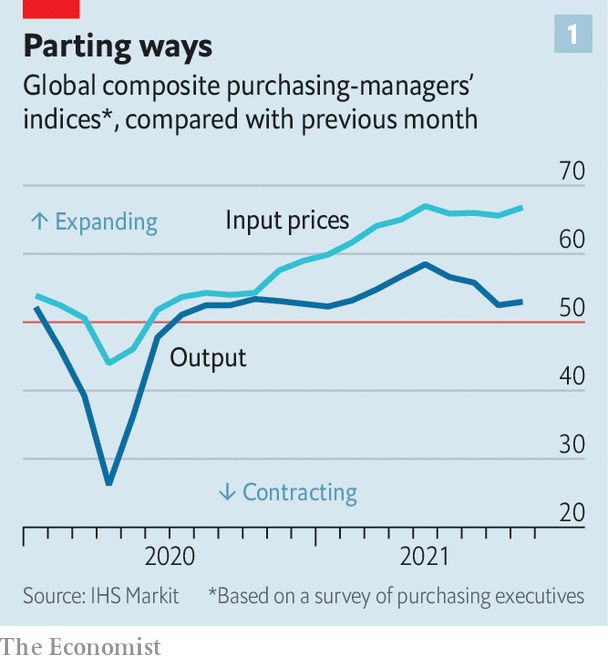
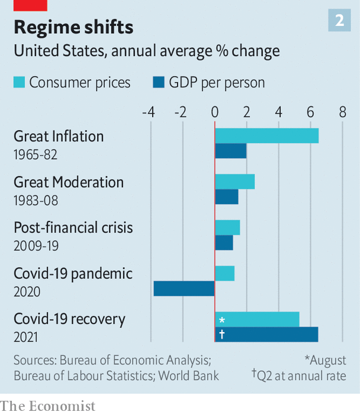

###### Stagflation sensation

# Is the world economy going back to the 1970s? 

##### Despite some eerie echoes, the past is not the best guide to the present 

 

> Oct 7th 2021 

IT IS NEARLY half a century since the Organisation of the Petroleum Exporting Countries imposed an oil embargo on America, turning a modest inflation problem into a protracted bout of soaring prices and economic misery. But the stagflation of the 1970s is back on economists’ minds today, as they confront strengthening inflation and disappointing economic activity. The voices warning of unsettling echoes with the past are influential ones, including Larry Summers and Kenneth Rogoff of Harvard University and Mohamed El-Erian of Cambridge University and previously of PIMCO, a bond-fund manager.

 


Stagflation is a particularly thorny problem because it combines two ills—high inflation and weak growth—that do not normally go together. So far this year economic growth across much of the world has been robust and unemployment rates, though generally still above pre-pandemic levels, have fallen. But the recovery seems to be losing momentum, fuelling fears of stagnation. Covid-19 has led to factory closures in parts of South-East Asia, hitting industrial production. Consumer sentiment in America is sputtering. Meanwhile, after a decade of sluggishness, price pressures are intensifying (see chart 1).  above central-bank targets across most of the world, and exceeds 3% in Britain and the euro area and 5% in America.


The economic picture is not as bad as the situation during the 1970s (see chart 2). But what worries stagflationists is less the precise figures than the fact that an array of forces threatens to keep inflation high even as growth slows—and that these look eerily similar to the factors behind the stagflation of the 1970s.

 


One parallel is that the world economy is once again weathering energy- and food-price shocks.  have risen by roughly a third over the past year.  and  prices are close to  in Asia and Europe. Stocks of both fuels are disconcertingly low in big economies such as China and India; power cuts, , may spread. Rising energy costs will exert more upward pressure on inflation and further darken the economic mood worldwide.

Other costs are rising too: , because of a shift in consumer spending towards goods and covid-related backlogs at ports. Workers are enjoying greater bargaining power this year, as firms facing surging demand struggle to . Unions in Germany, for instance, are demanding higher pay; some workers are going on strike.

Stagflationists see another similarity with the past in the current policy environment. They fret that macroeconomic thinking has regressed, creating an opening for sustained inflation. In the 1960s and 1970s governments and central banks tolerated rising inflation as they prioritised low unemployment over stable prices. But the bruising experience of stagflation helped shift thinking, producing a generation of central bankers determined to keep inflation in check. Then, after the global financial crisis and a period of deficient demand, this single-minded focus gave way to greater concern about unemployment. Low interest rates weakened fiscal discipline, and enabled vast amounts of stimulus during 2020. Now as in the 1970s, the worriers warn, governments and central banks may be tempted to solve supply-side problems by running the economy even hotter, yielding high inflation and disappointing growth.

These parallels aside, however, the 1970s provide little guidance to those seeking to understand current troubles. To see this, consider the areas where the historical comparison does not hold. Energy and food-price shocks typically worry economists because they could become baked into wage bargains and inflation expectations, causing spiralling . Yet the institutions that could underpin a new, long-lived era of labour strength remain weak, for the most part. In 1970 about 38% of workers across the OECD, a club of mostly rich countries, were covered by union wage bargains. By 2019, that figure had declined to 16%, the lowest on record.

Cost-of-living adjustments (COLA), which automatically translate increases in inflation into higher pay, were a common feature of wage contracts in the 1970s. But the practice has declined dramatically since. In 1976 more than 60% of American union workers were covered by collective-bargaining contracts with COLA provisions; by 1995, the share was down to 22%. A paper published in 2020 by Anna Stansbury of Harvard and Mr Summers argued that a secular decline in bargaining power is the “major structural change” explaining key features of recent macroeconomic performance, including low inflation, notwithstanding the decline in unemployment rates over time. As dramatic as the pandemic has been, it seems unlikely that such a big shift has reversed so quickly.

Moreover, stagflation in the 1970s was exacerbated by a sharp decline in productivity growth across rich economies. In the decades after the second world war, governments’ commitment to maintaining demand was accommodated by rocketing growth in productive capacity (the French called the period “les Trente Glorieuses”). But by the early 1970s the long productivity boom had run out of steam. The habit of stoking demand failed to help expand productive potential, and pushed up prices instead. What followed was a long period of disappointing productivity growth.

Since the worst of the pandemic, however, productivity has strengthened: output per hour worked in America grew at about 2% in the year to June, roughly double the average rate of the 2010s. Booming capital spending could mean such gains are sustained.

Another important break with the 1970s is that central banks have neither forgotten how to rein in inflation nor lost their commitment to price stability. In the 1970s even some central bankers doubted their power to curb wage and price increases. Arthur Burns, then the chairman of the Federal Reserve, reckoned that “monetary policy could do very little to arrest an inflation that rested so heavily on wage-cost pressures”. Research by Christina and David Romer of the University of California at Berkeley suggests that Mr Burns’s view was a common one at the time. But the end of the era of high inflation demonstrated that central banks could rein in such price rises, and this knowledge has not been lost. Last month Jerome Powell, the Fed’s current chairman, declared that, if “sustained higher inflation were to become a serious concern, we would certainly respond and use our tools to assure that inflation runs at levels that are consistent with our longer-run goal of 2%.”

The new fiscal orthodoxy likewise has its limits. Budget deficits around the world are forecast to shrink dramatically from this year to next. In America moderate Democrats’ worries about excessive spending may mean that President Joe Biden’s grand investment plans are pared down—or fail to pass at all.

What next for the world economy, then, if it does not face a 1970s re-run? Rocketing energy costs pose a serious risk to the recovery. Soaring prices—or shortages, if governments try to limit rises—will dent households’ and companies’ budgets and hit spending and production. That will come just as governments withdraw stimulus and central banks countenance tighter policy. A demand slowdown could relieve pressure on supply-constrained sectors: once they have paid their eye-watering electricity bills, Americans will be less able to afford scarce cars and computers. But it would add a painful coda to nearly two years of covid-19.

Another important respect in which the global economy has changed since the 1970s is in its far greater integration through financial markets and supply chains; trade as a share of global GDP, for instance, has more than doubled since 1970. The uneven recovery from the pandemic has placed intense stress on some of the ties binding economies together. Panicking governments could hoard resources, causing further disruption.

Past experience, therefore, is not the clearest lens through which to view the forces buffeting the global economy. The world has changed dramatically since the 1970s, and globalisation has created a vast network of interdependencies. The system now faces a new, unique test. ■

For more expert analysis of the biggest stories in economics, business and markets, , our weekly newsletter.

An early version of this article was published online on October 5th 2021

