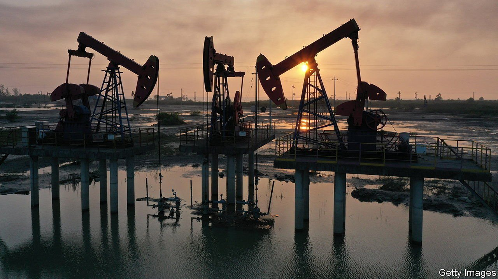
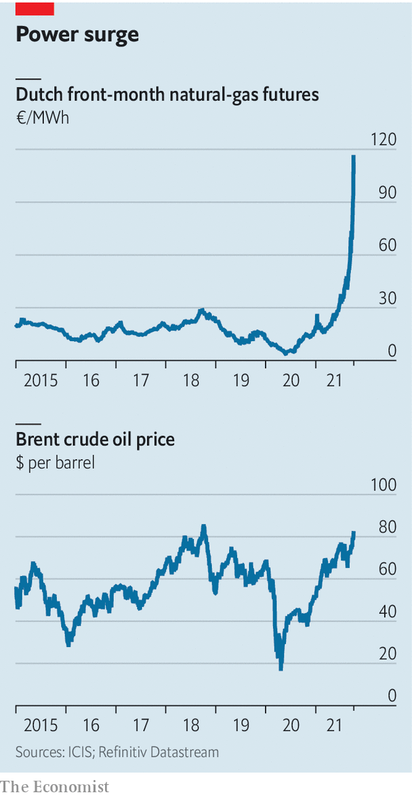

###### Can’t live with them, can’t live without them

# The age of fossil-fuel abundance is dead 

##### Dwindling investment in oil, gas and coal mean high prices are here to stay 

 

> Oct 4th 2021 

FOR MUCH of the past half-decade, the operative word in the energy sector was “abundance”. An industry that had long sought to ration the production of fossil fuels to keep prices high suddenly found itself swamped with oversupply, as America’s shale boom lowered the price of oil around the world and clean-energy sources, such as wind and solar, competed with other fuels used for power generation, such as coal and natural gas.

In recent weeks, however, it is a shortage of energy, rather than an abundance of it, that has caught the world’s attention. On the surface, its manifestations are mostly unconnected. Britain’s miffed motorists are suffering from a shortage of lorry drivers to deliver petrol. Power cuts in parts of China partly stem from the country’s attempts to curb emissions. Dwindling coal stocks at power stations in India are linked to a surge in the price of imports of the commodity.


Yet an underlying factor is expected to worsen the scarcity in the next few years: a slump in investment in oil wells, natural-gas hubs and coal mines. This is partly a hangover from the period of abundance, with years of overinvestment giving rise to more capital discipline. It is also the result of growing pressures to decarbonise. This year the investment shortfall is one of the main reasons prices of all three energy commodities have soared. European gas prices, though volatile, were near record highs as The Economist went to press. Oil crossed $81 a barrel after the Organisation of the Petroleum Exporting Countries (OPEC), and producers such as Russia who are part of the OPEC+ alliance, resisted calls to raise output at a meeting on October 4th.

 


The potentially inflationary upheaval will not be good for a world that still gets most of its energy from fossil fuels. But it may at least accelerate the shift to greener—and cheaper—sources of energy.

Start with oil, an industry that needs constant reinvestment just to stand still. A rule of thumb is that oil companies are supposed to allocate about four-fifths of their capital expenditure each year just to stopping their level of reserves from being depleted. Yet annual investment by the industry has fallen from $750bn in 2014 (when oil prices were above $100 a barrel) to an estimated $350bn this year, reckons Saad Rahim of Trafigura, a commodity trader. Analysts at Goldman Sachs, a bank, say that over the same period, the number of years’ worth of current production held in reserves in some of the world’s biggest projects has fallen from 50 to about 25. A supply crunch was averted last year because the covid-19 pandemic clobbered oil demand. But once the world economy started to recover, it was only a matter of time before a squeeze started to emerge.

The industry would usually respond to robust demand and higher prices by investing to drill more oil. But that is harder in an era of decarbonisation. For a start, big private-sector oil companies, such as ExxonMobil and Royal Dutch Shell, are being pressed by investors to treat oil and gas investments like week-old fish. That is either because their shareholders reckon that demand for oil will eventually peak, making long-term projects uneconomic, or because they prefer to hold stakes in companies that support the transition to clean energy. Even though prices are rising, investment in oil shows no sign of picking up. The Economist has looked at capital-spending forecasts for American and European commodity producers in 2021 and 2022 compared with 2019. Whereas mining firms predict big increases in capital expenditure, energy investment is expected to. Oil firms are instead giving excess cash back to shareholders.

Another factor inhibiting oil investment is the behaviour of OPEC+ countries. The half-decade of relatively low prices during the “age of abundance”, which reached its nadir with a price collapse at the start of the pandemic, gutted state coffers. That cut funding for investment. As prices recover, governments’ priority is not to expand oil-production capacity but to shore up national budgets. Moreover, state-run producers are cautious, worried that a new flare-up of covid-19 cases could hit demand again. And as Oswald Clint of Bernstein, an investment firm, puts it, many are wondering “Why not just ride this high price for a while?” In any case, even if the rally were eventually to inspire investment, it would take several years to meaningfully raise production.

Lower investment in oil has a spillover effect on the output of natural gas, which is often a by-product of drilling for crude. Added to that is a dearth of liquefied natural gas (LNG) terminals for shipping gas from places where it remains relatively easy to access (America) to those where it is scarcer (Asia and Europe). Given the long time it takes to build facilities, the lack of spare terminal capacity in America is expected to last at least until 2025.

Investment in thermal coal is weakest of all. Even in China and India, which are planning new coal-fired power plants, the mood has swung against the dirtiest fossil fuel, because of both its carbon emissions and its effect on air quality. Yet with demand likely to be pushed up as China potentially heads into a cold winter, and with India struggling with supplies, coal may be in the throes of its last hurrah.

All this places fossil-fuel producers in something of a bind. A slump in investment could enable some oil, gas and coal investors to make out like bandits. But the longer prices stay high, the more likely it becomes that the transition to clean energy ultimately buries the fossil-fuel industry. Consumers, in the meantime, must brace for more shortages. The age of abundance is dead. ■

For more expert analysis of the biggest stories in economics, business and markets, , our weekly newsletter.

An early version of this article was published online on October 4th 2021

