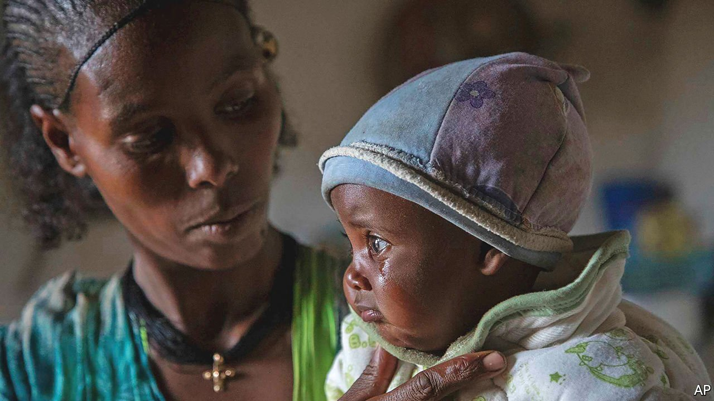

###### No favours for killers

# Ethiopia is deliberately starving its own citizens 

##### The world should apply whatever pressure it can to force it to stop 

 

> Oct 9th 2021 

IT IS ALMOST a year since Abiy Ahmed, the prime minister of Ethiopia, launched a “law enforcement” operation against the government of the northern region of Tigray, which he accused of rebellion. Since the beginning, the ensuing conflict has been marked by war crimes. Late last year in the city of Axum, for instance, Eritrean troops fighting alongside Ethiopian forces murdered hundreds of civilians, mostly men and boys. Some were lined up and shot in the back. Others were gunned down as they came out of church or murdered while lying in bed in hospital. And the Tigrayans have been accused, among other atrocities, of raping and killing Eritrean refugees in UN camps.

Horrifying as these crimes are, they are now being eclipsed by an even more heinous one: a deliberate attempt by the Ethiopian government to starve its own citizens. Since the fighting broke out Tigray has suffered an increasingly restrictive blockade by government forces. Since July it has received only a fraction of the food needed to keep its 6m inhabitants alive, hardly any fuel and no medical supplies at all. More than 5m people do not have enough to eat. Some 400,000 of those are facing what aid agencies call “catastrophic” hunger—the last step on the path to mass starvation. Aid workers compare the crisis to Ethiopia’s famine of the 1980s, when 400,000-700,000 died.


Ethiopia’s government insists it is doing all it can to help the hungry in Tigray and, in particular, that it is letting aid pass through its blockade. Data from the UN tell a different story.

Aid agencies reckon that 100 trucks of food and medicine must enter the state each day to avert famine. Only about a tenth of that is being let through by the government and its allies. Instead of asking international agencies for help to feed its citizens, the government is impeding their efforts. It has suspended the work of two of them, Médecins Sans Frontières and the Norwegian Refugee Council, and has also expelled seven senior UN officials, accusing them of “meddling” in its internal affairs.

America and the European Union have taken a few steps to press Ethiopia and the Tigrayans to stop the war and end abuses, including halting the sale of weapons and withholding some bilateral aid. America has also threatened to impose financial sanctions on people implicated in war crimes or in fanning the conflict’s flames.

But the impact has been negligible. To replace arms previously supplied by France, Germany and Israel, Ethiopia has turned to Turkey and Iran, among others. To make up for the reduction in aid, it has asked the IMF for a bail-out and its creditors for forgiveness of some of its $30bn in external debt.

It would take an arms embargo by the UN to stop the government getting hold of deadly weapons. Yet China and Russia are preventing the UN Security Council, which on October 6th discussed the conflict in Tigray for the tenth time, from even condemning the expulsion of UN officials, much less imposing strict sanctions.

Fortunately, Western countries still have considerable leverage. The emergency loan that Ethiopia wants from the IMF and the forbearance it is seeking from creditors depend on the acquiescence of America and Europe. They should not yield until the blockade ends. Trade is another point of pressure. Ethiopia exports about $250m a year to America under the African Growth and Opportunity Act, a duty-free scheme. Each country eligible to take part is reviewed by the American authorities every year. They should remove Ethiopia from the list unless Tigray is fed.

These steps may not work. Abiy, who won the Nobel peace prize in 2019 for ending a long conflict with Eritrea, seems . But to do anything less would be to stand by as mass murder is taking place. To avert a calamity, Western governments must pull every lever they have. ■

