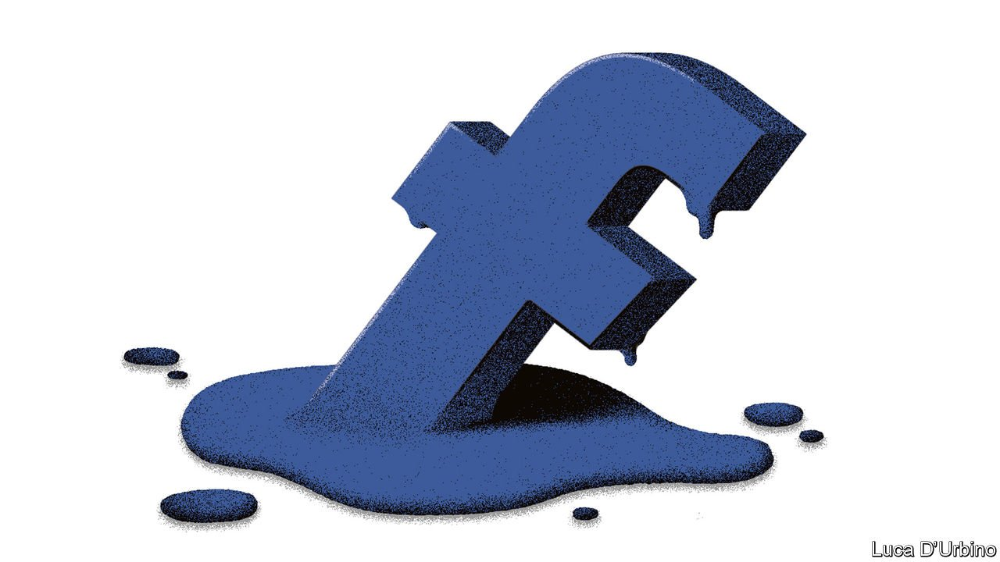

###### Facepalm

# Facebook is nearing a reputational point of no return 

##### The problem starts at the top 

 

> Oct 9th 2021 

DISASTER STRUCK the world’s biggest social network on October 4th when Facebook and its sister apps were knocked offline for six hours. It was one of the less embarrassing moments of the company’s week. The next day a whistleblower, Frances Haugen,  of all manner of wickedness at the firm, from promoting eating disorders to endangering democracy. Some wondered whether the world would be a better place if the outage were permanent.

A share of the opprobrium heaped on Facebook is incoherent. Politicians are angry but so far seem incapable of co-ordinating reform to rein it in. And investors have kept buying the stock, regardless of the bad headlines. Yet the company should take no comfort from this. The blind fury unleashed shows that its reputational problems have got out of hand.


Some of this week’s criticism was tendentious. Reports highlighted internal research showing that Instagram, Facebook’s photo-sharing app, makes one in five American teenagers feel worse about themselves. They paid less attention to the finding that Instagram makes twice as many feel better about themselves. Facebook’s critics are right that it should be more open. But the firm has half a point when it says that the hysterical reaction to unsurprising findings will lead companies to conclude that it is safer not to do such research at all.

Other complaints are really criticisms of the broader internet. The question of how to regulate viral content for children goes beyond Facebook, as any parent who has left their child with YouTube knows. Likewise, dilemmas over how the firm amplifies attention and how to draw the line between upholding free speech and minimising harm. Facebook repeated its plea that Congress should weigh in on matters such as minimum ages, rather than leaving it to firms. It has made a better stab than most at settling free-speech questions with its “oversight board”, a pompous-sounding but quietly useful body which dispenses rulings on matters from misogyny to misinformation.

The most damaging claim this week gained the least attention. Ms Haugen alleges that Facebook has concealed a decline in its young American users. She revealed internal projections that a drop in teenagers’ engagement could lead to an overall decline in American users of 45% within the next two years. Investors have long faced a lack of open disclosure. Misleading advertisers would undermine the source of nearly all the firm’s sales, and potentially break the law. (The firm denies it.)

Does any of this matter? Although Facebook’s share price has lagged behind some tech giants, it has risen by almost 30% in the past 12 months. Politicians threaten to break the company up, but the antitrust case is flawed. The Justice Department’s claim that Facebook is a monopoly rests on defining its market so as to exclude most social networks. The nonsense of this was demonstrated by the outage, when users flocked to apps like Telegram, TikTok and Twitter. The action is more an expression of frustration than a powerful argument about competition law.

But fury may matter. Facebook is nearing a reputational point of no return. Even when it set out plausible responses to Ms Haugen, people no longer wanted to hear. The firm risks joining the ranks of corporate untouchables like big tobacco. If that idea takes hold, Facebook risks losing its young, liberal staff. Even if its ageing customers stick with the social network, Facebook has bigger ambitions that could be foiled if public opinion continues to curdle. Who wants a metaverse created by Facebook? Perhaps as many people as would like their health care provided by Philip Morris.

If rational argument alone is no longer enough to get Facebook out of its hole, the company should look hard at its public face. Mark Zuckerberg, Facebook’s all-powerful founder, made a reasoned statement after this week’s wave of anger. He was ignored or ridiculed and increasingly looks like a liability. ■

