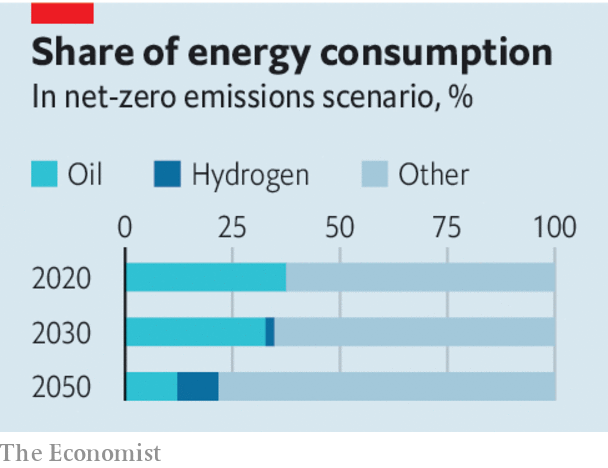

###### Climate change and innovation

# Hydrogen’s moment is here at last 

##### After decades of doubts the gas is coming of age 

 

> Oct 9th 2021 

HYDROGEN HAS been controversial ever since the tragedy of the Hindenburg, an airship filled with it that went down in flames in 1937. Boosters say that the gas is a low-carbon miracle which can power cars and homes. The hydrogen economy, they hope, will redraw the energy map. Sceptics note that several hydrogen investment drives since the 1970s have ended in tears as the gas’s shortcomings were exposed. As we , the reality lies in between. Hydrogen technologies could eliminate perhaps a tenth of today’s greenhouse-gas emissions by 2050. That is a sliver—but, considering the scale of the energy transition, a crucial and lucrative one.

Hydrogen is not a primary source of energy like oil or coal. It is best thought of as an energy carrier, akin to electricity, and as a means of storage, like a battery. It has to be manufactured. Low-carbon energy sources such as renewables and nuclear power can be used to separate water (HO) into its constituents of oxygen and hydrogen. This is inefficient and expensive, but costs are falling. Hydrogen can also be made from dirty fossil fuels but this emits a lot of pollution unless it is coupled with technologies that capture carbon and sequester it. Hydrogen is flammable and bulky compared with many fuels. The implacable laws of thermodynamics mean that converting primary energy into hydrogen and then hydrogen into usable power leads to waste.


All this explains the gas’s tricky history. The oil shocks of the 1970s led to research into hydrogen technologies but they never went far. In the 1980s the Soviet Union even flew a hydrogen-powered passenger jet—the maiden flight lasted just 21 minutes.

Today climate change is causing another wave of enthusiasm. More than 350 big projects are under way and cumulative investment could reach $500bn by 2030. Morgan Stanley, a bank, reckons that annual sales of hydrogen could be worth $600bn by 2050. That is up from $150bn of sales today, which come mainly from industrial processes, including making fertilisers. India will soon stage auctions for hydrogen and Chile is holding tenders for its production on public lands. Over a dozen countries including Britain, France, Germany, Japan and South Korea have national hydrogen plans.

 


Amid the excitement, it is worth being clear about what hydrogen can and cannot do. Japanese and South Korean firms are keen to sell cars using hydrogen fuel cells, but battery cars are roughly twice as energy efficient. Some European countries hope to pipe hydrogen into homes, but heat pumps are more effective and some pipes cannot handle the gas safely. Some big energy firms and petrostates want to use natural gas to make hydrogen without capturing the associated carbon effectively, but that does not eliminate emissions.

Instead, hydrogen can help in niche markets, involving complex chemical processes and high temperatures that are hard to achieve with electricity. Steel firms, spewing roughly 8% of global emissions, rely on coking coal and blast furnaces that wind power cannot replace but which hydrogen can, using a process known as direct reduction. Hybrit, a Swedish consortium, sold the world’s first green steel made this way in August.

Another niche is commercial transport, particularly for journeys beyond the scope of batteries. Hydrogen lorries can beat battery-powered rivals with faster refuelling, more room for cargo and a longer range. Cummins, an American company, is betting on them. Fuels derived from hydrogen may also be useful in aviation and shipping. Alstom, a French firm, is running hydrogen-powered locomotives on European tracks.

Last, hydrogen can be used as a material to store and transport energy in bulk. Renewable grids struggle when the wind dies or it is dark. Batteries can help, but if renewable power is converted to hydrogen, it can be stored cheaply for long periods and converted to electricity on demand. A power plant in Utah plans to store the gas in caverns to supply California. Sunny and windy places that lack transmission links can export clean energy as hydrogen. Australia, Chile and Morocco hope to “ship sunshine” to the world.

With so much money piling into hydrogen the list of uses for it may expand. Much of the work is up to the private sector but governments can do their bit. One task is to crack down on greenwashing: hydrogen made from dirty fuels without high-quality carbon capture will not help the climate. New rules are needed to measure and disclose the life-cycle emissions arising from producing hydrogen and, given that it will be traded across borders, these need international agreement.

Rainmakers move in

Government should also encourage hubs where different hydrogen users cluster, minimising the need to duplicate infrastructure. These are already emerging in Humberside in Britain and Rotterdam in the Netherlands. Hydrogen has its limitations, but it can play a vital role in bringing about cleaner energy. ■

For more coverage of climate change, register for The Climate Issue, our fortnightly , or visit our 

