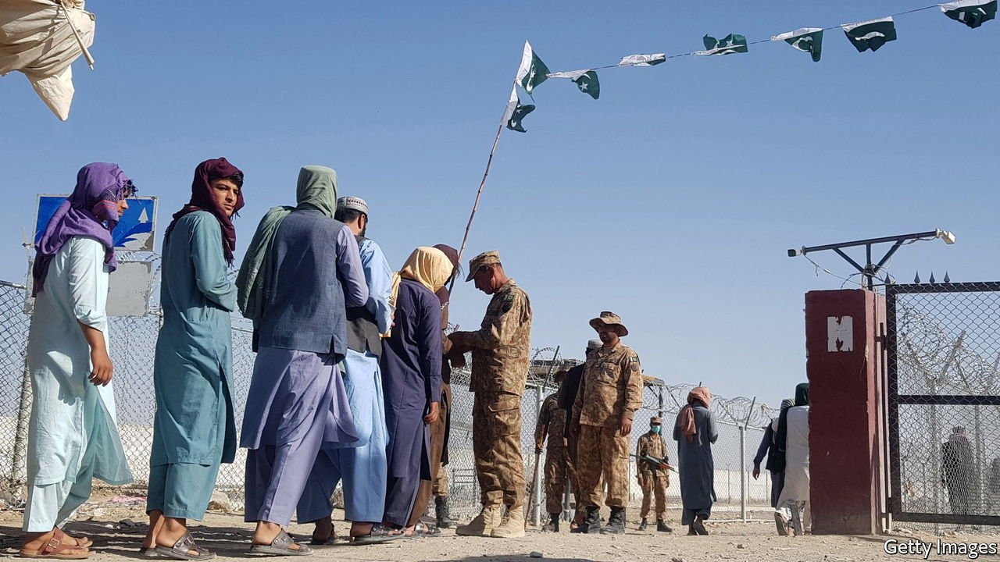

###### All-weather frenemy

# The war in Afghanistan is over, but the West still needs Pakistan 

##### It is too important—and dangerous—to ignore 

 

> Oct 7th 2021 

WHEN THE last American troops departed from Kabul on August 30th, it meant not only the end of a 20-year campaign in Afghanistan but also the end of Western reliance on neighbouring Pakistan. In that time the country had been an infuriating partner that had helped NATO forces with logistics and intelligence even as it provided a haven to the Taliban’s leaders. Now, perhaps America could wash its hands and walk away.

America and its allies have plenty of reasons to feel aggrieved. Pakistan is perpetually sparring with its neighbour, India—which is steadily becoming a vital regional partner for the West. It has close diplomatic and commercial ties with China, to which it provides access to the Indian Ocean, via the Karakoram highway and the port of Gwadar. It is home to lots of Muslim extremists. With a GDP per head that is just two-thirds of India’s and which has in recent years been falling, Pakistan might seem a sensible country to shun.


If only. Although Pakistan is no longer so central to America’s plans, it is still a pivotal—and worrying—place. It has a rapidly expanding arsenal of nuclear weapons. Those Muslim extremists have been involved in terror attacks all over the world. The country’s capacity to complicate relations between China and India means that it is too important to ignore.

However, the West needs to be realistic about what sort of co-operation is and is not possible. Realism starts by acknowledging that Pakistan will never do many of the things its Western friends would like. Exhortations to the army to stop stage-managing politics will fall on deaf ears, even though Pakistan would be better off if it did. Trying to induce Pakistan to split with China is also hopeless. The generals are too keen to have an ally against India, too eager for Chinese investment and too conscious of the West’s misgivings to put all their eggs in one basket. Doing anything that smacks of siding with America against fellow Muslims is also a hard sell. Pakistan’s rulers see themselves as natural leaders of the Islamic world and are reluctant to rile their most doctrinaire citizens.

Nevertheless, for all its problems, Pakistan is in a position to offer something to the West. Its politics have become calmer since the army stopped trying to run the country directly and  to a pliable politician, Imran Khan. The Islamist terrorists who made the place look like an incipient Afghanistan a few years ago have been largely suppressed. What is more, although Pakistan is chummy with China, it also craves Western attention. The elite speak English, send their children to American and European universities and holiday in London and Paris.

And Pakistan has something to gain. Even more than America, it benefits from tempering the zealotry of the Taliban, keeping Afghanistan stable and preventing the spread of extremism. The Pakistani version of the Taliban has killed far more Pakistanis than the Afghan Taliban killed Americans. Pakistan’s rulers would also like more economic assistance, ideally on more concessionary terms than the millstone loans that have accompanied some Chinese investments. No doubt they will give in to the temptation to play China and the West off against one another. But that is better than becoming a Chinese client state.

The ultimate prize would be some sort of detente between Pakistan and India. That will not come easily, or quickly. Politicians and soldiers in both countries find railing against the other lot too useful to abandon lightly. But Pakistanis know they cannot compete with India in the long run. And after border scuffles in the Himalayas, Indians are coming to see that deterring China is much more important than bickering with Pakistan. There is surely scope to make the region safer, and to build a stronger network of alliances, if the West is willing to remain sufficiently engaged and to plan for the long term.

Dial D for diplomacy

Although its Taliban allies won in Afghanistan, Pakistan is in a difficult position in a dangerous neighbourhood. The generals know that the West blows hot and cold, but their narrow self-interest leaves scope for co-operation. Some glad-handing would be a good start. Joe Biden, America’s president, has held two summits with Narendra Modi, India’s prime minister—one in person and one by video link. He has not yet deigned to give Mr Khan a call, much less invite him to the White House. Now that America has left Afghanistan, a bit of courtesy makes sense. ■

