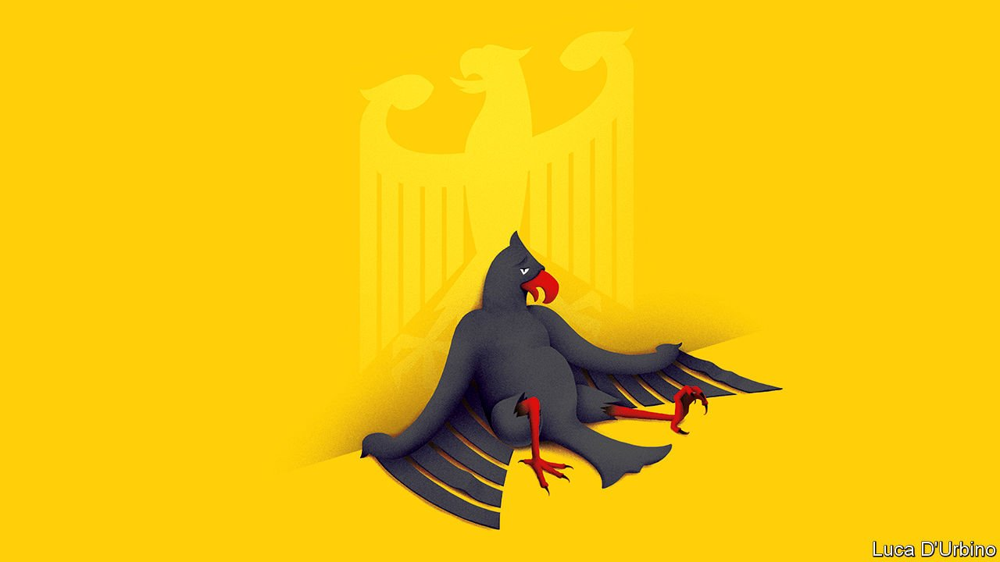
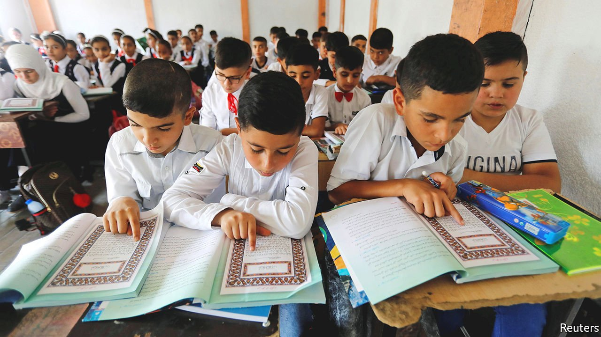
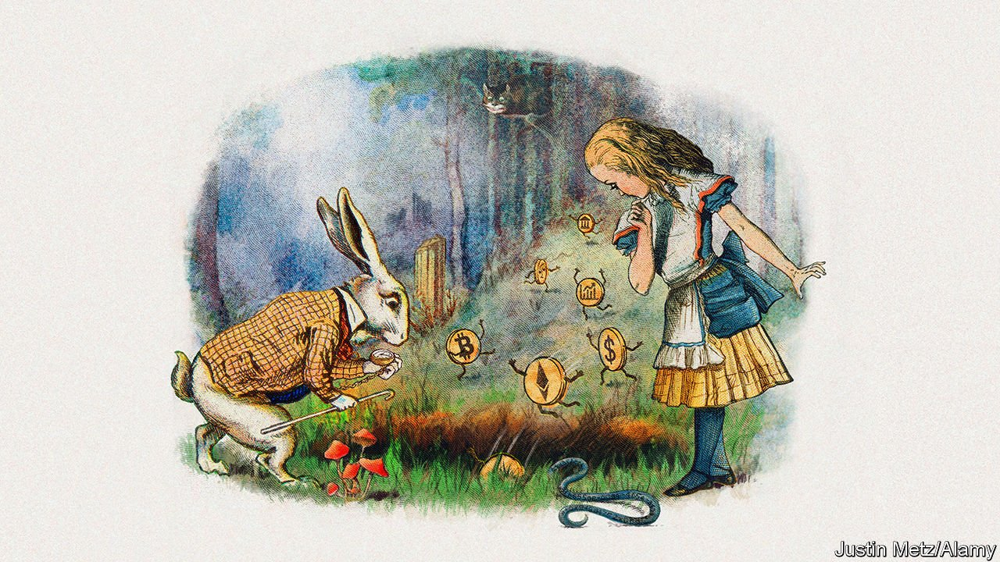
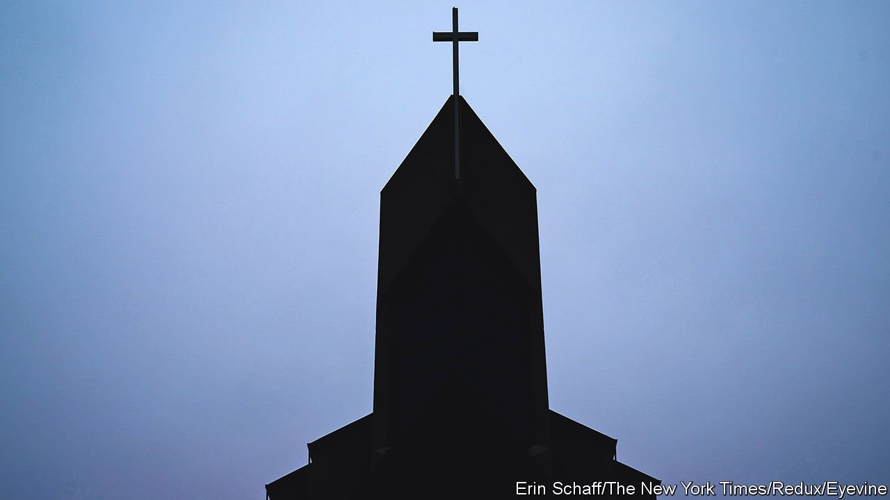

###### On Angela Merkel, modern Arabic, decentralised finance, Canada, vaccines

# Letters to the editor 

##### A selection of correspondence 

 

> Oct 9th 2021 


Angela Merkel’s legacy

I found myself nodding along to your assessment of the many problems facing Angela Merkel’s successor as chancellor of Germany (“”, September 25th). That said, I am rather bemused by the fact that it took you four legislative periods to acknowledge that many, if not most, of these problems were created by Mrs Merkel. The undoubted achievement of clinging to power for 16 years cannot mask the fact that successive governments under her leadership have failed to deal with every major challenge facing Germany in the coming decades.


Mrs Merkel rode on the success of unpopular economic reforms implemented by her predecessor, but Germany’s economic competitiveness has seen a steady decline. Companies and individuals pay some of the highest tax rates in the OECD. Investment is sorely lacking in technology and the green economy and stifled by red tape. The ideologically driven implementation of a ruinous centrally planned energy policy has pushed up electricity prices to the highest levels in the European Union, yet Germany’s carbon-dioxide emissions per person remain high. The sustainability of the welfare state has become ever more doubtful as the reality of demographic change has been wilfully ignored.

Furthermore, her stifling of traditional conservative voices in a nominally still-conservative party has allowed the AfD, an anti-democratic and populist-right party, to emerge to the right of the Christian Democrats, threatening the stability of German society.

Although Mrs Merkel deserves credit for her ability to manage the many crises that have emerged during her tenure, I must say that I, and many other Germans, would have rather preferred a succession of shorter-lived, yet more forward-looking heads of government.

MARK BAUER

Adelschlag, Germany

In your article on the German election (“”, September 25th) your correspondent wrote: “...a grinning passer-by exclaims “Toll, toll, toll” (Great, great, great!)”. 


That does not sound like something a German would say. My suspicion is that your correspondent misheard. The passer-by most probably said “Toi, toi, toi!” meaning “Good luck!”

ROBERTA SCHWARZ

London

 


What is Arabic?

I was surprised to read that the closest dialect to Modern Standard Arabic “is spoken by Palestinians” (“”, September 18th). It is something of a trope in Arabic linguistics that every Arab thinks their dialect is the closest to MSA. And, in a way, they are all right. Tunisians can point to the fact that they preserve almost all the standard Arabic consonants, though their love of consonant clusters makes their speech sound very different. Some desert Bedouins can boast that they maintain grammatical distinctions that disappeared from other spoken varieties long ago. Egyptians note that the non-standard G for J in their dialect is actually the most ancient form. From a linguistic perspective, there is no established method for determining the “closeness” of language varieties. People do try, but the answer you get depends very much on which features you compare, and how you weigh them.

You were right on another matter, though: even the “closest” dialect is still quite far from standard Arabic. MSA is based on classical Arabic, which ceased to be a spoken language at least 1,000 years ago, and all the vernaculars are closer to each other by any measure than they are to MSA. As you observe, this may play a role in the fact that Arabs do not read much for fun. You might also consider that some of the bestselling novels in the Arab world in recent years have been heretical ones that were written in the vernacular.

KAREN MCNEIL

Washington, DC

Your critique of the teaching of the Arabic language in Arab countries noted that “regimes are nervous of the free expression a more liberal approach may inspire” and that their censors “are banning books as keenly as ever”. The fate of our recently published “The Political Economy of Education in the Arab World” reaffirms your point. This edited collection identifies governmental repression as the primary obstacle to improving education in Arab countries and suggests various liberalising reforms. We had it translated into Arabic in the hopes of reaching a wider Arab audience. Alas, fearful of retribution by Arab regimes, potential publishers demanded we tone down the criticism. We refused and they declined to publish it, thereby inadvertently making our case.

HICHAM ALAOUI

Rabat

ROBERT SPRINGBORG

Vancouver

 


Defy DeFi

I read your briefing on decentralised finance, so please let me know if I got it straight (“”, September 18th). It seems that punters are supposed to buy tokens (streams of digits) of no inherent worth and which may change in value by a factor of ten or more in either direction for no obvious reason. Some tokens take vast amounts of energy to generate, and tokens are stored in ethereal “wallets” which live on Cloud Nine, from where they can be (and have been) stolen at the click of a hacker’s mouse.

The market in tokens is not regulated and no substantial organisation stands behind them. However, cryptocurrency tokens are greatly valued by gamblers and by criminals as they enable the anonymous transfer of ransom money from schools, hospitals and businesses after their data have been encrypted or stolen. You also mentioned possibly cheaper payment mechanisms, but I prefer to stick with my expensive Swiss bank.

DAVID MYERS

Commugny, Switzerland

Cracking properly encrypted data with today’s supercomputers that would now take millions of years could well be possible in next to no time with a quantum computer. I am greatly attracted by the efficiencies promised by DeFi, but am fearful that the whole edifice could be dreadfully exposed as and when quantum computing becomes a reality. Is anyone addressing this threat before it’s too late?

BRUCE MANFORD

London

 


Political satire

Canada has just had “” (September 25th), which makes me pine for the old Rhinoceros Party. It consistently offered tantalising election promises that spiced up the discourse. These included: providing higher education by building taller schools; instituting English, French and illiteracy as Canada’s three official languages; ending crime by abolishing all laws; and adopting the British system of driving on the left, but phasing it in gradually with only buses driving on the left to begin with. In the 1970s the Rhinos offered a package of corruption and incompetence, and claimed that the then ruling Liberal Party stole their party platform. Plus ça change, plus c’est la même chose.

PAUL GREENBERG

Brookline, Massachusetts

 


The voice of reason

Religious opposition to vaccinations (“”, September 18th) reminds me of a joke our minister told as part of a sermon. There was extreme flooding and the authorities decided to evacuate the area. Despite numerous measures, including finally a helicopter, one man refused all offers of help, saying God would rescue him. Finally he died and at the pearly gates said he was sure that God would have helped him. A voice said, “I sent you someone to tell you to evacuate, a boat and a helicopter. What more did you want?”

MORRIS SHAPIRO

East Kilbride, South Lanarkshire

