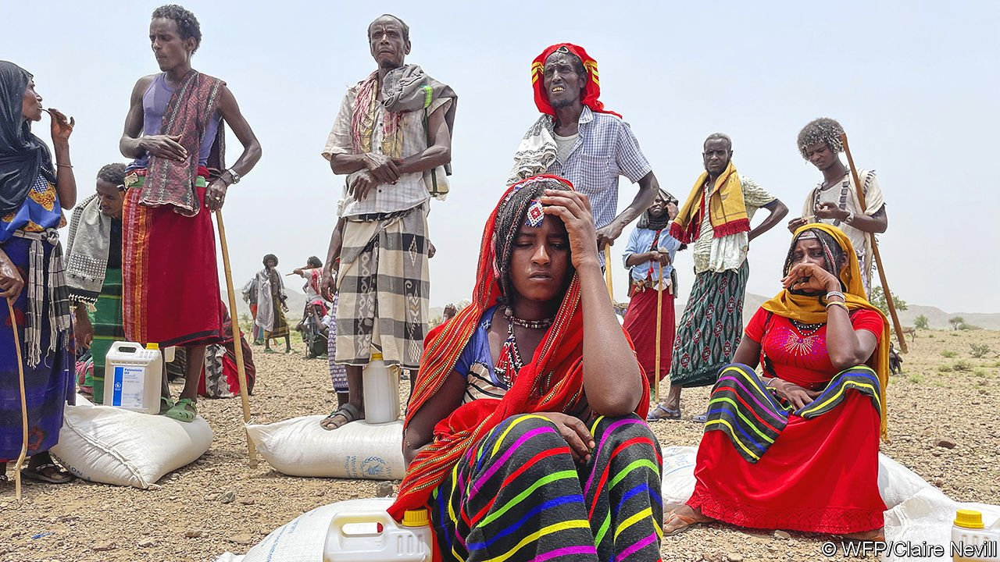
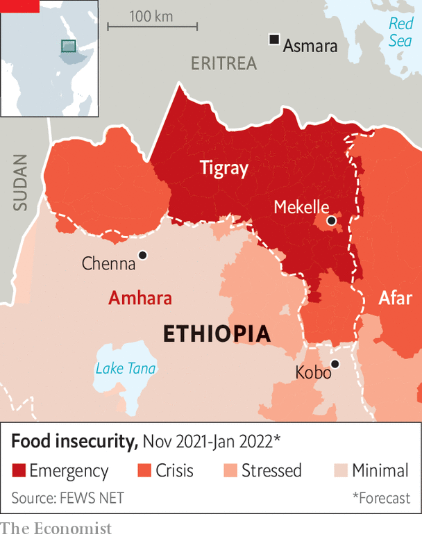

###### Bodies in the fields

# Both sides in Ethiopia’s conflict stand accused of war crimes 

##### A Tigrayan offensive has spread suffering beyond its borders 

 

> Oct 9th 2021 

YELLOW DAISIES blossom, like poppies in Flanders, among the bodies rotting in the fields. Of their former lives only glimpses remain: a scarf soaked in mud; a torn fragment of uniform; the toe of a plastic sandal poking through the dirt. Some have been buried under stones and leaves. Others have been left to lie in the open, limbs ravaged by dogs, torsos blackened and bloated from the rain.

Not much is known for certain about what happened in Chenna, a village in the Amhara region of northern Ethiopia, in the early days of September. There was certainly a battle, a fearsome one, for the evidence of that is everywhere—in the ransacked homes, the slaughtered cows, the bullet casings and the artillery shells. During a recent visit, your correspondent could hear the blasts of distant artillery.


Locals buried at least 56 bodies: civilians, they say, murdered by rebels from Tigray. Officials put the number higher still, at nearly 200. Baze Kisade, a farmer, says he came home to find two of his brothers dead, shot in the head, their hands tied behind their backs. Agera Tareke, a priest, says Tigrayan fighters broke into his home and killed his father in front of him. The leader of Chenna village counts an entire family of six among the dead.

Whether there was a cold-blooded massacre remains unclear. No doubt civilians died in the week-long battle between the Tigrayan People’s Liberation Front (TPLF) and government forces supported by Amhara paramilitaries. Tigrayan fighters fought from people’s homes and were bombarded by the army from a nearby mountainside. It seems likely that the rebels shot innocent civilians as they were pushed back. But a large number of villagers themselves joined the battle, as well as residents and students from nearby towns. Some took up arms while others tended to the wounded or fetched water for the troops. The blurry line between civilian and combatant makes it difficult to know the true extent of any war crimes.

 


What is beyond doubt is that the advance of Tigrayan rebels into adjacent regions since July has brought great suffering to civilians. In Kobo, a town in eastern Amhara, dozens if not hundreds were killed in early September. As in Chenna, many—but by no means all—were probably militiamen or farmers carrying guns. Elsewhere Tigrayan troops have reportedly shelled villages and looted clinics.

TPLF leaders justify their offensive by arguing they have to force Abiy Ahmed, the prime minister, to the negotiating table. But some speak of revenge. The war has wrought devastation in Tigray; towns have been pillaged, civilians slaughtered and women gang-raped. Now the region is under siege and starving (see map). Yet in Amhara, too, locals describe a war of survival. “The TPLF is going to destroy Amhara and Ethiopia,” says Solomon Alebachew, a militia leader. “I’ll be fighting until my last drop of blood.”

