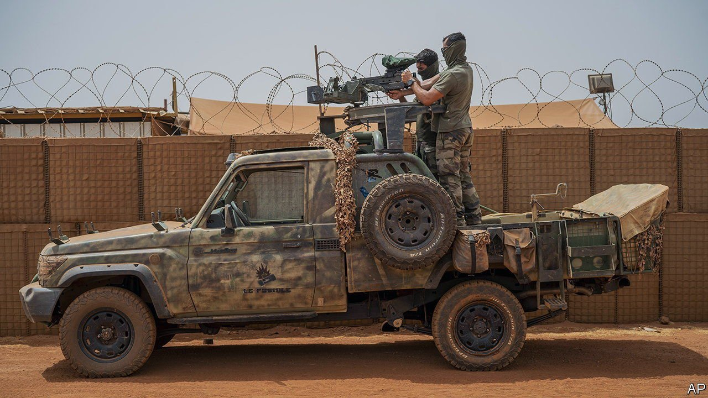

###### Liaisons douloureuses

# Emmanuel Macron hosts a different sort of Africa summit 

##### A moment to air grievances takes place against a background of heightened tension 

 

> Oct 7th 2021 

A YEAR AGO Achille Mbembe, a Cameroonian post-colonial writer, lambasted Emmanuel Macron’s Africa policy. Has France, he wrote, still not “understood that, far from being transitory, the discredit into which France has fallen is a structural and multi-generational phenomenon and not the result of the victimisation of a few ex-colonised people?”

On October 8th, at a France-Africa summit in the French city of Montpellier, none other than Mr Mbembe will host a discussion between the president and a dozen young people. The 3,000 or so guests, from Africa and its diaspora in France, will include entrepreneurs, activists, intellectuals, film directors, scientists and students. No African government leader is invited.


The official point, says the Elysée, is to “speed up the changing relationship between France and Africa” which Mr Macron hailed in a speech in Ouagadougou in 2017. Then, the freshly elected president told students in Burkina Faso’s capital: “I am of a generation for whom the crimes of European colonisation cannot be disputed” and “of a generation that doesn’t come to tell Africans what to do”. It felt like a symbolic moment that might herald a less testy and distrustful tie between France and Africa. The president has since returned art to Senegal and Benin, promised an end to the CFA franc in West Africa and asked for forgiveness for France’s share of responsibility for the genocide in Rwanda.

Yet distrust of French policy has if anything hardened, as has French frustration over those suspicions. Mr Macron keeps 5,100 soldiers in the Sahel as part of an American-backed anti-jihadist mission, Operation Barkhane. He will wind this down in northern Mali, closing three military bases there, and reshape it from a base in Niger around a European special-forces unit, Takuba. In August the French scored a tactical success when a drone strike killed Adnan Abu Walid al-Sahrawi, the leader of Islamic State in the Greater Sahara.

Jihadists and terrorists continue to flourish in the region, however, in areas beyond the control of states, as does abuse by government soldiers. Democracy and the rule of law are being trampled with abandon from Mali to Guinea. France usually turns a blind eye to coups. But it is losing patience. On September 25th Mali’s prime minister, Choguel Maïga, who was installed after the second coup in a year, accused Mr Macron of an “abandon in mid-flight”, and said he had no choice but to turn to others for security. He was referring, without naming it, to Wagner, a Russian mercenary outfit. Florence Parly, France’s defence minister, described the notion that French soldiers were quitting the region as “scandalous”. But she also warned Mali that a Wagner contract would compromise its military presence.

Amid such tension the unstated purpose of the summit is a “need to clarify the way France is questioned”, says a presidential aide. The idea is to let each side voice grievances, in the hope of clearing the air at a non-governmental level. The French feel that they are “reproached for silence”, says the Elysée, and when they do speak, “for interference”.

Mr Macron will have his work cut out, some of it of his own making. Days before the summit he drew Algerian ire by talking of a “politico-military system” which has “completely rewritten official history” based on “a hatred of France”. Algeria closed its air space to French military aircraft. France says it will cut the number of visas issued in Algeria, Morocco and Tunisia unless the trio co-operate in taking back expelled illegal immigrants.

This week Mali’s military rulers protested when Mr Macron criticised the absence of government in parts of their country. “You could say it’s a difficult moment to be airing differences,” says Hervé Berville, a Rwanda-born deputy for Mr Macron’s party, “or you could say it’s never been more pertinent or more important to do so.” ■

